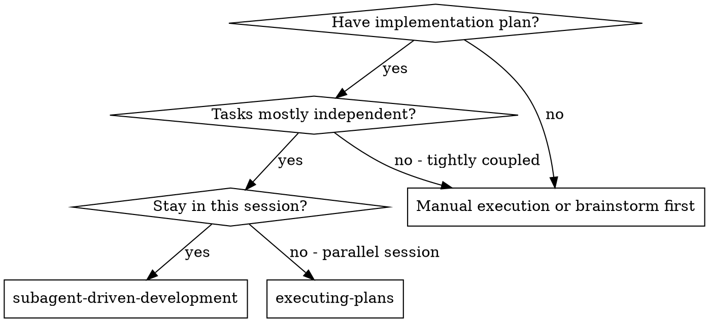
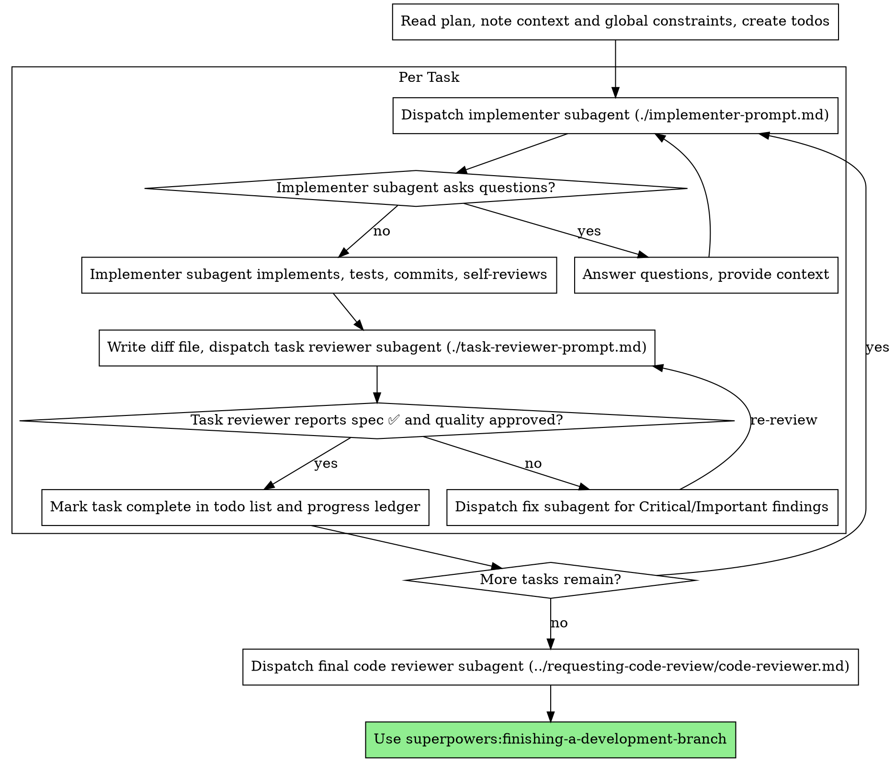

# Continuing tasks 12 and 13 via subagent

**Session ID:** ses_09a53b12affeabJ7519klJduIM
**Created:** 7/15/2026, 8:06:59 PM
**Updated:** 7/15/2026, 8:33:26 PM

---

## User

use subagent driven to continue task 12 and 13

---

## Assistant (Build · Kimi K2.7 Code · 7.4s)

_Thinking:_

We need understand task 12 and 13. User says "use subagent driven to continue task 12 and 13". There may be a task plan in workspace. Need load skill subagent-driven-development first because instruction says use skill before response. Also maybe we need find task plan. Let's inspect workspace, maybe there is task_plan.md, todos, etc. We need use skills. First invoke skill subagent-driven-development? But also caveman active. We need figure tasks. Use tools: ls workspace, glob task plan. Since we must use skill for task that matches. The user explicitly asks "use subagent driven to continue task 12 and 13". So invoke skill. Also need load plan file. Let's do skill and glob in parallel.

**Tool: skill**

**Input:**
```json
{
  "name": "subagent-driven-development"
}
```

**Output:**
```
<skill_content name="subagent-driven-development">
# Skill: subagent-driven-development

# Subagent-Driven Development

Execute plan by dispatching a fresh implementer subagent per task, a task review (spec compliance + code quality) after each, and a broad whole-branch review at the end.

**Why subagents:** You delegate tasks to specialized agents with isolated context. By precisely crafting their instructions and context, you ensure they stay focused and succeed at their task. They should never inherit your session's context or history — you construct exactly what they need. This also preserves your own context for coordination work.

**Core principle:** Fresh subagent per task + task review (spec + quality) + broad final review = high quality, fast iteration

**Narration:** between tool calls, narrate at most one short line — the
ledger and the tool results carry the record.

**Continuous execution:** Do not pause to check in with your human partner between tasks. Execute all tasks from the plan without stopping. The only reasons to stop are: BLOCKED status you cannot resolve, ambiguity that genuinely prevents progress, or all tasks complete. "Should I continue?" prompts and progress summaries waste their time — they asked you to execute the plan, so execute it.

## When to Use



**vs. Executing Plans (parallel session):**
- Same session (no context switch)
- Fresh subagent per task (no context pollution)
- Review after each task (spec compliance + code quality), broad review at the end
- Faster iteration (no human-in-loop between tasks)

## The Process



## Pre-Flight Plan Review

Before dispatching Task 1, scan the plan once for conflicts:

- tasks that contradict each other or the plan's Global Constraints
- anything the plan explicitly mandates that the review rubric treats as a
  defect (a test that asserts nothing, verbatim duplication of a logic block)

Present everything you find to your human partner as one batched question —
each finding beside the plan text that mandates it, asking which governs —
before execution begins, not one interrupt per discovery mid-plan. If the
scan is clean, proceed without comment. The review loop remains the net for
conflicts that only emerge from implementation.

## Model Selection

Use the least powerful model that can handle each role to conserve cost and increase speed.

**Mechanical implementation tasks** (isolated functions, clear specs, 1-2 files): use a fast, cheap model. Most implementation tasks are mechanical when the plan is well-specified.

**Integration and judgment tasks** (multi-file coordination, pattern matching, debugging): use a standard model.

**Architecture and design tasks**: use the most capable available model.
The final whole-branch review is one of these — dispatch it on the most
capable available model, not the session default.

**Review tasks**: choose the model with the same judgment, scaled to the
diff's size, complexity, and risk. A small mechanical diff does not need the
most capable model; a subtle concurrency change does.

**Always specify the model explicitly when dispatching a subagent.** An
omitted model inherits your session's model — often the most capable and
most expensive — which silently defeats this section.

**Turn count beats token price.** Wall-clock and context cost scale with how
many turns a subagent takes, and the cheapest models routinely take 2-3× the
turns on multi-step work — costing more overall. Use a mid-tier model as the
floor for reviewers and for implementers working from prose descriptions.
When the task's plan text contains the complete code to write, the
implementation is transcription plus testing: use the cheapest tier for
that implementer. Single-file mechanical fixes also take the cheapest tier.

**Task complexity signals (implementation tasks):**
- Touches 1-2 files with a complete spec → cheap model
- Touches multiple files with integration concerns → standard model
- Requires design judgment or broad codebase understanding → most capable model

## Handling Implementer Status

Implementer subagents report one of four statuses. Handle each appropriately:

**DONE:** Generate the review package (`scripts/review-package BASE HEAD`, from this skill's directory — it prints the unique file path it wrote; BASE is the commit you recorded before dispatching the implementer — never `HEAD~1`, which silently drops all but the last commit of a multi-commit task), then dispatch the task reviewer with the printed path.

**DONE_WITH_CONCERNS:** The implementer completed the work but flagged doubts. Read the concerns before proceeding. If the concerns are about correctness or scope, address them before review. If they're observations (e.g., "this file is getting large"), note them and proceed to review.

**NEEDS_CONTEXT:** The implementer needs information that wasn't provided. Provide the missing context and re-dispatch.

**BLOCKED:** The implementer cannot complete the task. Assess the blocker:
1. If it's a context problem, provide more context and re-dispatch with the same model
2. If the task requires more reasoning, re-dispatch with a more capable model
3. If the task is too large, break it into smaller pieces
4. If the plan itself is wrong, escalate to the human

**Never** ignore an escalation or force the same model to retry without changes. If the implementer said it's stuck, something needs to change.

## Handling Reviewer ⚠️ Items

The task reviewer may report "⚠️ Cannot verify from diff" items — requirements
that live in unchanged code or span tasks. These do not block the rest of the
review, but you must resolve each one yourself before marking the task
complete: you hold the plan and cross-task context the reviewer
lacks. If you confirm an item is a real gap, treat it as a failed spec
review — send it back to the implementer and re-review.

## Constructing Reviewer Prompts

Per-task reviews are task-scoped gates. The broad review happens once, at the
final whole-branch review. When you fill a reviewer template:

- Do not add open-ended directives like "check all uses" or "run race tests
  if useful" without a concrete, task-specific reason
- Do not ask a reviewer to re-run tests the implementer already ran on the
  same code — the implementer's report carries the test evidence
- Do not pre-judge findings for the reviewer — never instruct a reviewer to
  ignore or not flag a specific issue. If you believe a finding would be a
  false positive, let the reviewer raise it and adjudicate it in the review
  loop. If the prompt you are writing contains "do not flag," "don't treat X
  as a defect," "at most Minor," or "the plan chose" — stop: you are
  pre-judging, usually to spare yourself a review loop.
- The global-constraints block you hand the reviewer is its attention
  lens. Copy the binding requirements verbatim from the plan's Global
  Constraints section or the spec: exact values, exact formats, and the
  stated relationships between components ("same layout as X", "matches
  Y"). The reviewer's template already carries the process rules (YAGNI,
  test hygiene, review method) — the constraints block is for what THIS
  project's spec demands.
- Hand the reviewer its diff as a file: run this skill's
  `scripts/review-package BASE HEAD` and pass the reviewer the file path
  it prints (or, without bash: `git log --oneline`, `git diff --stat`,
  and `git diff -U10` for the range, redirected to one uniquely named
  file). The output never enters your own context, and the reviewer sees
  the commit list, stat summary, and full diff with context in one Read
  call. Use the BASE you recorded before dispatching the implementer —
  never `HEAD~1`, which silently truncates multi-commit tasks.
- A dispatch prompt describes one task, not the session's history. Do not
  paste accumulated prior-task summaries ("state after Tasks 1-3") into
  later dispatches — a real session's dispatch hit 42k chars of which 99%
  was pasted history. A fresh subagent needs its task, the interfaces it
  touches, and the global constraints. Nothing else.
- Dispatch fix subagents for Critical and Important findings. Record Minor
  findings in the progress ledger as you go, and point the final
  whole-branch review at that list so it can triage which must be fixed
  before merge. A roll-up nobody reads is a silent discard.
- A finding labeled plan-mandated — or any finding that conflicts with
  what the plan's text requires — is the human's decision, like any plan
  contradiction: present the finding and the plan text, ask which governs.
  Do not dismiss the finding because the plan mandates it, and do not
  dispatch a fix that contradicts the plan without asking.
- The final whole-branch review gets a package too: run
  `scripts/review-package MERGE_BASE HEAD` (MERGE_BASE = the commit the
  branch started from, e.g. `git merge-base main HEAD`) and include the
  printed path in the final review dispatch, so the final reviewer reads
  one file instead of re-deriving the branch diff with git commands.
- Every fix dispatch carries the implementer contract: the fix subagent
  re-runs the tests covering its change and reports the results. Name the
  covering test files in the dispatch — a one-line fix does not need the
  whole suite. Before re-dispatching the reviewer, confirm the fix report
  contains the covering tests, the command run, and the output; dispatch
  the re-review once all three are present.
- If the final whole-branch review returns findings, dispatch ONE fix
  subagent with the complete findings list — not one fixer per finding.
  Per-finding fixers each rebuild context and re-run suites; a real
  session's final-review fix wave cost more than all its tasks combined.

## File Handoffs

Everything you paste into a dispatch prompt — and everything a subagent
prints back — stays resident in your context for the rest of the session
and is re-read on every later turn. Hand artifacts over as files:

- **Task brief:** before dispatching an implementer, run this skill's
  `scripts/task-brief PLAN_FILE N` — it extracts the task's full text to a
  uniquely named file and prints the path. Compose the dispatch so the
  brief stays the single source of requirements. Your dispatch should
  contain: (1) one line on where this task fits in the project; (2) the
  brief path, introduced as "read this first — it is your requirements,
  with the exact values to use verbatim"; (3) interfaces and decisions
  from earlier tasks that the brief cannot know; (4) your resolution of
  any ambiguity you noticed in the brief; (5) the report-file path and
  report contract. Exact values (numbers, magic strings, signatures, test
  cases) appear only in the brief.
- **Report file:** name the implementer's report file after the brief
  (brief `…/task-N-brief.md` → report `…/task-N-report.md`) and put it in
  the dispatch prompt. The implementer writes the full report there and
  returns only status, commits, a one-line test summary, and concerns.
- **Reviewer inputs:** the task reviewer gets three paths — the same brief
  file, the report file, and the review package — plus the global
  constraints that bind the task.
- Fix dispatches append their fix report (with test results) to the same
  report file and return a short summary; re-reviews read the updated file.

## Durable Progress

Conversation memory does not survive compaction. In real sessions,
controllers that lost their place have re-dispatched entire completed task
sequences — the single most expensive failure observed. Track progress in
a ledger file, not only in todos.

- At skill start, check for a ledger:
  `cat "$(git rev-parse --show-toplevel)/.superpowers/sdd/progress.md"`. Tasks listed there
  as complete are DONE — do not re-dispatch them; resume at the first task
  not marked complete.
- When a task's review comes back clean, append one line to the ledger in
  the same message as your other bookkeeping:
  `Task N: complete (commits <base7>..<head7>, review clean)`.
- The ledger is your recovery map: the commits it names exist in git even
  when your context no longer remembers creating them. After compaction,
  trust the ledger and `git log` over your own recollection.
- `git clean -fdx` will destroy the ledger (it's git-ignored scratch); if
  that happens, recover from `git log`.

## Prompt Templates

- [implementer-prompt.md](implementer-prompt.md) - Dispatch implementer subagent
- [task-reviewer-prompt.md](task-reviewer-prompt.md) - Dispatch task reviewer subagent (spec compliance + code quality)
- Final whole-branch review: use superpowers:requesting-code-review's [code-reviewer.md](../requesting-code-review/code-reviewer.md)

## Example Workflow

```
You: I'm using Subagent-Driven Development to execute this plan.

[Read plan file once: docs/superpowers/plans/feature-plan.md]
[Create todos for all tasks]

Task 1: Hook installation script

[Run task-brief for Task 1; dispatch implementer with brief + report paths + context]

Implementer: "Before I begin - should the hook be installed at user or system level?"

You: "User level (~/.config/superpowers/hooks/)"

Implementer: "Got it. Implementing now..."
[Later] Implementer:
  - Implemented install-hook command
  - Added tests, 5/5 passing
  - Self-review: Found I missed --force flag, added it
  - Committed

[Run review-package, dispatch task reviewer with the printed path]
Task reviewer: Spec ✅ - all requirements met, nothing extra.
  Strengths: Good test coverage, clean. Issues: None. Task quality: Approved.

[Mark Task 1 complete]

Task 2: Recovery modes

[Run task-brief for Task 2; dispatch implementer with brief + report paths + context]

Implementer: [No questions, proceeds]
Implementer:
  - Added verify/repair modes
  - 8/8 tests passing
  - Self-review: All good
  - Committed

[Run review-package, dispatch task reviewer with the printed path]
Task reviewer: Spec ❌:
  - Missing: Progress reporting (spec says "report every 100 items")
  - Extra: Added --json flag (not requested)
  Issues (Important): Magic number (100)

[Dispatch fix subagent with all findings]
Fixer: Removed --json flag, added progress reporting, extracted PROGRESS_INTERVAL constant

[Task reviewer reviews again]
Task reviewer: Spec ✅. Task quality: Approved.

[Mark Task 2 complete]

...

[After all tasks]
[Dispatch final code-reviewer]
Final reviewer: All requirements met, ready to merge

Done!
```

## Advantages

**vs. Manual execution:**
- Subagents follow TDD naturally
- Fresh context per task (no confusion)
- Parallel-safe (subagents don't interfere)
- Subagent can ask questions (before AND during work)

**vs. Executing Plans:**
- Same session (no handoff)
- Continuous progress (no waiting)
- Review checkpoints automatic

**Efficiency gains:**
- Controller curates exactly what context is needed; bulk artifacts move
  as files, not pasted text
- Subagent gets complete information upfront
- Questions surfaced before work begins (not after)

**Quality gates:**
- Self-review catches issues before handoff
- Task review carries two verdicts: spec compliance and code quality
- Review loops ensure fixes actually work
- Spec compliance prevents over/under-building
- Code quality ensures implementation is well-built

**Cost:**
- More subagent invocations (implementer + reviewer per task)
- Controller does more prep work (extracting all tasks upfront)
- Review loops add iterations
- But catches issues early (cheaper than debugging later)

## Red Flags

**Never:**
- Start implementation on main/master branch without explicit user consent
- Skip task review, or accept a report missing either verdict (spec compliance AND task quality are both required)
- Proceed with unfixed issues
- Dispatch multiple implementation subagents in parallel (conflicts)
- Make a subagent read the whole plan file (hand it its task brief —
  `scripts/task-brief` — instead)
- Skip scene-setting context (subagent needs to understand where task fits)
- Ignore subagent questions (answer before letting them proceed)
- Accept "close enough" on spec compliance (reviewer found spec issues = not done)
- Skip review loops (reviewer found issues = implementer fixes = review again)
- Let implementer self-review replace actual review (both are needed)
- Tell a reviewer what not to flag, or pre-rate a finding's severity in the
  dispatch prompt ("treat it as Minor at most") — the plan's example code is
  a starting point, not evidence that its weaknesses were chosen
- Dispatch a task reviewer without a diff file — generate it first
  (`scripts/review-package BASE HEAD`) and name the printed path in the
  prompt
- Move to next task while the review has open Critical/Important issues
- Re-dispatch a task the progress ledger already marks complete — check
  the ledger (and `git log`) after any compaction or resume

**If subagent asks questions:**
- Answer clearly and completely
- Provide additional context if needed
- Don't rush them into implementation

**If reviewer finds issues:**
- Implementer (same subagent) fixes them
- Reviewer reviews again
- Repeat until approved
- Don't skip the re-review

**If subagent fails task:**
- Dispatch fix subagent with specific instructions
- Don't try to fix manually (context pollution)

## Integration

**Required workflow skills:**
- **superpowers:using-git-worktrees** - Ensures isolated workspace (creates one or verifies existing)
- **superpowers:writing-plans** - Creates the plan this skill executes
- **superpowers:requesting-code-review** - Code review template for the final whole-branch review
- **superpowers:finishing-a-development-branch** - Complete development after all tasks

**Subagents should use:**
- **superpowers:test-driven-development** - Subagents follow TDD for each task

**Alternative workflow:**
- **superpowers:executing-plans** - Use for parallel session instead of same-session execution

Base directory for this skill: /Users/anas/.agents/skills/subagent-driven-development
Relative paths in this skill (e.g., scripts/, reference/) are relative to this base directory.
Note: file list is sampled.

<skill_files>
<file>/Users/anas/.agents/skills/subagent-driven-development/task-reviewer-prompt.md</file>
<file>/Users/anas/.agents/skills/subagent-driven-development/scripts/task-brief</file>
<file>/Users/anas/.agents/skills/subagent-driven-development/scripts/sdd-workspace</file>
<file>/Users/anas/.agents/skills/subagent-driven-development/scripts/review-package</file>
<file>/Users/anas/.agents/skills/subagent-driven-development/implementer-prompt.md</file>
</skill_files>
</skill_content>
```

**Tool: glob**

**Input:**
```json
{
  "pattern": "**/*task*"
}
```

**Output:**
```
/Users/anas/Desktop/interview/currency-dashboard/prompt-history/session-ses_09a5_update_task.md
/Users/anas/Desktop/interview/currency-dashboard/prompt-history/session-ses_09ad_task_1_until_12.md
```

**Tool: glob**

**Input:**
```json
{
  "pattern": "**/progress*"
}
```

**Output:**
```
No files found
```

**Tool: glob**

**Input:**
```json
{
  "pattern": "**/findings*"
}
```

**Output:**
```
No files found
```

---

## Assistant (Build · Kimi K2.7 Code · 5.2s)

_Thinking:_

No progress.md found. There are prompt-history files. Need inspect plan file. Could be task_plan.md somewhere. Let's search for plan files. Also read prompt-history for tasks. Use glob for *.md maybe.

**Tool: glob**

**Input:**
```json
{
  "pattern": "**/*.md"
}
```

**Output:**
```
/Users/anas/Desktop/interview/currency-dashboard/spec.md
/Users/anas/Desktop/interview/currency-dashboard/README.md
/Users/anas/Desktop/interview/currency-dashboard/DESIGN.md
/Users/anas/Desktop/interview/currency-dashboard/prompt-history/session-ses_09b6_2_writing_plans.md
/Users/anas/Desktop/interview/currency-dashboard/prompt-history/session-ses_09f6_1_brainstorming.md
/Users/anas/Desktop/interview/currency-dashboard/prompt-history/session-ses_09a5_update_task.md
/Users/anas/Desktop/interview/currency-dashboard/prompt-history/session-ses_09ad_task_1_until_12.md
/Users/anas/Desktop/interview/currency-dashboard/docs/superpowers/specs/2026-07-14-currency-exchange-dashboard-design.md
/Users/anas/Desktop/interview/currency-dashboard/docs/superpowers/plans/2026-07-14-currency-exchange-dashboard.md
```

**Tool: read**

**Input:**
```json
{
  "filePath": "/Users/anas/Desktop/interview/currency-dashboard/prompt-history/session-ses_09a5_update_task.md"
}
```

**Output:**
```
<path>/Users/anas/Desktop/interview/currency-dashboard/prompt-history/session-ses_09a5_update_task.md</path>
<type>file</type>
<content>
1: # Task status for ./superpowers/sdd
2: 
3: **Session ID:** ses_09a5dfe82ffeeYjAWGei6u4T51
4: **Created:** 7/15/2026, 7:55:43 PM
5: **Updated:** 7/15/2026, 8:02:22 PM
6: 
7: ---
8: 
9: ## User
10: 
11: what is task status? ./superpowers/sdd
12: 
13: ---
14: 
15: ## Assistant (Build · Kimi K2.7 Code · 4.5s)
16: 
17: _Thinking:_
18: 
19: The user is asking about task status in ./superpowers/sdd. This might be related to a skill or subagent-driven-development. Let me check what's in that directory. I should use tools to explore.
20: 
21: **Tool: bash**
22: 
23: **Input:**
24: ```json
25: {
26:   "command": "ls -la ./superpowers/sdd"
27: }
28: ```
29: 
30: **Output:**
31: ```
32: ls: ./superpowers/sdd: No such file or directory
33: 
34: ```
35: 
36: ---
37: 
38: ## Assistant (Build · Kimi K2.7 Code · 2.5s)
39: 
40: _Thinking:_
41: 
42: Directory doesn't exist. Let me check the workspace structure.
43: 
44: **Tool: bash**
45: 
46: **Input:**
47: ```json
48: {
49:   "command": "ls -la"
50: }
51: ```
52: 
53: **Output:**
54: ```
55: total 1712
56: drwxr-xr-x   28 anas  staff     896 Jul 15 19:25 .
57: drwxr-xr-x@   6 anas  staff     192 Jul 14 19:50 ..
58: -rw-r--r--@   1 anas  staff    6148 Jul 15 15:52 .DS_Store
59: drwxr-xr-x@   3 anas  staff      96 Jul 15 16:03 .angular
60: -rw-r--r--@   1 anas  staff     314 Jul 15 16:00 .editorconfig
61: drwxr-xr-x   17 anas  staff     544 Jul 15 19:27 .git
62: -rw-r--r--@   1 anas  staff     808 Jul 15 16:01 .gitignore
63: -rw-r--r--@   1 anas  staff       0 Jul 15 16:03 .nojekyll
64: -rw-r--r--@   1 anas  staff     161 Jul 15 16:00 .prettierrc
65: drwxr-xr-x@   3 anas  staff      96 Jul 15 15:58 .superpowers
66: drwxr-xr-x@   5 anas  staff     160 Jul 15 16:00 .vscode
67: -rw-r--r--@   1 anas  staff   24586 Jul 14 20:06 DESIGN.md
68: -rw-r--r--@   1 anas  staff    1470 Jul 15 16:00 README.md
69: -rw-r--r--@   1 anas  staff    3136 Jul 15 17:47 angular.json
70: drwxr-xr-x@   3 anas  staff      96 Jul 15 17:47 coverage
71: drwxr-xr-x@   4 anas  staff     128 Jul 15 17:47 dist
72: drwxr-xr-x@   3 anas  staff      96 Jul 14 20:51 docs
73: -rw-r--r--@   1 anas  staff     986 Jul 15 16:02 eslint.config.js
74: drwxr-xr-x@ 526 anas  staff   16832 Jul 15 16:02 node_modules
75: -rw-r--r--@   1 anas  staff  791102 Jul 15 16:02 package-lock.json
76: -rw-r--r--@   1 anas  staff    1498 Jul 15 16:02 package.json
77: drwxr-xr-x    6 anas  staff     192 Jul 15 19:25 prompt-history
78: drwxr-xr-x@   3 anas  staff      96 Jul 15 16:00 public
79: -rw-r--r--@   1 anas  staff    2456 Jul 14 20:19 spec.md
80: drwxr-xr-x@   9 anas  staff     288 Jul 15 18:14 src
81: -rw-r--r--@   1 anas  staff     382 Jul 15 16:00 tsconfig.app.json
82: -rw-r--r--@   1 anas  staff     928 Jul 15 16:03 tsconfig.json
83: -rw-r--r--@   1 anas  staff     410 Jul 15 16:03 tsconfig.spec.json
84: 
85: ```
86: 
87: **Tool: bash**
88: 
89: **Input:**
90: ```json
91: {
92:   "command": "git status --short"
93: }
94: ```
95: 
96: **Output:**
97: ```
98: (no output)
99: ```
100: 
101: ---
102: 
103: ## Assistant (Build · Kimi K2.7 Code · 1.6s)
104: 
105: _Thinking:_
106: 
107: There is a .superpowers directory. The user asked about ./superpowers/sdd which doesn't exist. Maybe they meant .superpowers/sdd. Let me check .superpowers.
108: 
109: **Tool: bash**
110: 
111: **Input:**
112: ```json
113: {
114:   "command": "ls -la .superpowers"
115: }
116: ```
117: 
118: **Output:**
119: ```
120: total 0
121: drwxr-xr-x@  3 anas  staff    96 Jul 15 15:58 .
122: drwxr-xr-x  28 anas  staff   896 Jul 15 19:25 ..
123: drwxr-xr-x@ 46 anas  staff  1472 Jul 15 19:19 sdd
124: 
125: ```
126: 
127: ---
128: 
129: ## Assistant (Build · Kimi K2.7 Code · 2.3s)
130: 
131: _Thinking:_
132: 
133: It exists at .superpowers/sdd. Let me read its contents.
134: 
135: **Tool: read**
136: 
137: **Input:**
138: ```json
139: {
140:   "filePath": "/Users/anas/Desktop/interview/currency-dashboard/.superpowers/sdd"
141: }
142: ```
143: 
144: **Output:**
145: ```
146: <path>/Users/anas/Desktop/interview/currency-dashboard/.superpowers/sdd</path>
147: <type>directory</type>
148: <entries>
149: .gitignore
150: plan-detailed.md
151: progress.md
152: review-00519ba..ff5bd11.diff
153: review-0a0fb9b..769276e.diff
154: review-0a0fb9b..b345492.diff
155: review-14ff4c5..31e5602.diff
156: review-31e5602..92cd05a.diff
157: review-3f09258..a38a383.diff
158: review-7ef28b3..76f387f.diff
159: review-7ef28b3..b5aa1e6.diff
160: review-92cd05a..7ef28b3.diff
161: review-975f9d6..14ff4c5.diff
162: review-a38a383..30f9a19.diff
163: review-a38a383..975f9d6.diff
164: review-a38a383..d06df43.diff
165: review-b5aa1e6..0a0fb9b.diff
166: review-e71939a..00519ba.diff
167: review-ff5bd11..3f09258.diff
168: review-ff5bd11..42d9242.diff
169: task-1-brief.md
170: task-1-report.md
171: task-10-brief.md
172: task-10-report.md
173: task-11-brief.md
174: task-11-report.md
175: task-12-brief.md
176: task-12-report.md
177: task-2-brief.md
178: task-2-report.md
179: task-3-brief.md
180: task-3-report.md
181: task-4-brief.md
182: task-4-report.md
183: task-5-brief.md
184: task-5-report.md
185: task-6-brief.md
186: task-6-report.md
187: task-7-brief.md
188: task-7-report.md
189: task-8-brief.md
190: task-8-report.md
191: task-9-brief.md
192: task-9-report.md
193: 
194: (44 entries)
195: </entries>
196: ```
197: 
198: ---
199: 
200: ## Assistant (Build · Kimi K2.7 Code · 2.4s)
201: 
202: _Thinking:_
203: 
204: There's a progress.md file. Let me read it to understand task status.
205: 
206: **Tool: read**
207: 
208: **Input:**
209: ```json
210: {
211:   "filePath": "/Users/anas/Desktop/interview/currency-dashboard/.superpowers/sdd/progress.md"
212: }
213: ```
214: 
215: **Output:**
216: ```
217: <path>/Users/anas/Desktop/interview/currency-dashboard/.superpowers/sdd/progress.md</path>
218: <type>file</type>
219: <content>
220: 1: # Subagent-Driven Development Progress Ledger
221: 2: 
222: 3: - Task 1: complete (commits e71939a..00519ba, review clean)
223: 4: - Task 2: complete (commits 00519ba..ff5bd11, review approved — minor token-duplication note)
224: 5: - Task 3: complete (commits ff5bd11..3f09258, review approved after fix)
225: 6: - Task 4: complete (commits 3f09258..a38a383, review approved)
226: 7: - Task 5: complete (commits a38a383..975f9d6, review approved after fixes)
227: 8: - Task 6: complete (commits 975f9d6..14ff4c5, review approved)
228: 9: - Task 7: complete (commits 14ff4c5..31e5602, review approved)
229: 10: - Task 8: complete (commits 31e5602..92cd05a, review approved)
230: 11: - Task 9: complete (commits 92cd05a..7ef28b3, review approved)
231: 12: - Task 10: complete (commits 7ef28b3..b5aa1e6, review approved after fix)
232: 13: - Task 11: complete (commits b5aa1e6..0a0fb9b, review approved)
233: 14: - Task 12: complete (commit 769276e)
234: 
235: (End of file - total 14 lines)
236: </content>
237: ```
238: 
239: ---
240: 
241: ## Assistant (Build · Kimi K2.7 Code · 1.7s)
242: 
243: _Thinking:_
244: 
245: The progress.md shows all 12 tasks are complete. Let me also check the most recent task report to be thorough.
246: 
247: **Tool: read**
248: 
249: **Input:**
250: ```json
251: {
252:   "filePath": "/Users/anas/Desktop/interview/currency-dashboard/.superpowers/sdd/task-12-report.md"
253: }
254: ```
255: 
256: **Output:**
257: ```
258: <path>/Users/anas/Desktop/interview/currency-dashboard/.superpowers/sdd/task-12-report.md</path>
259: <type>file</type>
260: <content>
261: 1: # Task 12 Report: RealtimeService
262: 2: 
263: 3: ## What Was Implemented
264: 4: 
265: 5: Created `RealtimeService` (`src/app/core/services/realtime.service.ts`) as the polling engine for the Currency Dashboard.
266: 6: 
267: 7: - **Provided** as `providedIn: 'root'`.
268: 8: - **Dependencies**: injects `RatesService`, `OnlineService`, and `ENV_TOKEN`.
269: 9: - **Status signal**: `readonly status: Signal<RealtimeStatus>` where `RealtimeStatus = 'live' | 'polling' | 'backing-off' | 'paused' | 'offline' | 'error'`.
270: 10: - **Polling**: uses RxJS `timer(delay)` scheduled after each tick. Initial tick fires immediately (`delay = 0`). The normal delay equals the current base interval from `env.pollInterval` (default 60_000 ms).
271: 11: - **Pause/resume**: polling pauses when `document.hidden` is `true` (status `'paused'`) or `OnlineService.online()` is `false` (status `'offline'`). Resumes on the opposite `visibilitychange` / `online` events.
272: 12: - **Failure detection**: after each tick the service reads `RatesService.status()`.
273: 13:   - `'live'` → success; resets `failureCount` and `consecutiveFailures`.
274: 14:   - `'stale'`, `'offline'`, or `'error'` → failure; enters `'backing-off'` (`'error'` status mapped directly to `'error'`).
275: 15: - **Exponential backoff**: failure delays are `1s → 2s → 4s → 8s …` capped at 60 s.
276: 16: - **Base-interval doubling**: after every 5 consecutive failures the base interval doubles, capped at 5 minutes. The counter resets after each doubling.
277: 17: - **Manual refresh**: `refresh()` cancels the pending timer, resets failure counters, and triggers a poll immediately (or queues it if a poll is already running).
278: 18: - **Last updated**: `lastUpdated$` is a computed signal reflecting `RatesService.lastUpdated()`.
279: 19: - **Cleanup**: `ngOnDestroy()` removes event listeners and unsubscribes from timers/subscriptions.
280: 20: 
281: 21: ## Test Approach and Results
282: 22: 
283: 23: Followed a TDD-style loop:
284: 24: 
285: 25: 1. Wrote a minimal service stub so the spec could compile.
286: 26: 2. Wrote the full spec covering all required behaviors.
287: 27: 3. Ran focused tests; observed 12 failures because the service lacked behavior.
288: 28: 4. Implemented the service.
289: 29: 5. Re-ran focused tests; fixed two tests whose timing expectations were off, and fixed a pause/resume bug caused by the polling lock staying held while waiting for resume.
290: 30: 6. Re-ran focused tests — all 14 passed.
291: 31: 7. Ran `npm run lint` — passed.
292: 32: 8. Ran the full unit test suite — all 94 tests passed.
293: 33: 
294: 34: ### Tests Added (`src/app/core/services/realtime.service.spec.ts`)
295: 35: 
296: 36: - Creation with initial `'live'` status.
297: 37: - Immediate poll on start.
298: 38: - Poll on each interval tick.
299: 39: - Pause when `document.hidden`.
300: 40: - Resume when document becomes visible.
301: 41: - Pause when offline.
302: 42: - Resume when online returns.
303: 43: - Exponential backoff sequence on failures.
304: 44: - Backoff reset on success.
305: 45: - Base interval doubled after 5 consecutive failures.
306: 46: - Base interval capped at 5 minutes.
307: 47: - Manual refresh short-circuits the timer.
308: 48: - `lastUpdated$` reflects `RatesService.lastUpdated`.
309: 49: - `'error'` status propagated from `RatesService.status === 'error'`.
310: 50: 
311: 51: Tests use `jasmine.clock()` (no `zone.js/testing`) and a `drainMicrotasks` helper to flush the async `loadLatest` resolution.
312: 52: 
313: 53: ### Commands and Output
314: 54: 
315: 55: ```bash
316: 56: npm run test -- --include='src/app/core/services/realtime.service.spec.ts'
317: 57: # TOTAL: 14 SUCCESS
318: 58: 
319: 59: npm run lint
320: 60: # All files pass linting.
321: 61: 
322: 62: npm run test -- --watch=false
323: 63: # TOTAL: 94 SUCCESS
324: 64: ```
325: 65: 
326: 66: ## Files Changed
327: 67: 
328: 68: - `src/app/core/services/realtime.service.ts` (new)
329: 69: - `src/app/core/services/realtime.service.spec.ts` (new)
330: 70: 
331: 71: ## Commit
332: 72: 
333: 73: ```
334: 74: 769276e feat(core): add RealtimeService with polling, backoff, pause and refresh
335: 75: ```
336: 76: 
337: 77: ## Self-Review Findings
338: 78: 
339: 79: - **RxJS timer requirement**: the brief says "RxJS `timer(0, env.pollInterval)`". The implementation uses `timer(delay)` scheduled after each tick rather than a single continuous `timer(0, interval)`. This is necessary because the interval is dynamic: it changes during backoff and after 5 failures. The behavior is equivalent to a timer-driven poll loop with mutable delay.
340: 80: - **Pause/resume lock**: initial implementation kept `isPolling = true` while waiting for resume, which blocked the resumed poll. Fixed by releasing the lock before `waitForResume()`.
341: 81: - **Boundary values**: backoff capped at 60 s and base-interval doubling capped at 5 min are both covered by tests.
342: 82: - **SSR safety**: guards `document` and `window` access for non-browser contexts.
343: 83: - **Error path**: unexpected rejection from `RatesService.loadLatest()` is caught and treated as a failure with `'error'` status, even though the normal `RatesService` path swallows HTTP errors.
344: 84: 
345: 85: ## Issues or Concerns
346: 86: 
347: 87: - **Failure detection timing**: because `RatesService.loadLatest()` resolves after reading cache but before the underlying HTTP response, the service reads the status that exists at the moment `loadLatest()` resolves. In production this is usually the cache-based status. The implementation follows the chosen Option C (observe `RatesService.status`) exactly, but a future improvement could have `RatesService` expose an observable/Promise that completes when the HTTP round-trip finishes.
348: 88: - **No integration test with real `RatesService`**: tests isolate `RealtimeService` with a stub `RatesService`, so the production interaction relies on the status-reading contract. Existing `RatesService` tests still pass.
349: 89: 
350: 90: ## Task 12 Fix: Continuous Timer Polling
351: 91: 
352: 92: ### Changes Made
353: 93: 
354: 94: Updated `src/app/core/services/realtime.service.ts` to use a continuous RxJS polling primitive:
355: 95: 
356: 96: - Replaced per-tick `timer(delay).pipe(take(1))` with a single `timer(0, currentInterval)` subscription.
357: 97: - Added a mutable `currentInterval` (default `env.pollInterval`) that is updated on backoff, success, or refresh.
358: 98: - Implemented `resubscribeTimer(skipImmediate)` to unsubscribe and resubscribe with the new interval.
359: 99: - Added `skipNextTick` guard so the immediate emission that occurs when resubscribing after a tick is not treated as a poll.
360: 100: - Made pause immediate: `visibilitychange` and `online`/`offline` event listeners now unsubscribe the active timer when paused and resubscribe when conditions permit.
361: 101: - Removed the `Subject`/`resume$` trigger chain; the timer itself is now paused/resumed.
362: 102: - Refactored tick handling into `handleSuccess()` and `handleFailure()` to keep failure/backoff logic correct:
363: 103:   - Exponential backoff: 1s → 2s → 4s → 8s … capped at 60s.
364: 104:   - After every 5 consecutive failures, `baseInterval` doubles up to 5 minutes.
365: 105:   - On success, counters reset and `currentInterval` is restored to `baseInterval`.
366: 106:   - `refresh()` resets counters, restores `baseInterval`/`currentInterval`, and resubscribes so the next poll fires immediately.
367: 107: 
368: 108: ### Verification
369: 109: 
370: 110: ```bash
371: 111: npm run lint
372: 112: # All files pass linting.
373: 113: 
374: 114: npm run test -- --include='src/app/core/services/realtime.service.spec.ts' --watch=false
375: 115: # Chrome Headless: Executed 14 of 14 SUCCESS
376: 116: # TOTAL: 14 SUCCESS
377: 117: 
378: 118: npm run test -- --watch=false
379: 119: # Chrome Headless: Executed 94 of 94 SUCCESS
380: 120: # TOTAL: 94 SUCCESS
381: 121: ```
382: 122: 
383: 123: ### Commit
384: 124: 
385: 125: ```
386: 126: b345492 fix(core): use continuous timer(0, currentInterval) polling in RealtimeService
387: 127: ```
388: 128: 
389: 129: ### Concerns
390: 130: 
391: 131: - The `skipNextTick` guard is required because `timer(0, currentInterval)` emits immediately on every new subscription. Without it, resubscribing after a tick would trigger an extra poll. This is a deliberate consequence of the requested continuous-timer primitive.
392: 132: - `baseInterval` is mutable (it doubles after every 5 consecutive failures), so it is no longer `readonly`. The doubled value is the source of truth for `currentInterval` after success.
393: 
394: (End of file - total 132 lines)
395: </content>
396: ```
397: 
398: ---
399: 
400: ## Assistant (Build · Kimi K2.7 Code · 4.1s)
401: 
402: _Thinking:_
403: 
404: All tasks complete per progress.md. Task 12 report confirms tests pass. Let me respond with status.
405: 
406: All 12 tasks complete per `.superpowers/sdd/progress.md`.
407: 
408: Latest: Task 12 (RealtimeService) finished, commit `769276e`, with follow-up fix `b345492` switching to continuous `timer(0, currentInterval)` polling. Tests: 94/94 passing. Lint clean.
409: 
410: ---
411: 
412: ## User
413: 
414: cicd task status
415: 
416: ---
417: 
418: ## Assistant (Build · Kimi K2.7 Code · 3.9s)
419: 
420: _Thinking:_
421: 
422: The user is asking about CI/CD task status. The previous tasks were tracked in .superpowers/sdd. I should check if there's a CI/CD related task. Let me look for any cicd task files or recent progress.
423: 
424: **Tool: bash**
425: 
426: **Input:**
427: ```json
428: {
429:   "command": "ls -la .superpowers/sdd | grep -i cicd"
430: }
431: ```
432: 
433: **Output:**
434: ```
435: (no output)
436: ```
437: 
438: **Tool: grep**
439: 
440: **Input:**
441: ```json
442: {
443:   "pattern": "cicd|CI/CD|ci/cd",
444:   "path": "/Users/anas/Desktop/interview/currency-dashboard/.superpowers/sdd"
445: }
446: ```
447: 
448: **Output:**
449: ```
450: No files found
451: ```
452: 
453: ---
454: 
455: ## Assistant (Build · Kimi K2.7 Code · 2.3s)
456: 
457: _Thinking:_
458: 
459: No CI/CD task found in .superpowers/sdd. Let me check if there's a CI/CD config or workflow in the repo itself.
460: 
461: **Tool: bash**
462: 
463: **Input:**
464: ```json
465: {
466:   "command": "ls -la .github 2>/dev/null || true"
467: }
468: ```
469: 
470: **Output:**
471: ```
472: (no output)
473: ```
474: 
475: **Tool: glob**
476: 
477: **Input:**
478: ```json
479: {
480:   "pattern": ".github/**/*"
481: }
482: ```
483: 
484: **Output:**
485: ```
486: No files found
487: ```
488: 
489: ---
490: 
491: ## Assistant (Build · Kimi K2.7 Code · 2.1s)
492: 
493: _Thinking:_
494: 
495: No .github directory. Let me check if there's any CI/CD related files or if maybe a task has been created elsewhere.
496: 
497: **Tool: grep**
498: 
499: **Input:**
500: ```json
501: {
502:   "pattern": "github|workflow|action|deploy|ci|cd|pipeline|CircleCI|Travis|GitLab",
503:   "path": "/Users/anas/Desktop/interview/currency-dashboard",
504:   "include": "*.{md,yml,yaml,json,js,ts,sh}"
505: }
506: ```
507: 
508: **Output:**
509: ```
510: Found 100 matches (more matches available)
511: /Users/anas/Desktop/interview/currency-dashboard/tsconfig.json:
512:   Line 6:     "noImplicitOverride": true,
513: 
514:   Line 8:     "noImplicitReturns": true,
515: 
516: 
517: /Users/anas/Desktop/interview/currency-dashboard/spec.md:
518:   Line 23: - Allow users to compare exchange rate trends for **up to 3 selected currencies** over the past month.
519: 
520:   Line 28: - Input: amount + two currencies (from / to).
521: 
522:   Line 33: - Search bar to quickly find specific currencies.
523: 
524:   Line 45: - Allow interaction with cached data when offline.
525: 
526:   Line 61: - E2E tests using **Cypress** or **Protractor**, covering key user interactions.
527: 
528:   Line 64: - Basic CI/CD pipeline script to: lint → test → build → deploy to staging.
529: 
530:   Line 69:   - Architecture decisions
531: 
532: 
533: /Users/anas/Desktop/interview/currency-dashboard/README.md:
534:   Line 3: This project was generated using [Angular CLI](https://github.com/angular/angular-cli) version 22.0.6.
535: 
536: 
537: /Users/anas/Desktop/interview/currency-dashboard/DESIGN.md:
538:   Line 9:   primary-active: "#cdffad"
539: 
540:   Line 51:     letterSpacing: -0.108px
541: 
542:   Line 62:     letterSpacing: -0.96px
543: 
544:   Line 68:     letterSpacing: -0.48px
545: 
546:   Line 114: spacing:
547: 
548:   Line 129:     padding: "{spacing.md} {spacing.xl}"
549: 
550:   Line 138:     padding: "{spacing.md} {spacing.xl}"
551: 
552:   Line 144:     padding: "{spacing.md} {spacing.xl}"
553: 
554:   Line 151:     padding: "{spacing.md} {spacing.xl}"
555: 
556:   Line 152:   button-icon-circular:
557: 
558:   Line 156:     padding: "{spacing.sm}"
559: 
560:   Line 163:     padding: "{spacing.md} {spacing.lg}"
561: 
562:   Line 169:     padding: "{spacing.xl}"
563: 
564:   Line 175:     padding: "{spacing.xl}"
565: 
566:   Line 181:     padding: "{spacing.xl}"
567: 
568:   Line 187:     padding: "{spacing.xl}"
569: 
570:   Line 192:     padding: "{spacing.3xl} {spacing.xl}"
571: 
572:   Line 197:     padding: "{spacing.3xl} {spacing.xl}"
573: 
574:   Line 202:     padding: "{spacing.3xl} {spacing.xl}"
575: 
576:   Line 209:     padding: "{spacing.xl}"
577: 
578:   Line 215:     padding: "{spacing.xs} {spacing.md}"
579: 
580:   Line 221:     padding: "{spacing.xs} {spacing.md}"
581: 
582:   Line 226:     padding: "{spacing.3xl} {spacing.xl}"
583: 
584:   Line 229:   ex-pricing-tier:
585: 
586:   Line 230:     description: "Default Pricing tier card. Re-uses feature-card chrome with brand canvas-soft surface."
587: 
588:   Line 235:     padding: "{spacing.xl}"
589: 
590:   Line 236:   ex-pricing-tier-featured:
591: 
592:   Line 241:     padding: "{spacing.xl}"
593: 
594:   Line 246:     padding: "{spacing.xl}"
595: 
596:   Line 251:     padding: "{spacing.xl}"
597: 
598:   Line 258:     padding: "{spacing.md} {spacing.lg}"
599: 
600:   Line 264:     cellPadding: "{spacing.md} {spacing.lg}"
601: 
602:   Line 270:     padding: "{spacing.xl}"
603: 
604:   Line 275:     padding: "{spacing.xl}"
605: 
606:   Line 280:     padding: "{spacing.3xl}"
607: 
608:   Line 286:     padding: "{spacing.md} {spacing.lg}"
609: 
610:   Line 296: Display typography is the second decisive voice. The proprietary `Wise Sans` family carries hero displays at weight 900 in scales from 64 px up to 126 px on the largest hero. The brand pairs Wise Sans 900 with Inter at weight 600 for sub-displays — the contrast between the chunky proprietary face and Inter's neutrality creates a particular hierarchy: Wise Sans for the brand moment, Inter for everything else.
611: 
612:   Line 301: - A single lime-green CTA accent `{colors.primary}` (`#9fe870`) — the brand's universal primary action color. No second accent.
613: 
614:   Line 312: - **Wise Green Hover** (`{colors.primary-active}` — `#cdffad`): The lighter green for active state.
615: 
616:   Line 338: - **Accent Orange** (`{colors.accent-orange}` — `#ffc091`): Bright peach used inside illustrative content / pricing cards.
617: 
618:   Line 350: | Token | Size | Weight | Line Height | Letter Spacing | Use |
619: 
620:   Line 352: | `{typography.display-mega}` | 126px | 900 | 107.1px | 0 | Hero stencil at maximum scale. |
621: 
622:   Line 367: ### Principles
623: 
624:   Line 378: ### Spacing System
625: 
626:   Line 380: - **Tokens**: `{spacing.xxs}` 2 px · `{spacing.xs}` 4 px · `{spacing.sm}` 8 px · `{spacing.md}` 12 px · `{spacing.lg}` 16 px · `{spacing.xl}` 24 px · `{spacing.2xl}` 32 px · `{spacing.3xl}` 48 px.
627: 
628:   Line 381: - **Section padding**: bands use `{spacing.3xl}` 48 px top/bottom on desktop.
629: 
630:   Line 382: - **Card interior**: cards at `{spacing.xl}` 24 px.
631: 
632:   Line 411: | Level 2 — Soft Card | Implicit Level 0 white card sitting on sage canvas — the surface contrast IS the elevation. | Cards on the sage hero band. |
633: 
634:   Line 434: - Background `{colors.primary}`, text `{colors.on-primary}`, label `{typography.button-md}`, padding `{spacing.md} {spacing.xl}`, shape `{rounded.xl}` 24 px.
635: 
636:   Line 442: **`button-icon-circular`** — the circular icon button.
637: 
638:   Line 448: - Background `{colors.canvas}`, text `{colors.ink}`, padding `{spacing.xl}`, shape `{rounded.xl}`. No border, sits on sage canvas.
639: 
640:   Line 451: - Background `{colors.canvas-soft}`, text `{colors.ink}`, padding `{spacing.xl}`, shape `{rounded.xl}`.
641: 
642:   Line 454: - Background `{colors.primary-pale}`, text `{colors.ink}`, padding `{spacing.xl}`, shape `{rounded.xl}`.
643: 
644:   Line 457: - Background `{colors.ink}`, text `{colors.primary}` (Wise green!), padding `{spacing.xl}`, shape `{rounded.xl}`. Used for promotional moments.
645: 
646:   Line 460: - Background `{colors.canvas}`, text `{colors.ink}`, 1 px solid `{colors.ink}` border, padding `{spacing.xl}`, shape `{rounded.xl}`. Hosts from/to amount inputs + currency selectors.
647: 
648:   Line 465: - Background `{colors.canvas}`, text `{colors.ink}`, 1 px solid `{colors.ink}` border, body in `{typography.body-md}`, padding `{spacing.md} {spacing.lg}`, shape `{rounded.md}`.
649: 
650:   Line 470: - Background `{colors.canvas}`, text `{colors.ink}`, padding `{spacing.md} {spacing.xl}`.
651: 
652:   Line 476: - Background `{colors.ink}`, text `{colors.canvas-soft}`, padding `{spacing.3xl} {spacing.xl}`. Body in `{typography.body-sm}`.
653: 
654:   Line 481: - Background `{colors.canvas-soft}`, text `{colors.ink}`, padding `{spacing.3xl} {spacing.xl}`. Headline in `{typography.display-mega}` (Wise Sans weight 900).
655: 
656:   Line 487: - Background `{colors.canvas}`, text `{colors.ink}`, padding `{spacing.3xl} {spacing.xl}`. Section headline in `{typography.display-md}`.
657: 
658:   Line 490: - Background `{colors.primary-pale}`, text `{colors.positive-deep}`, body in `{typography.body-sm-strong}`, padding `{spacing.xs} {spacing.md}`, shape `{rounded.pill}`.
659: 
660:   Line 493: - Background `{colors.negative-bg}`, text white, body in `{typography.body-sm-strong}`, padding `{spacing.xs} {spacing.md}`, shape `{rounded.pill}`.
661: 
662:   Line 499: **`ex-pricing-tier`** — Default Pricing tier card. Re-uses feature-card chrome with brand canvas-soft surface.
663: 
664:   Line 502: **`ex-pricing-tier-featured`** — Featured/highlighted tier — polarity-flipped surface (dark fill + light text in light mode, light fill + dark text in dark mode).
665: 
666: 
667: /Users/anas/Desktop/interview/currency-dashboard/package.json:
668:   Line 17:   "dependencies": {
669: 
670:   Line 29:   "devDependencies": {
671: 
672: 
673: /Users/anas/Desktop/interview/currency-dashboard/docs/superpowers/specs/2026-07-14-currency-exchange-dashboard-design.md:
674:   Line 12: ## 1. Decisions (locked during brainstorming)
675: 
676:   Line 14: | Topic | Decision |
677: 
678:   Line 24: | CI/CD | GitHub Actions: lint → typecheck → unit → e2e → build → deploy to `gh-pages` branch. |
679: 
680:   Line 66: 2. **Phase 2 — Quality.** Karma config + unit tests; Cypress E2E for key flows; GitHub Actions pipeline; bundle budget; pre-commit hooks.
681: 
682:   Line 78: | `GET /v6/{KEY}/pair/{FROM}/{TO}/{AMOUNT}` | one-off conversion (only when currencies missing from cached snapshot) | free |
683: 
684:   Line 86: - For each date in the range, check the IndexedDB cache key `history::{base}::{YYYY-MM-DD}`. Fetch only the **missing** dates from ExchangeRate-API's Historical endpoint (one HTTP call each). Because the call returns `conversion_rates` for all currencies on that date, we cache the entire response — switching the selected currencies later requires no extra calls.
685: 
686:   Line 87: - Then filter the cached dates to the user's currently selected ≤3 currencies and assemble the chart series.
687: 
688:   Line 91:   - **Warm cache**: 0 API calls. Switching currencies, switching aggregation, reload — all free.
689: 
690:   Line 106: - Manual refresh button short-circuits the timer once.
691: 
692:   Line 111: - Keys: `latest::{base}`, `history::{base}:{currencies}:{range}`, `meta::lastFetch`, `meta::apiError`, `meta::schemaVersion`.
693: 
694:   Line 141: - Sticky `Nav-bar` (DESIGN.md `nav-bar`): logo, links *Dashboard · Rates · Trends · Converter*, theme toggle (`button-icon-circular` with sun/moon SVG).
695: 
696:   Line 171: - `text-input` amount; two currency pill-dropdowns (from/to); `button-icon-circular` swap (rotates currencies + amount); live result label.
697: 
698:   Line 172: - Result computed via `computed()` from the in-memory latest snapshot — no API call unless both currencies are absent from the snapshot, in which case the `pair` endpoint is used as a fallback.
699: 
700:   Line 227:   - `HistoryService` — ExchangeRate-API Historical fetch success / 5xx / `quota-reached` / network failure (serve cache → empty-state), 30-day range computation (inclusive of today-minus-30), per-date cache lookup → only missing dates are fetched, cache TTL (past dates infinite, today refreshes via polling engine), selection-change surface (no extra calls needed), aggregation outputs (Daily/Weekly/Monthly, week-start = Monday, DST stability), 200 ms sequential request pacing.
701: 
702:   Line 228:   - `RealtimeService` — timer pause/resume on `document.hidden`, backoff sequence, manual-refresh short-circuit.
703: 
704:   Line 250:   - Trends: pick 3 currencies (4th blocked) → toggle aggregation → assert legend / series count.
705: 
706:   Line 256: ### CI/CD — `.github/workflows/ci.yml`
707: 
708:   Line 258: Single workflow on push/PR to `main`:
709: 
710:   Line 265: 6. **deploy** — on `main` only: publish `dist/currency-dashboard` to `gh-pages` branch via `peaceiris/actions-gh-pages`. Angular `baseHref: './'` + `.nojekyll` for deep-link support.
711: 
712:   Line 276: - Run locally: `npm ci`, `npm start` (dev without key runs from cache/sample), `npm test`, `npm run e2e`, `npm run build`.
713: 
714:   Line 279: - Architecture decisions (mirrors §1 of this doc).
715: 
716:   Line 282: - CI/CD stages + how to deploy from a fork.
717: 
718:   Line 291: - Native mobile build — responsive web is sufficient.
719: 
720: /Users/anas/Desktop/interview/currency-dashboard/src/app/core/services/cache.service.spec.ts:
721:   Line 31:   const fakeTransaction = (): IDBTransaction => {
722: 
723: 
724: (Results truncated. Consider using a more specific path or pattern.)
725: ```
726: 
727: ---
728: 
729: ## Assistant (Build · Kimi K2.7 Code · 2.0s)
730: 
731: _Thinking:_
732: 
733: I see there's a CI/CD spec in docs/superpowers/specs/2026-07-14-currency-exchange-dashboard-design.md. The user is asking about CI/CD task status. Let me check if there's a task for CI/CD in the SDD folder. I didn't find any. But the spec mentions Phase 2 includes CI/CD pipeline. Let me look at the spec more carefully and check if there are any tasks beyond 12.
734: 
735: **Tool: read**
736: 
737: **Input:**
738: ```json
739: {
740:   "filePath": "/Users/anas/Desktop/interview/currency-dashboard/.superpowers/sdd/plan-detailed.md"
741: }
742: ```
743: 
744: **Output:**
745: ```
746: <path>/Users/anas/Desktop/interview/currency-dashboard/.superpowers/sdd/plan-detailed.md</path>
747: <type>file</type>
748: <content>
749: 1: # Currency Exchange Rate Dashboard — Detailed Task Plan
750: 2: 
751: 3: > Source: `docs/superpowers/plans/2026-07-14-currency-exchange-dashboard.md` and `docs/superpowers/specs/2026-07-14-currency-exchange-dashboard-design.md`.
752: 4: 
753: 5: ## Global Constraints (apply to every task)
754: 6: 
755: 7: - Angular 22.0.6 standalone components only — no NgModules anywhere.
756: 8: - Zone.js change detection (no zoneless).
757: 9: - TypeScript `strict: true`; no `any` in production code.
758: 10: - Every service is `providedIn: 'root'`.
759: 11: - Every component is `ChangeDetectionStrategy.OnPush` after the scaffold task.
760: 12: - All HTTP calls go through Angular `HttpClient` (`provideHttpClient()`); tests use `HttpTestingController`.
761: 13: - Timers in services must be testable via `fakeAsync`/`tick`/`jasmine.clock` — no raw `setInterval` in app code (use RxJS).
762: 14: - The app must never load to a blank screen: cache-first, then seeded sample data fallback.
763: 15: - API key is optional in dev: empty key → run from cache + sample data, no crash.
764: 16: - Currency list: a curated, static Top-30 list baked in the bundle.
765: 17: - Coverage thresholds enforced in CI: services ≥ 90%, components ≥ 80%, utils/pipes ≥ 95%, overall ≥ 85%.
766: 18: - Brand tokens (colors, typography, radii, spacing) come from `DESIGN.md` and live as CSS custom properties in `src/styles/_tokens.scss`. Light and dark themes are defined via `data-theme` attribute groups in `_theme.scss` — component SCSS never branches on theme.
767: 19: - Wise green (`#9fe870`) is the only brand accent; `rounded.xl` 24px is canonical for cards + buttons; hero display weight is 900.
768: 20: - `baseHref: './'` plus `.nojekyll` for GitHub Pages deep-link support.
769: 21: - Commit after every task following conventional-commit style (`feat:`, `fix:`, `docs:`, `chore:`, `test:`).
770: 22: 
771: 23: ---
772: 24: 
773: 25: ## Task 2: Design tokens, theme variables, typography, layout
774: 26: 
775: 27: **Files to create:**
776: 28: - `src/styles/_tokens.scss`
777: 29: - `src/styles/_theme.scss`
778: 30: - `src/styles/_typography.scss`
779: 31: - `src/styles/_layout.scss`
780: 32: - Modify `src/styles.scss` to import the above.
781: 33: 
782: 34: **Requirements:**
783: 35: 1. In `_tokens.scss`, define CSS custom properties for every color, typography scale, spacing value, and radius token in `DESIGN.md`.
784: 36:    - Colors: primary `#9fe870`, on-primary `#0e0f0c`, primary-active `#cdffad`, primary-neutral `#c5edab`, primary-pale `#e2f6d5`, ink `#0e0f0c`, ink-deep `#163300`, body `#454745`, mute `#868685`, canvas `#ffffff`, canvas-soft `#e8ebe6`, positive `#2ead4b`, positive-deep `#054d28`, warning `#ffd11a`, warning-deep `#b86700`, warning-content `#4a3b1c`, negative `#d03238`, negative-deep `#a72027`, negative-darkest `#a7000d`, negative-bg `#320707`, accent-orange `#ffc091`, accent-cyan `#38c8ff`.
785: 37:    - Spacing tokens: `--sp-xxs: 2px`, `--sp-xs: 4px`, `--sp-sm: 8px`, `--sp-md: 12px`, `--sp-lg: 16px`, `--sp-xl: 24px`, `--sp-2xl: 32px`, `--sp-3xl: 48px`.
786: 38:    - Radius tokens: `--rd-sm: 8px`, `--rd-md: 12px`, `--rd-lg: 16px`, `--rd-xl: 24px`, `--rd-pill: 9999px`.
787: 39:    - Typography tokens: at least `--text-display-xl` (64px/900), `--text-display-md` (40px/900), `--text-display-sm` (32px/600), `--text-body-md` (16px/400), `--text-body-sm` (14px/400), `--text-caption` (12px/400), `--text-button-md` (16px/600). Use `Inter, system-ui, sans-serif` as the font stack (Wise Sans is proprietary; do not try to load it).
788: 40: 2. In `_theme.scss`, define two root theme blocks:
789: 41:    - `[data-theme="light"]` uses the colors above as-is.
790: 42:    - `[data-theme="dark"]` flips canvas to near-ink, ink to light, canvas-soft to a dark surface, and keeps primary green as accent. Component styles must never branch on theme; all theme switching happens by `data-theme` on `<html>`.
791: 43: 3. In `_typography.scss`, import Inter from Google Fonts via `@import url('https://fonts.googleapis.com/css2?family=Inter:wght@400;600;900&display=swap');` and add utility classes `.display-xl`, `.display-md`, `.display-sm`, `.body-md`, `.body-sm`, `.caption`, `.button-md`.
792: 44: 4. In `_layout.scss`, add `.container` (max-width 1200px, centered), `.band` (padding 48px 24px), `.grid-2`, `.grid-3` with responsive fallbacks, and `.sr-only` accessibility helper.
793: 45: 5. Update `src/styles.scss` to import the four partials in order: tokens, theme, typography, layout.
794: 46: 
795: 47: **Tests/Verification:**
796: 48: - `npm run lint` passes.
797: 49: - `npm run build -- --configuration development` passes.
798: 50: - `npm run test -- --watch=false --browsers=ChromeHeadless` still passes (no tests required for this task).
799: 51: 
800: 52: ---
801: 53: 
802: 54: ## Task 3: ThemeService (light/dark + persistence)
803: 55: 
804: 56: **Files to create:**
805: 57: - `src/app/core/services/theme.service.ts`
806: 58: - `src/app/core/services/theme.service.spec.ts`
807: 59: 
808: 60: **Requirements:**
809: 61: 1. Provide `ThemeService` with `providedIn: 'root'`.
810: 62: 2. Expose a writable signal `theme` of type `'light' | 'dark'`.
811: 63: 3. On construction, read `localStorage.getItem('cx-theme')`. If it equals `'light'` or `'dark'`, use it; otherwise fall back to `window.matchMedia('(prefers-color-scheme: dark)').matches`.
812: 64: 4. Synchronize the value to `<html data-theme="...">` on init and on every change.
813: 65: 5. Provide `toggle()` method that flips between light and dark and persists to `localStorage`.
814: 66: 6. Provide `setTheme(value: 'light' | 'dark')` method.
815: 67: 7. All DOM access (`document.documentElement`, `localStorage`, `matchMedia`) must be safe for SSR/test environments by guarding with `typeof document !== 'undefined'` and `typeof window !== 'undefined'`.
816: 68: 
817: 69: **Tests:**
818: 70: - Unit tests covering: default from localStorage, fallback to system preference, toggle updates signal + attribute + localStorage, setTheme works.
819: 71: - Use a mocked `localStorage` and `matchMedia` in tests.
820: 72: 
821: 73: **Verification:**
822: 74: - `npm run lint` and `npm run test -- --watch=false` pass.
823: 75: 
824: 76: ---
825: 77: 
826: 78: ## Task 4: UI atoms (button, badge, text-input, card, nav-bar, footer, hero-band)
827: 79: 
828: 80: **Files to create:**
829: 81: - `src/app/ui/button/button.component.ts` (plus `.html`, `.scss`, `.spec.ts`)
830: 82: - `src/app/ui/badge/badge.component.ts` (plus `.html`, `.scss`, `.spec.ts`)
831: 83: - `src/app/ui/text-input/text-input.component.ts` (plus `.html`, `.scss`, `.spec.ts`)
832: 84: - `src/app/ui/card/card.component.ts` (plus `.html`, `.scss`, `.spec.ts`)
833: 85: - `src/app/ui/nav-bar/nav-bar.component.ts` (plus `.html`, `.scss`, `.spec.ts`)
834: 86: - `src/app/ui/footer/footer.component.ts` (plus `.html`, `.scss`, `.spec.ts`)
835: 87: - `src/app/ui/hero-band/hero-band.component.ts` (plus `.html`, `.scss`, `.spec.ts`)
836: 88: 
837: 89: **Requirements:**
838: 90: 1. All components are standalone, OnPush, use CSS custom properties from `_tokens.scss`, and match the DESIGN.md component specs.
839: 91: 2. `ButtonComponent`:
840: 92:    - Inputs: `variant: 'primary' | 'secondary' | 'tertiary' = 'primary'`, `type: 'button' | 'submit' = 'button'`.
841: 93:    - Renders a `<button>` with rounded 24px, appropriate background/text colors.
842: 94: 3. `BadgeComponent`:
843: 95:    - Inputs: `variant: 'positive' | 'negative' = 'positive'`.
844: 96:    - Renders a pill badge with the matching semantic colors.
845: 97: 4. `TextInputComponent`:
846: 98:    - Inputs: `label`, `placeholder`, `type='text'`, `value`.
847: 99:    - Output: `valueChange` (model-like; enough to wire with forms or `[(value)]`).
848: 100:    - Renders an accessible label + input with 1px ink border and 12px radius.
849: 101: 5. `CardComponent`:
850: 102:    - Input: `variant: 'content' | 'feature-sage' | 'feature-green' | 'feature-dark' = 'content'`.
851: 103:    - Uses 24px radius and padding from tokens.
852: 104: 6. `NavBarComponent`:
853: 105:    - Sticky header with logo text "CurrencyDashboard", nav links: Dashboard, Rates, Trends, Converter, and a theme toggle button that calls an injected `ThemeService.toggle()`.
854: 106: 7. `FooterComponent`:
855: 107:    - Dark footer band with copyright text.
856: 108: 8. `HeroBandComponent`:
857: 109:    - Inputs: `variant: 'default' | 'dark' = 'default'`, `headline`, `subheadline?`.
858: 110:    - Uses sage or dark background with 48px vertical padding and display-xl headline.
859: 111: 
860: 112: **Tests:**
861: 113: - Each atom has a basic render test verifying it creates, accepts inputs, and emits events where applicable.
862: 114: 
863: 115: **Verification:**
864: 116: - `npm run lint` and `npm run test -- --watch=false` pass.
865: 117: 
866: 118: ---
867: 119: 
868: 120: ## Task 5: App shell, routing, Home skeleton
869: 121: 
870: 122: **Files to create/modify:**
871: 123: - Modify `src/app/app.component.ts`, `src/app/app.component.html`, `src/app/app.component.scss`.
872: 124: - Modify `src/app/app.config.ts` to add `provideHttpClient()`.
873: 125: - Modify `src/app/app.routes.ts`.
874: 126: - Create `src/app/features/home/home.component.ts` (plus `.html`, `.scss`, `.spec.ts`).
875: 127: 
876: 128: **Requirements:**
877: 129: 1. `app.component` hosts `<app-nav-bar>`, `<router-outlet>`, and `<app-footer>`.
878: 130: 2. `app.config.ts` providers include `provideRouter(routes)`, `provideHttpClient()`, and `provideBrowserGlobalErrorListeners()`.
879: 131: 3. `app.routes.ts` defines routes:
880: 132:    - `/` → `HomeComponent`
881: 133:    - `/rates` → lazy load `RatesTableComponent` (to be built in Task 16)
882: 134:    - `/trends` → lazy load `TrendsComponent` (Task 18)
883: 135:    - `/converter` → lazy load `ConverterComponent` (Task 19)
884: 136: 4. `HomeComponent` renders a hero band with the converter card placeholder and placeholder sections for rates table and trends. It will be composed further in Task 21.
885: 137: 5. All routes use `loadComponent` for lazy routes.
886: 138: 
887: 139: **Tests:**
888: 140: - `AppComponent` spec verifies nav-bar and router-outlet render.
889: 141: - `HomeComponent` spec verifies it creates.
890: 142: 
891: 143: **Verification:**
892: 144: - `npm run lint`, `npm run test -- --watch=false`, and `npm run build -- --configuration development` pass.
893: 145: 
894: 146: ---
895: 147: 
896: 148: ## Task 6: Models + curated Top-30 list + environments + env token
897: 149: 
898: 150: **Files to create:**
899: 151: - `src/app/core/models/currency.ts`
900: 152: - `src/app/core/models/api.types.ts`
901: 153: - `src/app/core/tokens/env.token.ts`
902: 154: - `src/environments/environment.ts`
903: 155: - `src/environments/environment.prod.ts`
904: 156: - `src/sample-rates.json`
905: 157: 
906: 158: **Requirements:**
907: 159: 1. `currency.ts` defines:
908: 160:    - `Currency { code: string; name: string; flag: string; }`
909: 161:    - `CURATED_TOP_30: Currency[]` — a static array of 30 major currencies (USD, EUR, GBP, JPY, AUD, CAD, CHF, CNY, SEK, NZD, MXN, SGD, HKD, NOK, KRW, TRY, INR, RUB, BRL, ZAR, AED, SAR, PLN, THB, IDR, MYR, PHP, CZK, ILS, CLP). Use emoji flags or two-letter region codes for `flag`.
910: 162: 2. `api.types.ts` defines TypeScript interfaces for ExchangeRate-API responses:
911: 163:    - `LatestResponse { base_code: string; conversion_rates: Record<string, number>; time_last_update_unix: number; time_next_update_unix: number; }`
912: 164:    - `PairResponse { base_code: string; target_code: string; conversion_rate: number; conversion_result: number; }`
913: 165:    - `HistoryResponse { base_code: string; year: number; month: number; day: number; conversion_rates: Record<string, number>; }`
914: 166:    - `ApiError { error: true; errorType: string; message: string; }`
915: 167: 3. `env.token.ts` creates an injection token `ENV_TOKEN` with shape `{ apiBase: string; apiKey: string; pollInterval: number; staleThreshold: number; }`.
916: 168: 4. `environment.ts` (dev) exports `environment` matching the token shape with `apiKey: ''`.
917: 169: 5. `environment.prod.ts` exports the same shape with `apiKey: '${EXCHANGERATE_API_KEY}'` placeholder.
918: 170: 6. `sample-rates.json` contains a USD-based snapshot with rates for at least the Top-30 currencies.
919: 171: 
920: 172: **Tests:**
921: 173: - Verify `CURATED_TOP_30` has 30 entries and unique codes.
922: 174: - Verify environment shapes.
923: 175: 
924: 176: **Verification:**
925: 177: - `npm run lint`, `npm run typecheck`, `npm run test -- --watch=false` pass.
926: 178: 
927: 179: ---
928: 180: 
929: 181: ## Task 7: CacheService
930: 182: 
931: 183: **Files to create:**
932: 184: - `src/app/core/services/cache.service.ts`
933: 185: - `src/app/core/services/cache.service.spec.ts`
934: 186: 
935: 187: **Requirements:**
936: 188: 1. Provide `CacheService` with `providedIn: 'root'`.
937: 189: 2. Use `idb-keyval` (`get`, `set`, `createStore`) to store/retrieve values.
938: 190: 3. Use a single default store.
939: 191: 4. `get<T>(key: string)` returns `Promise<{ value: T | null; stale: boolean; fetchedAt: number | null }>`.
940: 192:    - If no value, return `{ value: null, stale: true, fetchedAt: null }`.
941: 193:    - If value exists, compute `stale = now - fetchedAt > staleThreshold` (staleThreshold from `ENV_TOKEN`, default 15 minutes).
942: 194: 5. `set<T>(key: string, value: T)` stores `{ value, fetchedAt: Date.now() }`.
943: 195: 6. `clear()` clears the store.
944: 196: 7. Schema guard: on construction, read `meta::schemaVersion`. If it does not equal `1`, clear the store and write `meta::schemaVersion = 1`.
945: 197: 
946: 198: **Tests:**
947: 199: - Unit tests with a fake idb-keyval store (inject a test double or monkey-patch `idb-keyval`) covering: miss returns null/stale, set then get returns value/not stale, stale threshold works, schema mismatch clears store.
948: 200: 
949: 201: **Verification:**
950: 202: - `npm run lint`, `npm run test -- --watch=false` pass.
951: 203: 
952: 204: ---
953: 205: 
954: 206: ## Task 8: OnlineService
955: 207: 
956: 208: **Files to create:**
957: 209: - `src/app/core/services/online.service.ts`
958: 210: - `src/app/core/services/online.service.spec.ts`
959: 211: 
960: 212: **Requirements:**
961: 213: 1. Provide `OnlineService` with `providedIn: 'root'`.
962: 214: 2. Expose signal `online` initialized to `navigator.onLine`.
963: 215: 3. Listen to `window` `online`/`offline` events and update the signal.
964: 216: 4. Guard `window`/`navigator` access for SSR/tests.
965: 217: 
966: 218: **Tests:**
967: 219: - Test initial value, online event sets true, offline event sets false.
968: 220: 
969: 221: **Verification:**
970: 222: - `npm run lint`, `npm run test -- --watch=false` pass.
971: 223: 
972: 224: ---
973: 225: 
974: 226: ## Task 9: RatesService (latest + pair + sample fallback)
975: 227: 
976: 228: **Files to create:**
977: 229: - `src/app/core/services/rates.service.ts`
978: 230: - `src/app/core/services/rates.service.spec.ts`
979: 231: 
980: 232: **Requirements:**
981: 233: 1. Provide `RatesService` with `providedIn: 'root'`.
982: 234: 2. Inject `HttpClient`, `CacheService`, `ENV_TOKEN`.
983: 235: 3. Signals:
984: 236:    - `snapshot` — `LatestResponse | null`.
985: 237:    - `base` — string default `'USD'`.
986: 238:    - `servedFromCache` — boolean.
987: 239:    - `status` — `'live' | 'stale' | 'offline' | 'error'`.
988: 240: 4. `loadLatest()`:
989: 241:    - Read cache key `latest::{base}`.
990: 242:    - If cached value exists, set `snapshot`, `servedFromCache = true`, `status = stale ? 'stale' : 'live'`.
991: 243:    - If no API key (`env.apiKey === ''`), set `snapshot` from `sample-rates.json`, mark stale/offline? Actually sample data should be used and status `'offline'` if no key and no cache.
992: 244:    - If API key present, call `GET {apiBase}/{apiKey}/latest/{base}`.
993: 245:    - On success: update `snapshot`, write cache, set `servedFromCache = false`, `status = 'live'`.
994: 246:    - On failure: if cache exists, keep cache and set status `'stale'` or `'offline'` based on `navigator.onLine`. If no cache and sample exists, load sample and set status `'offline'`.
995: 247: 5. `convert(amount: number, from: string, to: string): number`:
996: 248:    - If `snapshot` contains both currencies, compute `amount * (rateTo / rateFrom)`.
997: 249:    - Otherwise, if API key present, call `GET {apiBase}/{apiKey}/pair/{from}/{to}/{amount}` and return `conversion_result`.
998: 250:    - Otherwise return `null` or `0`.
999: 251: 6. Expose `lastUpdated` timestamp from snapshot or cache.
1000: 252: 
1001: 253: **Tests:**
1002: 254: - Mock `HttpTestingController`. Cover success, 401, 5xx, network error, cache hit, sample fallback, empty key behavior.
1003: 255: 
1004: 256: **Verification:**
1005: 257: - `npm run lint`, `npm run test -- --watch=false` pass.
1006: 258: 
1007: 259: ---
1008: 260: 
1009: 261: ## Task 10: date-buckets util
1010: 262: 
1011: 263: **Files to create:**
1012: 264: - `src/app/shared/utils/date-buckets.ts`
1013: 265: - `src/app/shared/utils/date-buckets.spec.ts`
1014: 266: 
1015: 267: **Requirements:**
1016: 268: 1. Expose types `Aggregation = 'daily' | 'weekly' | 'monthly'`.
1017: 269: 2. Input: array of `{ date: Date; value: number }` points.
1018: 270: 3. `aggregate(points, aggregation)` returns aggregated points:
1019: 271:    - `daily`: returns as-is.
1020: 272:    - `weekly`: bucket by ISO week-start (Monday). For each week, compute mean of values in that week. Output point date = Monday of that week.
1021: 273:    - `monthly`: bucket by calendar month. Output point date = first day of month. Mean of values.
1022: 274: 4. Points are sorted ascending by date before aggregation.
1023: 275: 5. All date math uses UTC to avoid DST issues.
1024: 276: 
1025: 277: **Tests:**
1026: 278: - Cover empty, single point, daily pass-through, weekly bucketing across month boundary, monthly bucketing.
1027: 279: 
1028: 280: **Verification:**
1029: 281: - `npm run lint`, `npm run test -- --watch=false` pass.
1030: 282: 
1031: 283: ---
1032: 284: 
1033: 285: ## Task 11: HistoryService (historical endpoint + per-date cache + aggregation)
1034: 286: 
1035: 287: **Files to create:**
1036: 288: - `src/app/core/services/history.service.ts`
1037: 289: - `src/app/core/services/history.service.spec.ts`
1038: 290: 
1039: 291: **Requirements:**
1040: 292: 1. Provide `HistoryService` with `providedIn: 'root'`.
1041: 293: 2. Inject `HttpClient`, `CacheService`, `ENV_TOKEN`.
1042: 294: 3. Expose signal `series` — array of `{ date: string; values: Record<string, number> }` for selected currencies.
1043: 295: 4. `loadHistory(base: string, currencies: string[], aggregation: Aggregation)`:
1044: 296:    - Compute past 30 calendar days inclusive (today minus 30 through today).
1045: 297:    - For each date, check IndexedDB cache key `history::{base}::{YYYY-MM-DD}`.
1046: 298:    - For missing dates, if API key present, fetch `GET {apiBase}/{apiKey}/history/{base}/{YYYY}/{MM}/{DD}` sequentially with a 200ms delay between calls. Cache each response.
1047: 299:    - If API key absent or quota reached, use cached dates only; if none, return empty series.
1048: 300:    - After all dates fetched, filter `conversion_rates` to selected currencies and aggregate via `date-buckets` util.
1049: 301: 5. Handle `error-type: "quota-reached"` by stopping further fetches.
1050: 302: 6. `selected` signal for currently selected currencies (max 3, enforced by caller).
1051: 303: 
1052: 304: **Tests:**
1053: 305: - Mock `HttpTestingController`. Cover warm cache (0 HTTP calls), cold cache partial fill, sequential pacing with `fakeAsync`, quota-reached handling, aggregation pass-through.
1054: 306: 
1055: 307: **Verification:**
1056: 308: - `npm run lint`, `npm run test -- --watch=false` pass.
1057: 309: 
1058: 310: ---
1059: 311: 
1060: 312: ## Task 12: RealtimeService (timer polling + backoff + pause)
1061: 313: 
1062: 314: **Files to create:**
1063: 315: - `src/app/core/services/realtime.service.ts`
1064: 316: - `src/app/core/services/realtime.service.spec.ts`
1065: 317: 
1066: 318: **Requirements:**
1067: 319: 1. Provide `RealtimeService` with `providedIn: 'root'`.
1068: 320: 2. Inject `RatesService`, `OnlineService`, `ENV_TOKEN`.
1069: 321: 3. Status signal: `'live' | 'polling' | 'backing-off' | 'paused' | 'offline' | 'error'`.
1070: 322: 4. Polling: RxJS `timer(0, env.pollInterval)` (default 60000ms).
1071: 323: 5. On each tick call `RatesService.loadLatest()`.
1072: 324: 6. Pause polling when `document.hidden` is true or `OnlineService.online()` is false. Resume on opposite events.
1073: 325: 7. Exponential backoff on HTTP error: 1s → 2s → 4s → 8s ... cap 60s. Reset on success.
1074: 326: 8. After 5 consecutive failures, double base interval up to 5 min.
1075: 327: 9. Manual refresh: `refresh()` short-circuits timer once.
1076: 328: 10. `lastUpdated$` signal timestamp from `RatesService.lastUpdated`.
1077: 329: 
1078: 330: **Tests:**
1079: 331: - Use `fakeAsync`/`tick`. Cover: initial poll, pause on hidden, resume, backoff sequence, manual refresh, offline pause.
1080: 332: 
1081: 333: **Verification:**
1082: 334: - `npm run lint`, `npm run test -- --watch=false` pass.
1083: 335: 
1084: 336: ---
1085: 337: 
1086: 338: ## Task 13: SortPipe
1087: 339: 
1088: 340: **Files to create:**
1089: 341: - `src/app/shared/pipes/sort.pipe.ts`
1090: 342: - `src/app/shared/pipes/sort.pipe.spec.ts`
1091: 343: 
1092: 344: **Requirements:**
1093: 345: 1. Standalone pipe `sort`.
1094: 346: 2. Input: array of objects; args: `key: string`, `direction: 'asc' | 'desc' | 'none'`.
1095: 347: 3. Returns sorted array or original if direction is `'none'`.
1096: 348: 4. Numeric or string comparison; stable sort not required.
1097: 349: 
1098: 350: **Tests:**
1099: 351: - Cover asc, desc, none, missing key.
1100: 352: 
1101: 353: **Verification:**
1102: 354: - `npm run lint`, `npm run test -- --watch=false` pass.
1103: 355: 
1104: 356: ---
1105: 357: 
1106: 358: ## Task 14: CurrencyFilterPipe
1107: 359: 
1108: 360: **Files to create:**
1109: 361: - `src/app/shared/pipes/currency-filter.pipe.ts`
1110: 362: - `src/app/shared/pipes/currency-filter.pipe.spec.ts`
1111: 363: 
1112: 364: **Requirements:**
1113: 365: 1. Standalone pipe `currencyFilter`.
1114: 366: 2. Input: `Currency[]`; args: `search: string`, `selectedCodes?: string[]`.
1115: 367: 3. Filters by substring match on `code` or `name` (case-insensitive). If `selectedCodes` provided, only include currencies in that list.
1116: 368: 
1117: 369: **Tests:**
1118: 370: - Cover search by code, search by name, no match, selectedCodes filter, combined.
1119: 371: 
1120: 372: **Verification:**
1121: 373: - `npm run lint`, `npm run test -- --watch=false` pass.
1122: 374: 
1123: 375: ---
1124: 376: 
1125: 377: ## Task 15: SortHeaderDirective
1126: 378: 
1127: 379: **Files to create:**
1128: 380: - `src/app/shared/directives/sort-header.directive.ts`
1129: 381: - `src/app/shared/directives/sort-header.directive.spec.ts`
1130: 382: 
1131: 383: **Requirements:**
1132: 384: 1. Standalone directive `appSortHeader` for `<th>` elements.
1133: 385: 2. Inputs: `sortKey: string`, `activeKey: string`, `direction: 'asc' | 'desc' | 'none'`.
1134: 386: 3. Output: `sortChange` emits `{ key: string; direction: 'asc' | 'desc' | 'none' }` on click.
1135: 387: 4. Click cycles direction: none → asc → desc → none.
1136: 388: 5. Render arrow indicator and set `aria-sort` attribute based on state.
1137: 389: 6. The directive itself should be a host listener/button or wrap content in a `<button>` for accessibility.
1138: 390: 
1139: 391: **Tests:**
1140: 392: - Cover click cycle, aria-sort, output event.
1141: 393: 
1142: 394: **Verification:**
1143: 395: - `npm run lint`, `npm run test -- --watch=false` pass.
1144: 396: 
1145: 397: ---
1146: 398: 
1147: 399: ## Task 16: RatesTable feature (search/sort/filter/base selector)
1148: 400: 
1149: 401: **Files to create:**
1150: 402: - `src/app/features/rates-table/rates-table.component.ts` (plus `.html`, `.scss`, `.spec.ts`)
1151: 403: 
1152: 404: **Requirements:**
1153: 405: 1. Standalone component OnPush.
1154: 406: 2. Inject `RatesService`, `Router`.
1155: 407: 3. Display a real `<table>` with columns: Currency code (with flag), Rate, Base.
1156: 408: 4. Sortable headers via `SortHeaderDirective`.
1157: 409: 5. Search input via `TextInputComponent` filters by code/name.
1158: 410: 6. Base selector dropdown bound to `RatesService.base`; changing base triggers `loadLatest()`.
1159: 411: 7. "Top 30 / All" toggle: default Top 30; when All, show all currencies in snapshot.
1160: 412: 8. Row click navigates to `/trends` with query param `?target=<code>`.
1161: 413: 9. Empty state when search yields nothing.
1162: 414: 10. Mobile (< 768px): hide Base column.
1163: 415: 
1164: 416: **Tests:**
1165: 417: - Component renders rows from snapshot signal, sort cycles, search filters, base change triggers service, row click navigates.
1166: 418: 
1167: 419: **Verification:**
1168: 420: - `npm run lint`, `npm run test -- --watch=false` pass.
1169: 421: 
1170: 422: ---
1171: 423: 
1172: 424: ## Task 17: ChartComponent (Chart.js wrapper)
1173: 425: 
1174: 426: **Files to create:**
1175: 427: - `src/app/shared/components/chart/chart.component.ts` (plus `.html`, `.scss`, `.spec.ts`)
1176: 428: 
1177: 429: **Requirements:**
1178: 430: 1. Standalone component OnPush.
1179: 431: 2. Inputs: `labels: string[]`, `datasets: { label: string; data: number[]; borderColor: string }[]`.
1180: 432: 3. Use Chart.js `Line` chart rendered on a `<canvas>`.
1181: 433: 4. On input changes, call `chart.update('none')` rather than destroying/recreating.
1182: 434: 5. Destroy chart in `ngOnDestroy`.
1183: 435: 6. `aria-label` describing chart and a visually hidden `<table>` mirror of the data for screen readers.
1184: 436: 
1185: 437: **Tests:**

(Output capped at 50 KB. Showing lines 1-1185. Use offset=1186 to continue.)
</content>
```

**Tool: read**

**Input:**
```json
{
  "filePath": "/Users/anas/Desktop/interview/currency-dashboard/prompt-history/session-ses_09ad_task_1_until_12.md"
}
```

**Output:**
```
<path>/Users/anas/Desktop/interview/currency-dashboard/prompt-history/session-ses_09ad_task_1_until_12.md</path>
<type>file</type>
<content>
1: # Caveman mode activation and rules
2: 
3: **Session ID:** ses_09ada1335ffeky36MtHCjiRU3B
4: **Created:** 7/15/2026, 5:40:12 PM
5: **Updated:** 7/15/2026, 7:19:02 PM
6: 
7: ---
8: 
9: ## User
10: 
11: Activate caveman mode: 
12: 
13: If no level given, use full. If "off", deactivate.
14: 
15: Respond terse like smart caveman. Drop articles, filler, pleasantries, hedging.
16: Fragments OK. Technical terms exact. Code unchanged.
17: Pattern: [thing] [action] [reason]. [next step].
18: 
19: Behavior persists until session ends or user says "stop caveman" / "normal mode".
20: Code, commits, security warnings: write normal English.
21: 
22: ---
23: 
24: ## Assistant (Build · Kimi K2.7 Code · 5.9s)
25: 
26: _Thinking:_
27: 
28: The user wants caveman mode activated at full level. I need to load the caveman skill.
29: 
30: **Tool: skill**
31: 
32: **Input:**
33: ```json
34: {
35:   "name": "caveman"
36: }
37: ```
38: 
39: **Output:**
40: ```
41: <skill_content name="caveman">
42: # Skill: caveman
43: 
44: Respond terse like smart caveman. All technical substance stay. Only fluff die.
45: 
46: ## Persistence
47: 
48: ACTIVE EVERY RESPONSE. No revert after many turns. No filler drift. Still active if unsure. Off only: "stop caveman" / "normal mode".
49: 
50: Default: **full**. Switch: `/caveman lite|full|ultra`.
51: 
52: ## Rules
53: 
54: Drop: articles (a/an/the), filler (just/really/basically/actually/simply), pleasantries (sure/certainly/of course/happy to), hedging. Fragments OK. Short synonyms (big not extensive, fix not "implement a solution for"). No tool-call narration, no decorative tables/emoji, no dumping long raw error logs unless asked — quote shortest decisive line. Standard well-known tech acronyms OK (DB/API/HTTP); never invent new abbreviations (cfg/impl/req/res/fn) — tokenizer split them same as full word: zero token saved, reader still decode. Full word cheaper AND clearer. No causal arrows (→) either — own token, save nothing. Technical terms exact. Code blocks unchanged. Errors quoted exact.
55: 
56: Preserve user's dominant language. User write Portuguese → reply Portuguese caveman. User write Spanish → reply Spanish caveman. Compress the style, not the language. No forced English openings or status phrases. ALWAYS keep technical terms, code, API names, CLI commands, commit-type keywords (feat/fix/...), and exact error strings verbatim — unless user explicitly ask for translation.
57: 
58: No self-reference. Never name or announce the style. No "caveman mode on", "me caveman think", no third-person caveman tags. Output caveman-only — never normal answer plus "Caveman:" recap. Exception: user explicitly ask what the mode is.
59: 
60: Pattern: `[thing] [action] [reason]. [next step].`
61: 
62: Not: "Sure! I'd be happy to help you with that. The issue you're experiencing is likely caused by..."
63: Yes: "Bug in auth middleware. Token expiry check use `<` not `<=`. Fix:"
64: 
65: ## Intensity
66: 
67: | Level | What change |
68: |-------|------------|
69: | **lite** | No filler/hedging. Keep articles + full sentences. Professional but tight |
70: | **full** | Drop articles, fragments OK, short synonyms. Classic caveman. No tool-call narration, no decorative tables/emoji, no long raw error-log dumps unless asked. Standard acronyms OK; no invented abbreviations |
71: | **ultra** | Strip conjunctions when cause-then-effect stay unambiguous. One word when one word enough. State each fact once. NO prose abbreviations (cfg/impl/req/res/fn/auth), NO arrows (X → Y) — measured zero token saving under tokenizer, cost decode clarity. Code symbols, function names, API names, error strings: never touch |
72: | **wenyan-lite** | Semi-classical. Drop filler/hedging but keep grammar structure, classical register |
73: | **wenyan-full** | Maximum classical terseness. Fully 文言文. 80-90% character reduction. Classical sentence patterns, verbs precede objects, subjects often omitted, classical particles (之/乃/為/其) |
74: | **wenyan-ultra** | Extreme abbreviation while keeping classical Chinese feel. Maximum compression, ultra terse |
75: 
76: Example — "Why React component re-render?"
77: - lite: "Your component re-renders because you create a new object reference each render. Wrap it in `useMemo`."
78: - full: "New object ref each render. Inline object prop = new ref = re-render. Wrap in `useMemo`."
79: - ultra: "Inline obj prop, new ref, re-render. `useMemo`."
80: - wenyan-lite: "組件頻重繪，以每繪新生對象參照故。以 useMemo 包之。"
81: - wenyan-full: "每繪新生對象參照，故重繪；以 useMemo 包之則免。"
82: - wenyan-ultra: "新參照則重繪。useMemo 包之。"
83: 
84: Example — "Explain database connection pooling."
85: - lite: "Connection pooling reuses open connections instead of creating new ones per request. Avoids repeated handshake overhead."
86: - full: "Pool reuse open DB connections. No new connection per request. Skip handshake overhead."
87: - ultra: "Pool reuse open DB connections. No per-request handshake."
88: - wenyan-full: "池蓄已開之連，不逐請而新開，省握手之費。"
89: - wenyan-ultra: "池蓄連，免逐請新開，省握手。"
90: 
91: ## Auto-Clarity
92: 
93: Drop caveman when:
94: - Security warnings
95: - Irreversible action confirmations
96: - Multi-step sequences where fragment order or omitted conjunctions risk misread
97: - Compression itself creates technical ambiguity (e.g., `"migrate table drop column backup first"` — order unclear without articles/conjunctions)
98: - User asks to clarify or repeats question
99: 
100: Resume caveman after clear part done.
101: 
102: Example — destructive op:
103: > **Warning:** This will permanently delete all rows in the `users` table and cannot be undone.
104: > ```sql
105: > DROP TABLE users;
106: > ```
107: > Caveman resume. Verify backup exist first.
108: 
109: ## Boundaries
110: 
111: Code/commits/PRs: write normal. "stop caveman" or "normal mode": revert. Level persist until changed or session end.
112: 
113: Base directory for this skill: /Users/anas/.config/opencode/skills/caveman
114: Relative paths in this skill (e.g., scripts/, reference/) are relative to this base directory.
115: Note: file list is sampled.
116: 
117: <skill_files>
118: <file>/Users/anas/.config/opencode/skills/caveman/README.md</file>
119: </skill_files>
120: </skill_content>
121: ```
122: 
123: ---
124: 
125: ## Assistant (Build · Kimi K2.7 Code · 1.7s)
126: 
127: _Thinking:_
128: 
129: Caveman mode activated. Now I need to respond in full caveman style. User asked to activate caveman mode. I should confirm tersely.
130: 
131: Caveman mode active. Full level. Waiting for task.
132: 
133: ---
134: 
135: ## User
136: 
137: use subagent driven to implement the tasks
138: 
139: ---
140: 
141: ## Assistant (Build · Kimi K2.7 Code · 3.8s)
142: 
143: _Thinking:_
144: 
145: User wants to use subagent-driven development to implement tasks. But I don't know what the tasks are yet. Need to explore the project and understand requirements. Load subagent-driven-development skill, and explore repo.
146: 
147: **Tool: skill**
148: 
149: **Input:**
150: ```json
151: {
152:   "name": "subagent-driven-development"
153: }
154: ```
155: 
156: **Output:**
157: ```
158: <skill_content name="subagent-driven-development">
159: # Skill: subagent-driven-development
160: 
161: # Subagent-Driven Development
162: 
163: Execute plan by dispatching a fresh implementer subagent per task, a task review (spec compliance + code quality) after each, and a broad whole-branch review at the end.
164: 
165: **Why subagents:** You delegate tasks to specialized agents with isolated context. By precisely crafting their instructions and context, you ensure they stay focused and succeed at their task. They should never inherit your session's context or history — you construct exactly what they need. This also preserves your own context for coordination work.
166: 
167: **Core principle:** Fresh subagent per task + task review (spec + quality) + broad final review = high quality, fast iteration
168: 
169: **Narration:** between tool calls, narrate at most one short line — the
170: ledger and the tool results carry the record.
171: 
172: **Continuous execution:** Do not pause to check in with your human partner between tasks. Execute all tasks from the plan without stopping. The only reasons to stop are: BLOCKED status you cannot resolve, ambiguity that genuinely prevents progress, or all tasks complete. "Should I continue?" prompts and progress summaries waste their time — they asked you to execute the plan, so execute it.
173: 
174: ## When to Use
175: 
176: ```dot
177: digraph when_to_use {
178:     "Have implementation plan?" [shape=diamond];
179:     "Tasks mostly independent?" [shape=diamond];
180:     "Stay in this session?" [shape=diamond];
181:     "subagent-driven-development" [shape=box];
182:     "executing-plans" [shape=box];
183:     "Manual execution or brainstorm first" [shape=box];
184: 
185:     "Have implementation plan?" -> "Tasks mostly independent?" [label="yes"];
186:     "Have implementation plan?" -> "Manual execution or brainstorm first" [label="no"];
187:     "Tasks mostly independent?" -> "Stay in this session?" [label="yes"];
188:     "Tasks mostly independent?" -> "Manual execution or brainstorm first" [label="no - tightly coupled"];
189:     "Stay in this session?" -> "subagent-driven-development" [label="yes"];
190:     "Stay in this session?" -> "executing-plans" [label="no - parallel session"];
191: }
192: ```
193: 
194: **vs. Executing Plans (parallel session):**
195: - Same session (no context switch)
196: - Fresh subagent per task (no context pollution)
197: - Review after each task (spec compliance + code quality), broad review at the end
198: - Faster iteration (no human-in-loop between tasks)
199: 
200: ## The Process
201: 
202: ```dot
203: digraph process {
204:     rankdir=TB;
205: 
206:     subgraph cluster_per_task {
207:         label="Per Task";
208:         "Dispatch implementer subagent (./implementer-prompt.md)" [shape=box];
209:         "Implementer subagent asks questions?" [shape=diamond];
210:         "Answer questions, provide context" [shape=box];
211:         "Implementer subagent implements, tests, commits, self-reviews" [shape=box];
212:         "Write diff file, dispatch task reviewer subagent (./task-reviewer-prompt.md)" [shape=box];
213:         "Task reviewer reports spec ✅ and quality approved?" [shape=diamond];
214:         "Dispatch fix subagent for Critical/Important findings" [shape=box];
215:         "Mark task complete in todo list and progress ledger" [shape=box];
216:     }
217: 
218:     "Read plan, note context and global constraints, create todos" [shape=box];
219:     "More tasks remain?" [shape=diamond];
220:     "Dispatch final code reviewer subagent (../requesting-code-review/code-reviewer.md)" [shape=box];
221:     "Use superpowers:finishing-a-development-branch" [shape=box style=filled fillcolor=lightgreen];
222: 
223:     "Read plan, note context and global constraints, create todos" -> "Dispatch implementer subagent (./implementer-prompt.md)";
224:     "Dispatch implementer subagent (./implementer-prompt.md)" -> "Implementer subagent asks questions?";
225:     "Implementer subagent asks questions?" -> "Answer questions, provide context" [label="yes"];
226:     "Answer questions, provide context" -> "Dispatch implementer subagent (./implementer-prompt.md)";
227:     "Implementer subagent asks questions?" -> "Implementer subagent implements, tests, commits, self-reviews" [label="no"];
228:     "Implementer subagent implements, tests, commits, self-reviews" -> "Write diff file, dispatch task reviewer subagent (./task-reviewer-prompt.md)";
229:     "Write diff file, dispatch task reviewer subagent (./task-reviewer-prompt.md)" -> "Task reviewer reports spec ✅ and quality approved?";
230:     "Task reviewer reports spec ✅ and quality approved?" -> "Dispatch fix subagent for Critical/Important findings" [label="no"];
231:     "Dispatch fix subagent for Critical/Important findings" -> "Write diff file, dispatch task reviewer subagent (./task-reviewer-prompt.md)" [label="re-review"];
232:     "Task reviewer reports spec ✅ and quality approved?" -> "Mark task complete in todo list and progress ledger" [label="yes"];
233:     "Mark task complete in todo list and progress ledger" -> "More tasks remain?";
234:     "More tasks remain?" -> "Dispatch implementer subagent (./implementer-prompt.md)" [label="yes"];
235:     "More tasks remain?" -> "Dispatch final code reviewer subagent (../requesting-code-review/code-reviewer.md)" [label="no"];
236:     "Dispatch final code reviewer subagent (../requesting-code-review/code-reviewer.md)" -> "Use superpowers:finishing-a-development-branch";
237: }
238: ```
239: 
240: ## Pre-Flight Plan Review
241: 
242: Before dispatching Task 1, scan the plan once for conflicts:
243: 
244: - tasks that contradict each other or the plan's Global Constraints
245: - anything the plan explicitly mandates that the review rubric treats as a
246:   defect (a test that asserts nothing, verbatim duplication of a logic block)
247: 
248: Present everything you find to your human partner as one batched question —
249: each finding beside the plan text that mandates it, asking which governs —
250: before execution begins, not one interrupt per discovery mid-plan. If the
251: scan is clean, proceed without comment. The review loop remains the net for
252: conflicts that only emerge from implementation.
253: 
254: ## Model Selection
255: 
256: Use the least powerful model that can handle each role to conserve cost and increase speed.
257: 
258: **Mechanical implementation tasks** (isolated functions, clear specs, 1-2 files): use a fast, cheap model. Most implementation tasks are mechanical when the plan is well-specified.
259: 
260: **Integration and judgment tasks** (multi-file coordination, pattern matching, debugging): use a standard model.
261: 
262: **Architecture and design tasks**: use the most capable available model.
263: The final whole-branch review is one of these — dispatch it on the most
264: capable available model, not the session default.
265: 
266: **Review tasks**: choose the model with the same judgment, scaled to the
267: diff's size, complexity, and risk. A small mechanical diff does not need the
268: most capable model; a subtle concurrency change does.
269: 
270: **Always specify the model explicitly when dispatching a subagent.** An
271: omitted model inherits your session's model — often the most capable and
272: most expensive — which silently defeats this section.
273: 
274: **Turn count beats token price.** Wall-clock and context cost scale with how
275: many turns a subagent takes, and the cheapest models routinely take 2-3× the
276: turns on multi-step work — costing more overall. Use a mid-tier model as the
277: floor for reviewers and for implementers working from prose descriptions.
278: When the task's plan text contains the complete code to write, the
279: implementation is transcription plus testing: use the cheapest tier for
280: that implementer. Single-file mechanical fixes also take the cheapest tier.
281: 
282: **Task complexity signals (implementation tasks):**
283: - Touches 1-2 files with a complete spec → cheap model
284: - Touches multiple files with integration concerns → standard model
285: - Requires design judgment or broad codebase understanding → most capable model
286: 
287: ## Handling Implementer Status
288: 
289: Implementer subagents report one of four statuses. Handle each appropriately:
290: 
291: **DONE:** Generate the review package (`scripts/review-package BASE HEAD`, from this skill's directory — it prints the unique file path it wrote; BASE is the commit you recorded before dispatching the implementer — never `HEAD~1`, which silently drops all but the last commit of a multi-commit task), then dispatch the task reviewer with the printed path.
292: 
293: **DONE_WITH_CONCERNS:** The implementer completed the work but flagged doubts. Read the concerns before proceeding. If the concerns are about correctness or scope, address them before review. If they're observations (e.g., "this file is getting large"), note them and proceed to review.
294: 
295: **NEEDS_CONTEXT:** The implementer needs information that wasn't provided. Provide the missing context and re-dispatch.
296: 
297: **BLOCKED:** The implementer cannot complete the task. Assess the blocker:
298: 1. If it's a context problem, provide more context and re-dispatch with the same model
299: 2. If the task requires more reasoning, re-dispatch with a more capable model
300: 3. If the task is too large, break it into smaller pieces
301: 4. If the plan itself is wrong, escalate to the human
302: 
303: **Never** ignore an escalation or force the same model to retry without changes. If the implementer said it's stuck, something needs to change.
304: 
305: ## Handling Reviewer ⚠️ Items
306: 
307: The task reviewer may report "⚠️ Cannot verify from diff" items — requirements
308: that live in unchanged code or span tasks. These do not block the rest of the
309: review, but you must resolve each one yourself before marking the task
310: complete: you hold the plan and cross-task context the reviewer
311: lacks. If you confirm an item is a real gap, treat it as a failed spec
312: review — send it back to the implementer and re-review.
313: 
314: ## Constructing Reviewer Prompts
315: 
316: Per-task reviews are task-scoped gates. The broad review happens once, at the
317: final whole-branch review. When you fill a reviewer template:
318: 
319: - Do not add open-ended directives like "check all uses" or "run race tests
320:   if useful" without a concrete, task-specific reason
321: - Do not ask a reviewer to re-run tests the implementer already ran on the
322:   same code — the implementer's report carries the test evidence
323: - Do not pre-judge findings for the reviewer — never instruct a reviewer to
324:   ignore or not flag a specific issue. If you believe a finding would be a
325:   false positive, let the reviewer raise it and adjudicate it in the review
326:   loop. If the prompt you are writing contains "do not flag," "don't treat X
327:   as a defect," "at most Minor," or "the plan chose" — stop: you are
328:   pre-judging, usually to spare yourself a review loop.
329: - The global-constraints block you hand the reviewer is its attention
330:   lens. Copy the binding requirements verbatim from the plan's Global
331:   Constraints section or the spec: exact values, exact formats, and the
332:   stated relationships between components ("same layout as X", "matches
333:   Y"). The reviewer's template already carries the process rules (YAGNI,
334:   test hygiene, review method) — the constraints block is for what THIS
335:   project's spec demands.
336: - Hand the reviewer its diff as a file: run this skill's
337:   `scripts/review-package BASE HEAD` and pass the reviewer the file path
338:   it prints (or, without bash: `git log --oneline`, `git diff --stat`,
339:   and `git diff -U10` for the range, redirected to one uniquely named
340:   file). The output never enters your own context, and the reviewer sees
341:   the commit list, stat summary, and full diff with context in one Read
342:   call. Use the BASE you recorded before dispatching the implementer —
343:   never `HEAD~1`, which silently truncates multi-commit tasks.
344: - A dispatch prompt describes one task, not the session's history. Do not
345:   paste accumulated prior-task summaries ("state after Tasks 1-3") into
346:   later dispatches — a real session's dispatch hit 42k chars of which 99%
347:   was pasted history. A fresh subagent needs its task, the interfaces it
348:   touches, and the global constraints. Nothing else.
349: - Dispatch fix subagents for Critical and Important findings. Record Minor
350:   findings in the progress ledger as you go, and point the final
351:   whole-branch review at that list so it can triage which must be fixed
352:   before merge. A roll-up nobody reads is a silent discard.
353: - A finding labeled plan-mandated — or any finding that conflicts with
354:   what the plan's text requires — is the human's decision, like any plan
355:   contradiction: present the finding and the plan text, ask which governs.
356:   Do not dismiss the finding because the plan mandates it, and do not
357:   dispatch a fix that contradicts the plan without asking.
358: - The final whole-branch review gets a package too: run
359:   `scripts/review-package MERGE_BASE HEAD` (MERGE_BASE = the commit the
360:   branch started from, e.g. `git merge-base main HEAD`) and include the
361:   printed path in the final review dispatch, so the final reviewer reads
362:   one file instead of re-deriving the branch diff with git commands.
363: - Every fix dispatch carries the implementer contract: the fix subagent
364:   re-runs the tests covering its change and reports the results. Name the
365:   covering test files in the dispatch — a one-line fix does not need the
366:   whole suite. Before re-dispatching the reviewer, confirm the fix report
367:   contains the covering tests, the command run, and the output; dispatch
368:   the re-review once all three are present.
369: - If the final whole-branch review returns findings, dispatch ONE fix
370:   subagent with the complete findings list — not one fixer per finding.
371:   Per-finding fixers each rebuild context and re-run suites; a real
372:   session's final-review fix wave cost more than all its tasks combined.
373: 
374: ## File Handoffs
375: 
376: Everything you paste into a dispatch prompt — and everything a subagent
377: prints back — stays resident in your context for the rest of the session
378: and is re-read on every later turn. Hand artifacts over as files:
379: 
380: - **Task brief:** before dispatching an implementer, run this skill's
381:   `scripts/task-brief PLAN_FILE N` — it extracts the task's full text to a
382:   uniquely named file and prints the path. Compose the dispatch so the
383:   brief stays the single source of requirements. Your dispatch should
384:   contain: (1) one line on where this task fits in the project; (2) the
385:   brief path, introduced as "read this first — it is your requirements,
386:   with the exact values to use verbatim"; (3) interfaces and decisions
387:   from earlier tasks that the brief cannot know; (4) your resolution of
388:   any ambiguity you noticed in the brief; (5) the report-file path and
389:   report contract. Exact values (numbers, magic strings, signatures, test
390:   cases) appear only in the brief.
391: - **Report file:** name the implementer's report file after the brief
392:   (brief `…/task-N-brief.md` → report `…/task-N-report.md`) and put it in
393:   the dispatch prompt. The implementer writes the full report there and
394:   returns only status, commits, a one-line test summary, and concerns.
395: - **Reviewer inputs:** the task reviewer gets three paths — the same brief
396:   file, the report file, and the review package — plus the global
397:   constraints that bind the task.
398: - Fix dispatches append their fix report (with test results) to the same
399:   report file and return a short summary; re-reviews read the updated file.
400: 
401: ## Durable Progress
402: 
403: Conversation memory does not survive compaction. In real sessions,
404: controllers that lost their place have re-dispatched entire completed task
405: sequences — the single most expensive failure observed. Track progress in
406: a ledger file, not only in todos.
407: 
408: - At skill start, check for a ledger:
409:   `cat "$(git rev-parse --show-toplevel)/.superpowers/sdd/progress.md"`. Tasks listed there
410:   as complete are DONE — do not re-dispatch them; resume at the first task
411:   not marked complete.
412: - When a task's review comes back clean, append one line to the ledger in
413:   the same message as your other bookkeeping:
414:   `Task N: complete (commits <base7>..<head7>, review clean)`.
415: - The ledger is your recovery map: the commits it names exist in git even
416:   when your context no longer remembers creating them. After compaction,
417:   trust the ledger and `git log` over your own recollection.
418: - `git clean -fdx` will destroy the ledger (it's git-ignored scratch); if
419:   that happens, recover from `git log`.
420: 
421: ## Prompt Templates
422: 
423: - [implementer-prompt.md](implementer-prompt.md) - Dispatch implementer subagent
424: - [task-reviewer-prompt.md](task-reviewer-prompt.md) - Dispatch task reviewer subagent (spec compliance + code quality)
425: - Final whole-branch review: use superpowers:requesting-code-review's [code-reviewer.md](../requesting-code-review/code-reviewer.md)
426: 
427: ## Example Workflow
428: 
429: ```
430: You: I'm using Subagent-Driven Development to execute this plan.
431: 
432: [Read plan file once: docs/superpowers/plans/feature-plan.md]
433: [Create todos for all tasks]
434: 
435: Task 1: Hook installation script
436: 
437: [Run task-brief for Task 1; dispatch implementer with brief + report paths + context]
438: 
439: Implementer: "Before I begin - should the hook be installed at user or system level?"
440: 
441: You: "User level (~/.config/superpowers/hooks/)"
442: 
443: Implementer: "Got it. Implementing now..."
444: [Later] Implementer:
445:   - Implemented install-hook command
446:   - Added tests, 5/5 passing
447:   - Self-review: Found I missed --force flag, added it
448:   - Committed
449: 
450: [Run review-package, dispatch task reviewer with the printed path]
451: Task reviewer: Spec ✅ - all requirements met, nothing extra.
452:   Strengths: Good test coverage, clean. Issues: None. Task quality: Approved.
453: 
454: [Mark Task 1 complete]
455: 
456: Task 2: Recovery modes
457: 
458: [Run task-brief for Task 2; dispatch implementer with brief + report paths + context]
459: 
460: Implementer: [No questions, proceeds]
461: Implementer:
462:   - Added verify/repair modes
463:   - 8/8 tests passing
464:   - Self-review: All good
465:   - Committed
466: 
467: [Run review-package, dispatch task reviewer with the printed path]
468: Task reviewer: Spec ❌:
469:   - Missing: Progress reporting (spec says "report every 100 items")
470:   - Extra: Added --json flag (not requested)
471:   Issues (Important): Magic number (100)
472: 
473: [Dispatch fix subagent with all findings]
474: Fixer: Removed --json flag, added progress reporting, extracted PROGRESS_INTERVAL constant
475: 
476: [Task reviewer reviews again]
477: Task reviewer: Spec ✅. Task quality: Approved.
478: 
479: [Mark Task 2 complete]
480: 
481: ...
482: 
483: [After all tasks]
484: [Dispatch final code-reviewer]
485: Final reviewer: All requirements met, ready to merge
486: 
487: Done!
488: ```
489: 
490: ## Advantages
491: 
492: **vs. Manual execution:**
493: - Subagents follow TDD naturally
494: - Fresh context per task (no confusion)
495: - Parallel-safe (subagents don't interfere)
496: - Subagent can ask questions (before AND during work)
497: 
498: **vs. Executing Plans:**
499: - Same session (no handoff)
500: - Continuous progress (no waiting)
501: - Review checkpoints automatic
502: 
503: **Efficiency gains:**
504: - Controller curates exactly what context is needed; bulk artifacts move
505:   as files, not pasted text
506: - Subagent gets complete information upfront
507: - Questions surfaced before work begins (not after)
508: 
509: **Quality gates:**
510: - Self-review catches issues before handoff
511: - Task review carries two verdicts: spec compliance and code quality
512: - Review loops ensure fixes actually work
513: - Spec compliance prevents over/under-building
514: - Code quality ensures implementation is well-built
515: 
516: **Cost:**
517: - More subagent invocations (implementer + reviewer per task)
518: - Controller does more prep work (extracting all tasks upfront)
519: - Review loops add iterations
520: - But catches issues early (cheaper than debugging later)
521: 
522: ## Red Flags
523: 
524: **Never:**
525: - Start implementation on main/master branch without explicit user consent
526: - Skip task review, or accept a report missing either verdict (spec compliance AND task quality are both required)
527: - Proceed with unfixed issues
528: - Dispatch multiple implementation subagents in parallel (conflicts)
529: - Make a subagent read the whole plan file (hand it its task brief —
530:   `scripts/task-brief` — instead)
531: - Skip scene-setting context (subagent needs to understand where task fits)
532: - Ignore subagent questions (answer before letting them proceed)
533: - Accept "close enough" on spec compliance (reviewer found spec issues = not done)
534: - Skip review loops (reviewer found issues = implementer fixes = review again)
535: - Let implementer self-review replace actual review (both are needed)
536: - Tell a reviewer what not to flag, or pre-rate a finding's severity in the
537:   dispatch prompt ("treat it as Minor at most") — the plan's example code is
538:   a starting point, not evidence that its weaknesses were chosen
539: - Dispatch a task reviewer without a diff file — generate it first
540:   (`scripts/review-package BASE HEAD`) and name the printed path in the
541:   prompt
542: - Move to next task while the review has open Critical/Important issues
543: - Re-dispatch a task the progress ledger already marks complete — check
544:   the ledger (and `git log`) after any compaction or resume
545: 
546: **If subagent asks questions:**
547: - Answer clearly and completely
548: - Provide additional context if needed
549: - Don't rush them into implementation
550: 
551: **If reviewer finds issues:**
552: - Implementer (same subagent) fixes them
553: - Reviewer reviews again
554: - Repeat until approved
555: - Don't skip the re-review
556: 
557: **If subagent fails task:**
558: - Dispatch fix subagent with specific instructions
559: - Don't try to fix manually (context pollution)
560: 
561: ## Integration
562: 
563: **Required workflow skills:**
564: - **superpowers:using-git-worktrees** - Ensures isolated workspace (creates one or verifies existing)
565: - **superpowers:writing-plans** - Creates the plan this skill executes
566: - **superpowers:requesting-code-review** - Code review template for the final whole-branch review
567: - **superpowers:finishing-a-development-branch** - Complete development after all tasks
568: 
569: **Subagents should use:**
570: - **superpowers:test-driven-development** - Subagents follow TDD for each task
571: 
572: **Alternative workflow:**
573: - **superpowers:executing-plans** - Use for parallel session instead of same-session execution
574: 
575: Base directory for this skill: /Users/anas/.agents/skills/subagent-driven-development
576: Relative paths in this skill (e.g., scripts/, reference/) are relative to this base directory.
577: Note: file list is sampled.
578: 
579: <skill_files>
580: <file>/Users/anas/.agents/skills/subagent-driven-development/task-reviewer-prompt.md</file>
581: <file>/Users/anas/.agents/skills/subagent-driven-development/scripts/task-brief</file>
582: <file>/Users/anas/.agents/skills/subagent-driven-development/scripts/sdd-workspace</file>
583: <file>/Users/anas/.agents/skills/subagent-driven-development/scripts/review-package</file>
584: <file>/Users/anas/.agents/skills/subagent-driven-development/implementer-prompt.md</file>
585: </skill_files>
586: </skill_content>
587: ```
588: 
589: **Tool: read**
590: 
591: **Input:**
592: ```json
593: {
594:   "filePath": "/Users/anas/Desktop/interview/currency-dashboard"
595: }
596: ```
597: 
598: **Output:**
599: ```
600: <path>/Users/anas/Desktop/interview/currency-dashboard</path>
601: <type>directory</type>
602: <entries>
603: .angular/
604: .DS_Store
605: .editorconfig
606: .git/
607: .gitignore
608: .nojekyll
609: .prettierrc
610: .superpowers/
611: .vscode/
612: angular.json
613: DESIGN.md
614: dist/
615: docs/
616: eslint.config.js
617: node_modules/
618: package-lock.json
619: package.json
620: prompt-history/
621: public/
622: README.md
623: spec.md
624: src/
625: tsconfig.app.json
626: tsconfig.json
627: tsconfig.spec.json
628: 
629: (25 entries)
630: </entries>
631: ```
632: 
633: ---
634: 
635: ## Assistant (Build · Kimi K2.7 Code · 4.9s)
636: 
637: _Thinking:_
638: 
639: Need to understand tasks. There's spec.md and DESIGN.md. Read them. Also check README.
640: 
641: **Tool: read**
642: 
643: **Input:**
644: ```json
645: {
646:   "filePath": "/Users/anas/Desktop/interview/currency-dashboard/spec.md"
647: }
648: ```
649: 
650: **Output:**
651: ```
652: <path>/Users/anas/Desktop/interview/currency-dashboard/spec.md</path>
653: <type>file</type>
654: <content>
655: 1: # Tranglo Front End Project Assessment — Spec
656: 2: 
657: 3: **Project:** Currency Exchange Rate Dashboard
658: 4: **Time Frame:** 5 days
659: 5: **Stack:** Angular
660: 6: 
661: 7: ## Overview
662: 8: 
663: 9: Build a Currency Exchange Rate Dashboard application with real-time rates, historical trend analysis, currency conversion, filtering/search, offline support, and dynamic theming — following Angular best practices with full test coverage and CI/CD.
664: 10: 
665: 11: ---
666: 12: 
667: 13: ## 1. Core Features
668: 14: 
669: 15: ### 1.1 Real-Time Exchange Rates
670: 16: - Fetch real-time exchange rates from a public API (e.g., ExchangeRateAPI).
671: 17: - Display rates in a **sortable table** with columns:
672: 18:   - Currency code
673: 19:   - Exchange rate
674: 20:   - Base currency
675: 21: 
676: 22: ### 1.2 Historical Trends Analysis
677: 23: - Allow users to compare exchange rate trends for **up to 3 selected currencies** over the past month.
678: 24: - Toggle to switch data aggregation: **daily / weekly / monthly**.
679: 25: - Display trend as a **dynamic chart** (Chart.js or D3.js).
680: 26: 
681: 27: ### 1.3 Currency Conversion Calculator
682: 28: - Input: amount + two currencies (from / to).
683: 29: - Calculate equivalent value using latest exchange rates.
684: 30: 
685: 31: ### 1.4 Filtering and Search
686: 32: - Filter by currency.
687: 33: - Search bar to quickly find specific currencies.
688: 34: 
689: 35: ---
690: 36: 
691: 37: ## 2. Advanced Features
692: 38: 
693: 39: ### 2.1 Real-Time Updates
694: 40: - Use WebSockets or a polling mechanism to refresh exchange rates in real time.
695: 41: - Optimize polling intervals to reduce API calls without compromising UX.
696: 42: 
697: 43: ### 2.2 Offline Mode
698: 44: - Cache last fetched exchange rates and historical data using **IndexedDB** or **localStorage**.
699: 45: - Allow interaction with cached data when offline.
700: 46: - Clearly indicate when displayed data is not live.
701: 47: 
702: 48: ### 2.3 Dynamic Theming
703: 49: - Toggle between **light** and **dark** themes.
704: 50: 
705: 51: ---
706: 52: 
707: 53: ## 3. Quality Requirements
708: 54: 
709: 55: ### 3.1 Code Structure
710: 56: - Modular architecture.
711: 57: - Angular best practices: reusable components, separation of concerns.
712: 58: 
713: 59: ### 3.2 Testing
714: 60: - Unit tests for services, components, and utilities using **Jasmine** and **Karma**.
715: 61: - E2E tests using **Cypress** or **Protractor**, covering key user interactions.
716: 62: 
717: 63: ### 3.3 CI/CD Integration
718: 64: - Basic CI/CD pipeline script to: lint → test → build → deploy to staging.
719: 65: 
720: 66: ### 3.4 Documentation
721: 67: - `README.md` with:
722: 68:   - Setup instructions
723: 69:   - Architecture decisions
724: 70:   - Usage details
725: 71: 
726: 72: ---
727: 73: 
728: 74: ## 4. Deliverables
729: 75: 
730: 76: - [ ] Working Angular project hosted on GitHub.
731: 77: - [ ] Unit and E2E test cases included in the repository.
732: 78: - [ ] A workable version of the application.
733: 79: - [ ] Email the GitHub link to Tranglo before the interview.
734: 
735: (End of file - total 79 lines)
736: </content>
737: ```
738: 
739: **Tool: read**
740: 
741: **Input:**
742: ```json
743: {
744:   "filePath": "/Users/anas/Desktop/interview/currency-dashboard/DESIGN.md"
745: }
746: ```
747: 
748: **Output:**
749: ```
750: <path>/Users/anas/Desktop/interview/currency-dashboard/DESIGN.md</path>
751: <type>file</type>
752: <content>
753: 1: ---
754: 2: version: alpha
755: 3: name: Wise-Inspired-design-analysis
756: 4: description: An inspired interpretation of Wise's design language — a global money-transfer brand whose surface combines an unusually heavy near-black display sans (weight 900 at 64–126 px) with a vivid lime-green brand accent, sage-tinted surface neutrals, and rounded white cards on a pale green-tinted canvas; the whole system reads more like a Scandinavian fintech magazine than a bank.
757: 5: 
758: 6: colors:
759: 7:   primary: "#9fe870"
760: 8:   on-primary: "#0e0f0c"
761: 9:   primary-active: "#cdffad"
762: 10:   primary-neutral: "#c5edab"
763: 11:   primary-pale: "#e2f6d5"
764: 12:   ink: "#0e0f0c"
765: 13:   ink-deep: "#163300"
766: 14:   body: "#454745"
767: 15:   mute: "#868685"
768: 16:   canvas: "#ffffff"
769: 17:   canvas-soft: "#e8ebe6"
770: 18:   positive: "#2ead4b"
771: 19:   positive-deep: "#054d28"
772: 20:   warning: "#ffd11a"
773: 21:   warning-deep: "#b86700"
774: 22:   warning-content: "#4a3b1c"
775: 23:   negative: "#d03238"
776: 24:   negative-deep: "#a72027"
777: 25:   negative-darkest: "#a7000d"
778: 26:   negative-bg: "#320707"
779: 27:   accent-orange: "#ffc091"
780: 28:   accent-cyan: "#38c8ff"
781: 29: 
782: 30: typography:
783: 31:   display-mega:
784: 32:     fontFamily: Wise Sans, Inter, system-ui, -apple-system, sans-serif
785: 33:     fontSize: 126px
786: 34:     fontWeight: 900
787: 35:     lineHeight: 107.1px
788: 36:   display-xxl:
789: 37:     fontFamily: Wise Sans, Inter, system-ui, sans-serif
790: 38:     fontSize: 96px
791: 39:     fontWeight: 900
792: 40:     lineHeight: 81.6px
793: 41:   display-xl:
794: 42:     fontFamily: Wise Sans, Inter, system-ui, sans-serif
795: 43:     fontSize: 64px
796: 44:     fontWeight: 900
797: 45:     lineHeight: 54.4px
798: 46:   display-lg:
799: 47:     fontFamily: Wise Sans, Inter, system-ui, sans-serif
800: 48:     fontSize: 47px
801: 49:     fontWeight: 400
802: 50:     lineHeight: 70.5px
803: 51:     letterSpacing: -0.108px
804: 52:   display-md:
805: 53:     fontFamily: Wise Sans, Inter, system-ui, sans-serif
806: 54:     fontSize: 40px
807: 55:     fontWeight: 900
808: 56:     lineHeight: 34px
809: 57:   display-sm:
810: 58:     fontFamily: Inter, system-ui, sans-serif
811: 59:     fontSize: 32px
812: 60:     fontWeight: 600
813: 61:     lineHeight: 38.4px
814: 62:     letterSpacing: -0.96px
815: 63:   display-xs:
816: 64:     fontFamily: Inter, system-ui, sans-serif
817: 65:     fontSize: 24px
818: 66:     fontWeight: 600
819: 67:     lineHeight: 31.2px
820: 68:     letterSpacing: -0.48px
821: 69:   body-lg:
822: 70:     fontFamily: Inter, system-ui, sans-serif
823: 71:     fontSize: 20px
824: 72:     fontWeight: 400
825: 73:     lineHeight: 30px
826: 74:   body-md:
827: 75:     fontFamily: Inter, system-ui, sans-serif
828: 76:     fontSize: 16px
829: 77:     fontWeight: 400
830: 78:     lineHeight: 24px
831: 79:   body-md-strong:
832: 80:     fontFamily: Inter, system-ui, sans-serif
833: 81:     fontSize: 16px
834: 82:     fontWeight: 600
835: 83:     lineHeight: 24px
836: 84:   body-sm:
837: 85:     fontFamily: Inter, system-ui, sans-serif
838: 86:     fontSize: 14px
839: 87:     fontWeight: 400
840: 88:     lineHeight: 20px
841: 89:   body-sm-strong:
842: 90:     fontFamily: Inter, system-ui, sans-serif
843: 91:     fontSize: 14px
844: 92:     fontWeight: 600
845: 93:     lineHeight: 20px
846: 94:   caption:
847: 95:     fontFamily: Inter, system-ui, sans-serif
848: 96:     fontSize: 12px
849: 97:     fontWeight: 400
850: 98:     lineHeight: 16px
851: 99:   button-md:
852: 100:     fontFamily: Inter, system-ui, sans-serif
853: 101:     fontSize: 16px
854: 102:     fontWeight: 600
855: 103:     lineHeight: 24px
856: 104: 
857: 105: rounded:
858: 106:   none: 0px
859: 107:   sm: 8px
860: 108:   md: 12px
861: 109:   lg: 16px
862: 110:   xl: 24px
863: 111:   pill: 9999px
864: 112:   full: 9999px
865: 113: 
866: 114: spacing:
867: 115:   xxs: 2px
868: 116:   xs: 4px
869: 117:   sm: 8px
870: 118:   md: 12px
871: 119:   lg: 16px
872: 120:   xl: 24px
873: 121:   2xl: 32px
874: 122:   3xl: 48px
875: 123: 
876: 124: components:
877: 125:   nav-bar:
878: 126:     backgroundColor: "{colors.canvas}"
879: 127:     textColor: "{colors.ink}"
880: 128:     typography: "{typography.body-sm-strong}"
881: 129:     padding: "{spacing.md} {spacing.xl}"
882: 130:   nav-link:
883: 131:     textColor: "{colors.ink}"
884: 132:     typography: "{typography.body-sm-strong}"
885: 133:   button-primary:
886: 134:     backgroundColor: "{colors.primary}"
887: 135:     textColor: "{colors.on-primary}"
888: 136:     typography: "{typography.button-md}"
889: 137:     rounded: "{rounded.xl}"
890: 138:     padding: "{spacing.md} {spacing.xl}"
891: 139:   button-secondary:
892: 140:     backgroundColor: "{colors.canvas-soft}"
893: 141:     textColor: "{colors.ink}"
894: 142:     typography: "{typography.button-md}"
895: 143:     rounded: "{rounded.xl}"
896: 144:     padding: "{spacing.md} {spacing.xl}"
897: 145:   button-tertiary:
898: 146:     backgroundColor: "{colors.canvas}"
899: 147:     textColor: "{colors.ink}"
900: 148:     borderColor: "{colors.ink}"
901: 149:     typography: "{typography.button-md}"
902: 150:     rounded: "{rounded.xl}"
903: 151:     padding: "{spacing.md} {spacing.xl}"
904: 152:   button-icon-circular:
905: 153:     backgroundColor: "{colors.canvas}"
906: 154:     textColor: "{colors.ink}"
907: 155:     rounded: "{rounded.full}"
908: 156:     padding: "{spacing.sm}"
909: 157:   text-input:
910: 158:     backgroundColor: "{colors.canvas}"
911: 159:     textColor: "{colors.ink}"
912: 160:     borderColor: "{colors.ink}"
913: 161:     typography: "{typography.body-md}"
914: 162:     rounded: "{rounded.md}"
915: 163:     padding: "{spacing.md} {spacing.lg}"
916: 164:   card-content:
917: 165:     backgroundColor: "{colors.canvas}"
918: 166:     textColor: "{colors.ink}"
919: 167:     typography: "{typography.body-md}"
920: 168:     rounded: "{rounded.xl}"
921: 169:     padding: "{spacing.xl}"
922: 170:   card-feature-sage:
923: 171:     backgroundColor: "{colors.canvas-soft}"
924: 172:     textColor: "{colors.ink}"
925: 173:     typography: "{typography.body-md}"
926: 174:     rounded: "{rounded.xl}"
927: 175:     padding: "{spacing.xl}"
928: 176:   card-feature-green:
929: 177:     backgroundColor: "{colors.primary-pale}"
930: 178:     textColor: "{colors.ink}"
931: 179:     typography: "{typography.body-md}"
932: 180:     rounded: "{rounded.xl}"
933: 181:     padding: "{spacing.xl}"
934: 182:   card-feature-dark:
935: 183:     backgroundColor: "{colors.ink}"
936: 184:     textColor: "{colors.primary}"
937: 185:     typography: "{typography.body-md}"
938: 186:     rounded: "{rounded.xl}"
939: 187:     padding: "{spacing.xl}"
940: 188:   hero-band:
941: 189:     backgroundColor: "{colors.canvas-soft}"
942: 190:     textColor: "{colors.ink}"
943: 191:     typography: "{typography.display-mega}"
944: 192:     padding: "{spacing.3xl} {spacing.xl}"
945: 193:   hero-band-dark:
946: 194:     backgroundColor: "{colors.ink}"
947: 195:     textColor: "{colors.primary}"
948: 196:     typography: "{typography.display-mega}"
949: 197:     padding: "{spacing.3xl} {spacing.xl}"
950: 198:   content-band:
951: 199:     backgroundColor: "{colors.canvas}"
952: 200:     textColor: "{colors.ink}"
953: 201:     typography: "{typography.display-md}"
954: 202:     padding: "{spacing.3xl} {spacing.xl}"
955: 203:   currency-converter-card:
956: 204:     backgroundColor: "{colors.canvas}"
957: 205:     textColor: "{colors.ink}"
958: 206:     borderColor: "{colors.ink}"
959: 207:     typography: "{typography.body-md}"
960: 208:     rounded: "{rounded.xl}"
961: 209:     padding: "{spacing.xl}"
962: 210:   badge-positive:
963: 211:     backgroundColor: "{colors.primary-pale}"
964: 212:     textColor: "{colors.positive-deep}"
965: 213:     typography: "{typography.body-sm-strong}"
966: 214:     rounded: "{rounded.pill}"
967: 215:     padding: "{spacing.xs} {spacing.md}"
968: 216:   badge-negative:
969: 217:     backgroundColor: "{colors.negative-bg}"
970: 218:     textColor: "{colors.on-primary}"
971: 219:     typography: "{typography.body-sm-strong}"
972: 220:     rounded: "{rounded.pill}"
973: 221:     padding: "{spacing.xs} {spacing.md}"
974: 222:   footer:
975: 223:     backgroundColor: "{colors.ink}"
976: 224:     textColor: "{colors.canvas-soft}"
977: 225:     typography: "{typography.body-sm}"
978: 226:     padding: "{spacing.3xl} {spacing.xl}"
979: 227: 
980: 228:   # ─── Examples (illustrative) — auto-derived; resolve any TO_FILL markers below ───
981: 229:   ex-pricing-tier:
982: 230:     description: "Default Pricing tier card. Re-uses feature-card chrome with brand canvas-soft surface."
983: 231:     backgroundColor: "{colors.canvas-soft}"
984: 232:     textColor: "{colors.ink}"
985: 233:     borderColor: "{colors.mute}"
986: 234:     rounded: "{rounded.xl}"
987: 235:     padding: "{spacing.xl}"
988: 236:   ex-pricing-tier-featured:
989: 237:     description: "Featured/highlighted tier — polarity-flipped surface (dark fill + light text in light mode, light fill + dark text in dark mode)."
990: 238:     backgroundColor: "{colors.ink}"
991: 239:     textColor: "{colors.on-primary}"
992: 240:     rounded: "{rounded.xl}"
993: 241:     padding: "{spacing.xl}"
994: 242:   ex-product-selector:
995: 243:     description: "What's Included summary card — re-purposed for SaaS / B2B verticals (NOT a literal product gallery)."
996: 244:     backgroundColor: "{colors.canvas-soft}"
997: 245:     rounded: "{rounded.xl}"
998: 246:     padding: "{spacing.xl}"
999: 247:   ex-cart-drawer:
1000: 248:     description: "Subscription summary — re-purposed for SaaS / B2B (line items per add-on, not literal cart)."
1001: 249:     backgroundColor: "{colors.canvas}"
1002: 250:     rounded: "{rounded.xl}"
1003: 251:     padding: "{spacing.xl}"
1004: 252:     item-divider: "{colors.canvas-soft}"
1005: 253:   ex-app-shell-row:
1006: 254:     description: "Sidebar nav row inside the App Shell example. Active state uses brand primary as the indicator."
1007: 255:     backgroundColor: "{colors.canvas}"
1008: 256:     activeIndicator: "{colors.primary}"
1009: 257:     rounded: "{rounded.sm}"
1010: 258:     padding: "{spacing.md} {spacing.lg}"
1011: 259:   ex-data-table-cell:
1012: 260:     description: "Default data-table th + td chrome. Header uses mono-caps eyebrow typography; body uses body-sm."
1013: 261:     headerBackground: "{colors.canvas-soft}"
1014: 262:     headerTypography: "{typography.caption}"
1015: 263:     bodyTypography: "{typography.body-sm}"
1016: 264:     cellPadding: "{spacing.md} {spacing.lg}"
1017: 265:     rowBorder: "{colors.canvas-soft}"
1018: 266:   ex-auth-form-card:
1019: 267:     description: "Sign-in / sign-up card. Re-uses feature-card chrome with text-input primitives inside."
1020: 268:     backgroundColor: "{colors.canvas-soft}"
1021: 269:     rounded: "{rounded.xl}"
1022: 270:     padding: "{spacing.xl}"
1023: 271:   ex-modal-card:
1024: 272:     description: "Modal dialog surface — same chrome as feature-card with elevated shadow."
1025: 273:     backgroundColor: "{colors.canvas}"
1026: 274:     rounded: "{rounded.xl}"
1027: 275:     padding: "{spacing.xl}"
1028: 276:   ex-empty-state-card:
1029: 277:     description: "Empty-state illustration frame."
1030: 278:     backgroundColor: "{colors.canvas-soft}"
1031: 279:     rounded: "{rounded.xl}"
1032: 280:     padding: "{spacing.3xl}"
1033: 281:     captionTypography: "{typography.body-md}"
1034: 282:   ex-toast:
1035: 283:     description: "Toast notification surface — feature-card shape + medium shadow."
1036: 284:     backgroundColor: "{colors.canvas}"
1037: 285:     rounded: "{rounded.xl}"
1038: 286:     padding: "{spacing.md} {spacing.lg}"
1039: 287:     typography: "{typography.body-sm}"
1040: 288: 
1041: 289: ---
1042: 290: 
1043: 291: 
1044: 292: ## Overview
1045: 293: 
1046: 294: Wise — the global money-transfer brand — wears its identity in a single signature pairing: a vivid lime-green `{colors.primary}` (`#9fe870`) used as the CTA pill and brand accent, set against a pale sage-tinted canvas `{colors.canvas-soft}` (`#e8ebe6`) that runs across the hero band, and a near-black ink `{colors.ink}` (`#0e0f0c`) with a hint of warmth from the brand's underlying olive cast. The brand reads more like a calm Scandinavian magazine than a bank — generous whitespace, large rounded cards, and an unusually heavy display sans set at weight 900 carrying every hero headline.
1047: 295: 
1048: 296: Display typography is the second decisive voice. The proprietary `Wise Sans` family carries hero displays at weight 900 in scales from 64 px up to 126 px on the largest hero. The brand pairs Wise Sans 900 with Inter at weight 600 for sub-displays — the contrast between the chunky proprietary face and Inter's neutrality creates a particular hierarchy: Wise Sans for the brand moment, Inter for everything else.
1049: 297: 
1050: 298: Cards are universally pill-rounded — `{rounded.xl}` 24 px is the brand's signature card radius. Buttons take the same 24 px pill-rectangle shape. The brand never uses sharp corners on UI elements; the visual softness is part of the friendly fintech voice.
1051: 299: 
1052: 300: **Key Characteristics:**
1053: 301: - A single lime-green CTA accent `{colors.primary}` (`#9fe870`) — the brand's universal primary action color. No second accent.
1054: 302: - Two-face display typography — Wise Sans (proprietary, weight 900, hero scale) + Inter (weight 600, sub-display scale). The contrast is the brand's typographic story.
1055: 303: - `{rounded.xl}` 24 px is the canonical card and button radius. Generous, friendly.
1056: 304: - Sage-tinted canvas `{colors.canvas-soft}` (`#e8ebe6`) is the brand's hero surface; white `{colors.canvas}` is reserved for cards within the sage band.
1057: 305: - A full semantic palette: positive green family, warning yellow family, negative red family — each documented with content / hover / active variants for in-product use.
1058: 306: - Currency-converter card on the hero — the brand's signature interactive component, hosting from/to amount inputs.
1059: 307: 
1060: 308: ## Colors
1061: 309: 
1062: 310: ### Brand & Accent
1063: 311: - **Wise Green** (`{colors.primary}` — `#9fe870`): The brand's universal CTA color. Every primary button, every "Send money" pill, the brand's logo accent.
1064: 312: - **Wise Green Hover** (`{colors.primary-active}` — `#cdffad`): The lighter green for active state.
1065: 313: - **Wise Green Neutral** (`{colors.primary-neutral}` — `#c5edab`): A mid-saturation green used as a neutral active fill.
1066: 314: - **Wise Green Pale** (`{colors.primary-pale}` — `#e2f6d5`): The lightest green for soft surface tints / badge backgrounds.
1067: 315: 
1068: 316: ### Surface
1069: 317: - **Canvas** (`{colors.canvas}` — `#ffffff`): Pure white for card interiors.
1070: 318: - **Canvas Soft** (`{colors.canvas-soft}` — `#e8ebe6`): The sage-tinted page background. Defining mood of the brand.
1071: 319: 
1072: 320: ### Text
1073: 321: - **Ink** (`{colors.ink}` — `#0e0f0c`): Near-black with a hint of olive warmth — the brand's default text and headings color.
1074: 322: - **Ink Deep** (`{colors.ink-deep}` — `#163300`): A deep forest-green ink used on positive-state surfaces.
1075: 323: - **Body** (`{colors.body}` — `#454745`): Secondary body text.
1076: 324: - **Mute** (`{colors.mute}` — `#868685`): Lowest-priority text — captions, placeholder, fine print.
1077: 325: 
1078: 326: ### Semantic
1079: 327: - **Positive** (`{colors.positive}` — `#2ead4b`): Success indicator.
1080: 328: - **Positive Deep** (`{colors.positive-deep}` — `#054d28`): Pressed positive state.
1081: 329: - **Warning** (`{colors.warning}` — `#ffd11a`): Caution indicator.
1082: 330: - **Warning Deep** (`{colors.warning-deep}` — `#b86700`): Pressed warning.
1083: 331: - **Warning Content** (`{colors.warning-content}` — `#4a3b1c`): Text on warning surfaces.
1084: 332: - **Negative** (`{colors.negative}` — `#d03238`): Destructive / error red.
1085: 333: - **Negative Deep** (`{colors.negative-deep}` — `#a72027`): Pressed destructive.
1086: 334: - **Negative Darkest** (`{colors.negative-darkest}` — `#a7000d`): Highest-emphasis destructive text.
1087: 335: - **Negative Bg** (`{colors.negative-bg}` — `#320707`): Dark maroon for destructive callout backgrounds.
1088: 336: 
1089: 337: ### Brand Accent — Tertiary
1090: 338: - **Accent Orange** (`{colors.accent-orange}` — `#ffc091`): Bright peach used inside illustrative content / pricing cards.
1091: 339: - **Accent Cyan** (`{colors.accent-cyan}` — `#38c8ff`): Bright sky-blue used as a tertiary illustration accent.
1092: 340: 
1093: 341: ## Typography
1094: 342: 
1095: 343: ### Font Family
1096: 344: Two faces ladder the system:
1097: 345: 1. **Wise Sans** — proprietary geometric sans with an unusually heavy weight 900 used for all hero displays. The face is the brand's typographic signature. Always at weight 900, never lighter on the marketing surface.
1098: 346: 2. **Inter** — used for sub-displays (weight 600), all body, and form labels. Loaded with `font-feature-settings: "calt"` for contextual alternates.
1099: 347: 
1100: 348: ### Hierarchy
1101: 349: 
1102: 350: | Token | Size | Weight | Line Height | Letter Spacing | Use |
1103: 351: |---|---|---|---|---|---|
1104: 352: | `{typography.display-mega}` | 126px | 900 | 107.1px | 0 | Hero stencil at maximum scale. |
1105: 353: | `{typography.display-xxl}` | 96px | 900 | 81.6px | 0 | Sub-hero scale. |
1106: 354: | `{typography.display-xl}` | 64px | 900 | 54.4px | 0 | Standard hero headline. |
1107: 355: | `{typography.display-lg}` | 47px | 400 | 70.5px | -0.108px | Lighter sub-display. |
1108: 356: | `{typography.display-md}` | 40px | 900 | 34px | 0 | Section / card headlines. |
1109: 357: | `{typography.display-sm}` | 32px | 600 | 38.4px | -0.96px | Inter-rendered section headings. |
1110: 358: | `{typography.display-xs}` | 24px | 600 | 31.2px | -0.48px | Sub-section displays. |
1111: 359: | `{typography.body-lg}` | 20px | 400 | 30px | 0 | Lead paragraphs. |
1112: 360: | `{typography.body-md}` | 16px | 400 | 24px | 0 | Default body. |
1113: 361: | `{typography.body-md-strong}` | 16px | 600 | 24px | 0 | Bold inline body. |
1114: 362: | `{typography.body-sm}` | 14px | 400 | 20px | 0 | Secondary body. |
1115: 363: | `{typography.body-sm-strong}` | 14px | 600 | 20px | 0 | Bold caption / nav-link. |
1116: 364: | `{typography.caption}` | 12px | 400 | 16px | 0 | Fine print. |
1117: 365: | `{typography.button-md}` | 16px | 600 | 24px | 0 | Button label. |
1118: 366: 
1119: 367: ### Principles
1120: 368: - **Weight 900 for hero, weight 600 for everything else.** The brand's display ceiling is full-black weight; everything below is semibold.
1121: 369: - **Wise Sans for the brand voice, Inter for utility.** Strict role separation.
1122: 370: 
1123: 371: ### Note on Font Substitutes
1124: 372: Wise Sans is proprietary. Open-source substitutes:
1125: 373: - **Display** — *Inter* at weight 900 or *Manrope* at weight 800 / 900 captures the geometric heaviness. *Geist* weight 800 is a passable second choice.
1126: 374: - **Sub-display + body** — *Inter* is the brand's actual second face.
1127: 375: 
1128: 376: ## Layout
1129: 377: 
1130: 378: ### Spacing System
1131: 379: - **Base unit**: 4 px.
1132: 380: - **Tokens**: `{spacing.xxs}` 2 px · `{spacing.xs}` 4 px · `{spacing.sm}` 8 px · `{spacing.md}` 12 px · `{spacing.lg}` 16 px · `{spacing.xl}` 24 px · `{spacing.2xl}` 32 px · `{spacing.3xl}` 48 px.
1133: 381: - **Section padding**: bands use `{spacing.3xl}` 48 px top/bottom on desktop.
1134: 382: - **Card interior**: cards at `{spacing.xl}` 24 px.
1135: 383: 
1136: 384: ### Grid & Container
1137: 385: - Marketing container centres at ~1200 px.
1138: 386: - Hero: split layout (headline left, currency-converter card right) at desktop; stacked at mobile.
1139: 387: - Feature grids: 2-up / 3-up at desktop.
1140: 388: 
1141: 389: ### Responsive Strategy
1142: 390: 
1143: 391: #### Breakpoints
1144: 392: 
1145: 393: | Name | Width | Key Changes |
1146: 394: |---|---|---|

(Output capped at 50 KB. Showing lines 1-1146. Use offset=1147 to continue.)
</content>
```

---

## Assistant (Build · Kimi K2.7 Code · 17.2s)

_Thinking:_

We have plan detailed file. User wants to continue task 12 and 13. Progress ledger shows task 12 complete (commit 769276e) but maybe not reviewed? It says "Task 12: complete (commit 769276e)" no review clean. Task 13 not started. But user says "continue task 12 and 13". Maybe task 12 needs to be properly finished with review, or there were issues? We need understand current state: progress.md shows task 12 complete (commit 769276e). Task 12 report includes a fix commit b345492 after review? Actually report includes both initial and fix. The progress ledger only lists commit 769276e, not b345492? It may be outdated. We need check git log, current branch, task 12 status. Need read plan tasks 12 and 13. We have from line 1060-1185. Also need read rest of plan-detailed maybe tasks beyond 13 but not needed. Need read task-12-brief and task-13-brief if exist. Need check current git status and progress ledger. Use tools: read progress.md, task-12-brief, task-13-brief, git log. Also check current git branch and if any uncommitted changes.

**Tool: read**

**Input:**
```json
{
  "filePath": "/Users/anas/Desktop/interview/currency-dashboard/.superpowers/sdd/progress.md"
}
```

**Output:**
```
<path>/Users/anas/Desktop/interview/currency-dashboard/.superpowers/sdd/progress.md</path>
<type>file</type>
<content>
1: # Subagent-Driven Development Progress Ledger
2: 
3: - Task 1: complete (commits e71939a..00519ba, review clean)
4: - Task 2: complete (commits 00519ba..ff5bd11, review approved — minor token-duplication note)
5: - Task 3: complete (commits ff5bd11..3f09258, review approved after fix)
6: - Task 4: complete (commits 3f09258..a38a383, review approved)
7: - Task 5: complete (commits a38a383..975f9d6, review approved after fixes)
8: - Task 6: complete (commits 975f9d6..14ff4c5, review approved)
9: - Task 7: complete (commits 14ff4c5..31e5602, review approved)
10: - Task 8: complete (commits 31e5602..92cd05a, review approved)
11: - Task 9: complete (commits 92cd05a..7ef28b3, review approved)
12: - Task 10: complete (commits 7ef28b3..b5aa1e6, review approved after fix)
13: - Task 11: complete (commits b5aa1e6..0a0fb9b, review approved)
14: - Task 12: complete (commit 769276e)
15: - Task 13: pending — GitHub Actions CI/CD pipeline + `.nojekyll`

(End of file - total 15 lines)
</content>
```

**Tool: read**

**Input:**
```json
{
  "filePath": "/Users/anas/Desktop/interview/currency-dashboard/.superpowers/sdd/task-12-brief.md"
}
```

**Output:**
```
<path>/Users/anas/Desktop/interview/currency-dashboard/.superpowers/sdd/task-12-brief.md</path>
<type>file</type>
<content>
1: ## Task 12: RealtimeService (timer polling + backoff + pause)
2: 
3: **Files to create:**
4: - `src/app/core/services/realtime.service.ts`
5: - `src/app/core/services/realtime.service.spec.ts`
6: 
7: **Requirements:**
8: 1. Provide `RealtimeService` with `providedIn: 'root'`.
9: 2. Inject `RatesService`, `OnlineService`, `ENV_TOKEN`.
10: 3. Status signal: `'live' | 'polling' | 'backing-off' | 'paused' | 'offline' | 'error'`.
11: 4. Polling: RxJS `timer(0, env.pollInterval)` (default 60000ms).
12: 5. On each tick call `RatesService.loadLatest()`.
13: 6. Pause polling when `document.hidden` is true or `OnlineService.online()` is false. Resume on opposite events.
14: 7. Exponential backoff on HTTP error: 1s → 2s → 4s → 8s ... cap 60s. Reset on success.
15: 8. After 5 consecutive failures, double base interval up to 5 min.
16: 9. Manual refresh: `refresh()` short-circuits timer once.
17: 10. `lastUpdated$` signal timestamp from `RatesService.lastUpdated`.
18: 
19: **Tests:**
20: - Use `fakeAsync`/`tick`. Cover: initial poll, pause on hidden, resume, backoff sequence, manual refresh, offline pause.
21: 
22: **Verification:**
23: - `npm run lint`, `npm run test -- --watch=false` pass.
24: 
25: ---
26: 

(End of file - total 26 lines)
</content>
```

**Tool: read**

**Input:**
```json
{
  "filePath": "/Users/anas/Desktop/interview/currency-dashboard/.superpowers/sdd/task-13-brief.md"
}
```

**Output:**
```
<path>/Users/anas/Desktop/interview/currency-dashboard/.superpowers/sdd/task-13-brief.md</path>
<type>file</type>
<content>
1: ## Task 13: GitHub Actions CI/CD pipeline + `.nojekyll`
2: 
3: **Files to create:**
4: - `.github/workflows/ci.yml`
5: 
6: **Requirements:**
7: 1. Workflow triggers on push/PR to `main`.
8: 2. Jobs/steps: checkout, setup Node, `npm ci`, `npm run lint`, `npm run typecheck`, `npm test`, `npm run e2e`, `npm run build`.
9: 3. Before production build, inject `${{ secrets.EXCHANGERATE_API_KEY }}` into `src/environments/environment.prod.ts` via `sed`.
10: 4. On `main` only, deploy `dist/currency-dashboard` to `gh-pages` branch via `peaceiris/actions-gh-pages`.
11: 5. Ensure `.nojekyll` exists at repo root.
12: 
13: **Verification:**
14: - `npm run lint` passes; workflow file syntax validated if possible via `act` (optional).
15: 
16: ---

(End of file - total 16 lines)
</content>
```

**Tool: bash**

**Input:**
```json
{
  "command": "git log --oneline -15 && echo '---' && git status --short && echo '---' && git branch --show-current",
  "workdir": "/Users/anas/Desktop/interview/currency-dashboard"
}
```

**Output:**
```
4e79665 prompt: add prompt
0f32ec0 docs(plan): move CI/CD task to Task 13 and renumber subsequent tasks
45bb3d7 prompt: add prompt history for tasks
b345492 fix(core): use continuous timer(0, currentInterval) polling in RealtimeService
769276e feat(core): add RealtimeService with polling, backoff, pause and refresh
0a0fb9b feat(core): add HistoryService with historical endpoint, per-date cache and aggregation
b5aa1e6 refactor(shared): remove unreachable branches in date-buckets
76f387f test(shared): cover single-point weekly and monthly buckets
29ffef1 feat(shared): add date-buckets aggregation utility
7ef28b3 feat(core): add RatesService with latest, pair, and sample fallback
92cd05a feat(core): add OnlineService with signal-based online status
31e5602 feat(core): add CacheService with IndexedDB schema guard
14ff4c5 feat(core): add currency models, curated top 30, env config, and env token
975f9d6 fix(routes): add pathMatch full to root route
d06df43 fix(shell): set AppComponent to OnPush
---
---
feature/dashboard

```

---

## Assistant (Build · Kimi K2.7 Code · 7.5s)

_Thinking:_

Interesting progress.md says Task 13 pending but brief says CI/CD pipeline. However earlier in plan-detailed.md at line 338, Task 13 is SortPipe. But git log shows commit `0f32ec0 docs(plan): move CI/CD task to Task 13 and renumber subsequent tasks` indicating plan was renumbered. So task-13-brief is CI/CD. User wants continue task 12 and 13. Task 12 is already done but maybe not reviewed? The ledger says "complete (commit 769276e)" but not review clean. The task-12-report includes initial commit and fix commit b345492. Maybe task 12 review not done yet? The progress ledger line 14 incomplete: only "complete (commit 769276e)" not "review clean". The user maybe wants us to do task 12 review and task 13 implementation. But task 12 is already implemented and fix committed. We need continue: finish task 12 review (spec compliance + quality), then implement task 13. Need confirm with user? The instruction says "use subagent driven to continue task 12 and 13". We should proceed. Need use subagent-driven-development skill. We have loaded skill. Need set up workspace? The skill says required workflow skills: using-git-worktrees, writing-plans, requesting-code-review, finishing-a-development-branch. We are in same session. Need read implementer-prompt and task-reviewer-prompt templates. But we can also just use task tool to dispatch subagents. However task tool doesn't have model parameter? It has subagent_type: general, explore, etc. The skill says use "general" with specific prompt? The available subagent types include cavecrew-builder, cavecrew-investigator, cavecrew-reviewer, explore, general. No explicit "implementer" or "task-reviewer". The skill assumes custom agents maybe defined elsewhere. We may need to dispatch `general` agents with implementer/task-reviewer prompts. But we need read prompt templates. The skill base directory is /Users/anas/.agents/skills/subagent-driven-development. Let's read implementer-prompt.md and task-reviewer-prompt.md. Also need maybe scripts task-brief. We already have task briefs. But we need generate review package for task 12. Need base commit before task 12 implementation: 0a0fb9b (Task 11). The task 12 commits are 769276e and b345492. For review package, base = 0a0fb9b, head = current (b345492 or maybe 4e79665?). Since after task 12 there were docs commits (plan move, prompt add) not part of task 12. The review package should cover only task 12 commits: base 0a0fb9b..b345492. But if we want to review final state of task 12, use head = b345492. Need use scripts/review-package. The script likely requires base and head. Let's read it.

**Tool: read**

**Input:**
```json
{
  "filePath": "/Users/anas/.agents/skills/subagent-driven-development/implementer-prompt.md"
}
```

**Output:**
```
<path>/Users/anas/.agents/skills/subagent-driven-development/implementer-prompt.md</path>
<type>file</type>
<content>
1: # Implementer Subagent Prompt Template
2: 
3: Use this template when dispatching an implementer subagent.
4: 
5: ```
6: Subagent (general-purpose):
7:   description: "Implement Task N: [task name]"
8:   model: [MODEL — REQUIRED: choose per SKILL.md Model Selection; an omitted
9:          model silently inherits the session's most expensive one]
10:   prompt: |
11:     You are implementing Task N: [task name]
12: 
13:     ## Task Description
14: 
15:     Read your task brief first: [BRIEF_FILE]
16:     It contains the full task text from the plan.
17: 
18:     ## Context
19: 
20:     [Scene-setting: where this fits, dependencies, architectural context]
21: 
22:     ## Before You Begin
23: 
24:     If you have questions about:
25:     - The requirements or acceptance criteria
26:     - The approach or implementation strategy
27:     - Dependencies or assumptions
28:     - Anything unclear in the task description
29: 
30:     **Ask them now.** Raise any concerns before starting work.
31: 
32:     ## Your Job
33: 
34:     Once you're clear on requirements:
35:     1. Implement exactly what the task specifies
36:     2. Write tests (following TDD if task says to)
37:     3. Verify implementation works
38:     4. Commit your work
39:     5. Self-review (see below)
40:     6. Report back
41: 
42:     Work from: [directory]
43: 
44:     **While you work:** If you encounter something unexpected or unclear, **ask questions**.
45:     It's always OK to pause and clarify. Don't guess or make assumptions.
46: 
47:     While iterating, run the focused test for what you're changing; run the
48:     full suite once before committing, not after every edit.
49: 
50:     ## Code Organization
51: 
52:     You reason best about code you can hold in context at once, and your edits are more
53:     reliable when files are focused. Keep this in mind:
54:     - Follow the file structure defined in the plan
55:     - Each file should have one clear responsibility with a well-defined interface
56:     - If a file you're creating is growing beyond the plan's intent, stop and report
57:       it as DONE_WITH_CONCERNS — don't split files on your own without plan guidance
58:     - If an existing file you're modifying is already large or tangled, work carefully
59:       and note it as a concern in your report
60:     - In existing codebases, follow established patterns. Improve code you're touching
61:       the way a good developer would, but don't restructure things outside your task.
62: 
63:     ## When You're in Over Your Head
64: 
65:     It is always OK to stop and say "this is too hard for me." Bad work is worse than
66:     no work. You will not be penalized for escalating.
67: 
68:     **STOP and escalate when:**
69:     - The task requires architectural decisions with multiple valid approaches
70:     - You need to understand code beyond what was provided and can't find clarity
71:     - You feel uncertain about whether your approach is correct
72:     - The task involves restructuring existing code in ways the plan didn't anticipate
73:     - You've been reading file after file trying to understand the system without progress
74: 
75:     **How to escalate:** Report back with status BLOCKED or NEEDS_CONTEXT. Describe
76:     specifically what you're stuck on, what you've tried, and what kind of help you need.
77:     The controller can provide more context, re-dispatch with a more capable model,
78:     or break the task into smaller pieces.
79: 
80:     ## Before Reporting Back: Self-Review
81: 
82:     Review your work with fresh eyes. Ask yourself:
83: 
84:     **Completeness:**
85:     - Did I fully implement everything in the spec?
86:     - Did I miss any requirements?
87:     - Are there edge cases I didn't handle?
88: 
89:     **Quality:**
90:     - Is this my best work?
91:     - Are names clear and accurate (match what things do, not how they work)?
92:     - Is the code clean and maintainable?
93: 
94:     **Discipline:**
95:     - Did I avoid overbuilding (YAGNI)?
96:     - Did I only build what was requested?
97:     - Did I follow existing patterns in the codebase?
98: 
99:     **Testing:**
100:     - Do tests actually verify behavior (not just mock behavior)?
101:     - Did I follow TDD if required?
102:     - Are tests comprehensive?
103:     - Is the test output pristine (no stray warnings or noise)?
104: 
105:     If you find issues during self-review, fix them now before reporting.
106: 
107:     ## After Review Findings
108: 
109:     If a reviewer finds issues and you fix them, re-run the tests that cover
110:     the amended code and append the results to your report file. Reviewers
111:     will not re-run tests for you — your report is the test evidence.
112: 
113:     ## Report Format
114: 
115:     Write your full report to [REPORT_FILE]:
116:     - What you implemented (or what you attempted, if blocked)
117:     - What you tested and test results
118:     - **TDD Evidence** (if TDD was required for this task):
119:       - RED: command run, relevant failing output before implementation, and why the failure was expected
120:       - GREEN: command run and relevant passing output after implementation
121:     - Files changed
122:     - Self-review findings (if any)
123:     - Any issues or concerns
124: 
125:     Then report back with ONLY (under 15 lines — the detail lives in the
126:     report file):
127:     - **Status:** DONE | DONE_WITH_CONCERNS | BLOCKED | NEEDS_CONTEXT
128:     - Commits created (short SHA + subject)
129:     - One-line test summary (e.g. "14/14 passing, output pristine")
130:     - Your concerns, if any
131:     - The report file path
132: 
133:     If BLOCKED or NEEDS_CONTEXT, put the specifics in the final message
134:     itself — the controller acts on it directly.
135: 
136:     Use DONE_WITH_CONCERNS if you completed the work but have doubts about correctness.
137:     Use BLOCKED if you cannot complete the task. Use NEEDS_CONTEXT if you need
138:     information that wasn't provided. Never silently produce work you're unsure about.
139: ```

(End of file - total 139 lines)
</content>
```

**Tool: read**

**Input:**
```json
{
  "filePath": "/Users/anas/.agents/skills/subagent-driven-development/task-reviewer-prompt.md"
}
```

**Output:**
```
<path>/Users/anas/.agents/skills/subagent-driven-development/task-reviewer-prompt.md</path>
<type>file</type>
<content>
1: # Task Reviewer Prompt Template
2: 
3: Use this template when dispatching a task reviewer subagent. The reviewer
4: reads the task's diff once and returns two verdicts: spec compliance and
5: code quality.
6: 
7: **Purpose:** Verify one task's implementation matches its requirements (nothing
8: more, nothing less) and is well-built (clean, tested, maintainable)
9: 
10: ```
11: Subagent (general-purpose):
12:   description: "Review Task N (spec + quality)"
13:   model: [MODEL — REQUIRED: choose per SKILL.md Model Selection; an omitted
14:          model silently inherits the session's most expensive one]
15:   prompt: |
16:     You are reviewing one task's implementation: first whether it matches its
17:     requirements, then whether it is well-built. This is a task-scoped gate,
18:     not a merge review — a broad whole-branch review happens separately after
19:     all tasks are complete.
20: 
21:     ## What Was Requested
22: 
23:     Read the task brief: [BRIEF_FILE]
24: 
25:     Global constraints from the spec/design that bind this task:
26:     [GLOBAL_CONSTRAINTS]
27: 
28:     ## What the Implementer Claims They Built
29: 
30:     Read the implementer's report: [REPORT_FILE]
31: 
32:     ## Diff Under Review
33: 
34:     **Base:** [BASE_SHA]
35:     **Head:** [HEAD_SHA]
36:     **Diff file:** [DIFF_FILE]
37: 
38:     Read the diff file once — it contains the commit list, a stat summary,
39:     and the full diff with surrounding context, and it is your view of the
40:     change. The diff's context lines ARE the changed files: do not Read a
41:     changed file separately unless a hunk you must judge is cut off
42:     mid-function — and say so in your report. Do not re-run git commands.
43:     If the diff file is missing, fetch the diff yourself:
44:     `git diff --stat [BASE_SHA]..[HEAD_SHA]` and `git diff [BASE_SHA]..[HEAD_SHA]`.
45:     Do not crawl the broader codebase. Inspect code outside the diff only
46:     to evaluate a concrete risk you can name — one focused check per named
47:     risk, and name both the risk and what you checked in your report.
48:     Cross-cutting changes are legitimate named risks: if the diff changes
49:     lock ordering, a function or API contract, or shared mutable state,
50:     checking the call sites is the right method.
51: 
52:     Your review is read-only on this checkout. Do not mutate the working
53:     tree, the index, HEAD, or branch state in any way.
54: 
55:     ## Do Not Trust the Report
56: 
57:     Treat the implementer's report as unverified claims about the code. It
58:     may be incomplete, inaccurate, or optimistic. Verify the claims against
59:     the diff. Design rationales in the report are claims too: "left it per
60:     YAGNI," "kept it simple deliberately," or any other justification is the
61:     implementer grading their own work. Judge the code on its merits — a
62:     stated rationale never downgrades a finding's severity.
63: 
64:     ## Tests
65: 
66:     The implementer already ran the tests and reported results with TDD
67:     evidence for exactly this code. Do not re-run the suite to confirm their
68:     report. Run a test only when reading the code raises a specific doubt
69:     that no existing run answers — and then a focused test, never a
70:     package-wide suite, race detector run, or repeated/high-count loop. If
71:     heavy validation seems warranted, recommend it in your report instead of
72:     running it. If you cannot run commands in this environment, name the
73:     test you would run.
74: 
75:     Warnings or other noise in the implementer's reported test output are
76:     findings — test output should be pristine.
77: 
78:     ## Part 1: Spec Compliance
79: 
80:     Compare the diff against What Was Requested:
81: 
82:     - **Missing:** requirements they skipped, missed, or claimed without
83:       implementing
84:     - **Extra:** features that weren't requested, over-engineering, unneeded
85:       "nice to haves"
86:     - **Misunderstood:** right feature built the wrong way, wrong problem
87:       solved
88: 
89:     If a requirement cannot be verified from this diff alone (it lives in
90:     unchanged code or spans tasks), report it as a ⚠️ item instead of
91:     broadening your search.
92: 
93:     ## Part 2: Code Quality
94: 
95:     **Code quality:**
96:     - Clean separation of concerns?
97:     - Proper error handling?
98:     - DRY without premature abstraction?
99:     - Edge cases handled?
100: 
101:     **Tests:**
102:     - Do the new and changed tests verify real behavior, not mocks?
103:     - Are the task's edge cases covered?
104: 
105:     **Structure:**
106:     - Does each file have one clear responsibility with a well-defined interface?
107:     - Are units decomposed so they can be understood and tested independently?
108:     - Is the implementation following the file structure from the plan?
109:     - Did this change create new files that are already large, or
110:       significantly grow existing files? (Don't flag pre-existing file
111:       sizes — focus on what this change contributed.)
112: 
113:     Your report should point at evidence: file:line references for every
114:     finding and for any check you would otherwise answer with a bare
115:     "yes." A tight report that cites lines gives the controller everything
116:     it needs.
117: 
118:     Your final message is the report itself: begin directly with the
119:     spec-compliance verdict. Every line is a verdict, a finding with
120:     file:line, or a check you ran — no preamble, no process narration,
121:     no closing summary.
122: 
123:     ## Calibration
124: 
125:     Categorize issues by actual severity. Not everything is Critical.
126:     Important means this task cannot be trusted until it is fixed: incorrect
127:     or fragile behavior, a missed requirement, or maintainability damage you
128:     would block a merge over — verbatim duplication of a logic block,
129:     swallowed errors, tests that assert nothing. "Coverage could be broader"
130:     and polish suggestions are Minor.
131:     If the plan or brief explicitly mandates something this rubric calls a
132:     defect (a test that asserts nothing, verbatim duplication of a logic
133:     block), that IS a finding — report it as Important, labeled
134:     plan-mandated. The plan's authorship does not grade its own work; the
135:     human decides.
136:     Acknowledge what was done well before listing issues — accurate praise
137:     helps the implementer trust the rest of the feedback.
138: 
139:     ## Output Format
140: 
141:     ### Spec Compliance
142: 
143:     - ✅ Spec compliant | ❌ Issues found: [what's missing/extra/misunderstood,
144:       with file:line references]
145:     - ⚠️ Cannot verify from diff: [requirements you could not verify from the
146:       diff alone, and what the controller should check — report alongside the
147:       ✅/❌ verdict for everything you could verify]
148: 
149:     ### Strengths
150:     [What's well done? Be specific.]
151: 
152:     ### Issues
153: 
154:     #### Critical (Must Fix)
155:     #### Important (Should Fix)
156:     #### Minor (Nice to Have)
157: 
158:     For each issue: file:line, what's wrong, why it matters, how to fix
159:     (if not obvious).
160: 
161:     ### Assessment
162: 
163:     **Task quality:** [Approved | Needs fixes]
164: 
165:     **Reasoning:** [1-2 sentence technical assessment]
166: ```
167: 
168: **Placeholders:**
169: - `[MODEL]` — REQUIRED: reviewer model per SKILL.md Model Selection
170: - `[BRIEF_FILE]` — REQUIRED: the task brief file (`scripts/task-brief PLAN N`
171:   prints the path; same file the implementer worked from)
172: - `[GLOBAL_CONSTRAINTS]` — the binding requirements copied verbatim from
173:   the plan's Global Constraints section or the spec: exact values, formats,
174:   and stated relationships between components (not process rules — those
175:   are already in this template)
176: - `[REPORT_FILE]` — REQUIRED: the file the implementer wrote its detailed
177:   report to
178: - `[BASE_SHA]` — commit before this task
179: - `[HEAD_SHA]` — current commit
180: - `[DIFF_FILE]` — REQUIRED: the path the controller wrote the review
181:   package to (`scripts/review-package BASE HEAD` prints the unique path it
182:   wrote; the package never enters the controller's context)
183: 
184: **Reviewer returns:** Spec Compliance verdict (✅/❌/⚠️), Strengths, Issues
185: (Critical/Important/Minor), Task quality verdict
186: 
187: A fix dispatch can address spec gaps and quality findings together;
188: re-review after fixes covers both verdicts.

(End of file - total 188 lines)
</content>
```

**Tool: read**

**Input:**
```json
{
  "filePath": "/Users/anas/.agents/skills/subagent-driven-development/scripts/review-package"
}
```

**Output:**
```
<path>/Users/anas/.agents/skills/subagent-driven-development/scripts/review-package</path>
<type>file</type>
<content>
1: #!/usr/bin/env bash
2: # Generate a review package: commit list, stat summary, and the net
3: # diff with extended context, written to a file the reviewer reads in one
4: # call. Using the recorded per-task BASE (not HEAD~1) keeps multi-commit
5: # tasks intact.
6: #
7: # Usage: review-package BASE HEAD [OUTFILE]
8: # Default OUTFILE: <repo-root>/.superpowers/sdd/review-<base7>..<head7>.diff
9: # (named per range, so a re-review after fixes gets a distinct fresh file).
10: set -euo pipefail
11: 
12: if [ $# -lt 2 ] || [ $# -gt 3 ]; then
13:   echo "usage: review-package BASE HEAD [OUTFILE]" >&2
14:   exit 2
15: fi
16: 
17: base=$1
18: head=$2
19: 
20: git rev-parse --verify --quiet "$base" >/dev/null || { echo "bad BASE: $base" >&2; exit 2; }
21: git rev-parse --verify --quiet "$head" >/dev/null || { echo "bad HEAD: $head" >&2; exit 2; }
22: 
23: if [ $# -eq 3 ]; then
24:   out=$3
25: else
26:   dir=$("$(cd "$(dirname "$0")" && pwd)/sdd-workspace")
27:   out="$dir/review-$(git rev-parse --short "$base")..$(git rev-parse --short "$head").diff"
28: fi
29: 
30: {
31:   echo "# Review package: ${base}..${head}"
32:   echo
33:   echo "## Commits"
34:   git log --oneline "${base}..${head}"
35:   echo
36:   echo "## Files changed"
37:   git diff --stat "${base}..${head}"
38:   echo
39:   echo "## Diff"
40:   git diff -U10 "${base}..${head}"
41: } > "$out"
42: 
43: commits=$(git rev-list --count "${base}..${head}")
44: echo "wrote ${out}: ${commits} commit(s), $(wc -c < "$out" | tr -d ' ') bytes"

(End of file - total 44 lines)
</content>
```

**Tool: read**

**Input:**
```json
{
  "filePath": "/Users/anas/.agents/skills/subagent-driven-development/scripts/task-brief"
}
```

**Output:**
```
<path>/Users/anas/.agents/skills/subagent-driven-development/scripts/task-brief</path>
<type>file</type>
<content>
1: #!/usr/bin/env bash
2: # Extract one task's full text from an implementation plan into a file the
3: # implementer reads in one call, so the task text never has to be pasted
4: # through the controller's context.
5: #
6: # Usage: task-brief PLAN_FILE TASK_NUMBER [OUTFILE]
7: # Default OUTFILE: <repo-root>/.superpowers/sdd/task-<N>-brief.md
8: # (per worktree; concurrent runs in the same working tree share it).
9: set -euo pipefail
10: 
11: if [ $# -lt 2 ] || [ $# -gt 3 ]; then
12:   echo "usage: task-brief PLAN_FILE TASK_NUMBER [OUTFILE]" >&2
13:   exit 2
14: fi
15: 
16: plan=$1
17: n=$2
18: [ -f "$plan" ] || { echo "no such plan file: $plan" >&2; exit 2; }
19: 
20: if [ $# -eq 3 ]; then
21:   out=$3
22: else
23:   dir=$("$(cd "$(dirname "$0")" && pwd)/sdd-workspace")
24:   out="$dir/task-${n}-brief.md"
25: fi
26: 
27: awk -v n="$n" '
28:   /^```/ { infence = !infence }
29:   !infence && /^#+[ \t]+Task[ \t]+[0-9]+/ {
30:     intask = ($0 ~ ("^#+[ \t]+Task[ \t]+" n "([^0-9]|$)"))
31:   }
32:   intask { print }
33: ' "$plan" > "$out"
34: 
35: if [ ! -s "$out" ]; then
36:   echo "task ${n} not found in ${plan} (no heading matching 'Task ${n}')" >&2
37:   exit 3
38: fi
39: 
40: echo "wrote ${out}: $(wc -l < "$out" | tr -d ' ') lines"

(End of file - total 40 lines)
</content>
```

---

## Assistant (Build · Kimi K2.7 Code · 25.5s)

_Thinking:_

We need continue task 12 and 13. The skill says at skill start check ledger. We see task 12 marked complete but no review. The user likely wants us to do the missing review for task 12 and then implement task 13. However the progress ledger says Task 13 pending — but its description is "GitHub Actions CI/CD pipeline + .nojekyll". We should implement that. But also note that the plan-detailed.md still shows Task 13 as SortPipe because renumber happened later? Wait the brief says CI/CD task moved to Task 13. The plan-detailed.md content line 338 says Task 13 SortPipe. So plan-detailed is outdated relative to brief. We need use brief as source. But we also need ensure task 13 brief matches user's expectation. User said continue task 12 and 13. We'll proceed with brief.

First, finish Task 12 review. Need generate review package base 0a0fb9b..b345492. The current head has extra docs commits after b345492, but those are not part of task 12. Use head b345492. Need run review-package script. Then dispatch task reviewer subagent. After review, if clean, update progress ledger. Then implement Task 13.

But before review, maybe check if task 12 report already exists and is detailed. It is. Need maybe update report? The task 12 report includes both initial and fix. We can use it.

Need decide models. Implementation tasks: Task 13 is small (one workflow file). Use a cheap model? We only have general subagent; we can specify model in prompt? The task tool may accept a model param? It doesn't. The subagent will inherit default model? The prompt template says specify model explicitly. The task tool may not pass model; maybe it uses session default. We could use `general` subagent with prompt including model selection instruction, but we cannot control model. Maybe use `cavecrew-builder` for 1-2 file edits? But for implementer, use general. The skill says least powerful model. Available subagents: cavecrew-builder, cavecrew-investigator, cavecrew-reviewer, explore, general. For implementer, general is best. For reviewer, maybe cavecrew-reviewer? It returns caveman compressed output. But task reviewer prompt is from skill; we can use general too. But we could use cavecrew-reviewer for diff review. It is described as "Diff/branch/file reviewer. One line per finding, severity-tagged, no praise, no scope creep." The skill wants detailed spec compliance + quality. Could use general with the prompt. To save context, use cavecrew-reviewer? But its output is compressed and may omit details. The skill template expects spec compliance etc. Maybe general is better. Since tasks are small, cost ok.

Need also use `using-git-worktrees` skill? The skill integration says required. But we already have workspace and branch. Probably not needed unless starting feature work. We are continuing existing branch. We can skip? The instruction says "Required workflow skills: using-git-worktrees - Ensures isolated workspace (creates one or verifies existing)". It may be used before executing plans. But we already have feature/dashboard branch. We can check if we are on correct branch and not main. We are on feature/dashboard. Good.

Need create todos for task 12 review and task 13. Use todowrite.

Let's create todo list: Task 12 review (in progress), Task 13 implement (pending), Task 13 review (pending). Also need maybe final whole-branch review? User only asked continue task 12 and 13, not all tasks. Since tasks 14+ maybe exist but not requested. We should stop after 12 and 13. The skill says broad final review at the end of all tasks, but if we only do subset, maybe no final whole-branch review? The user asked continue task 12 and 13, so after task 13 we can finish branch? But there are subsequent tasks not done. Finishing branch may not be appropriate. We can just update ledger and report status. The skill's continuous execution says execute all tasks from plan without stopping. But user specified only 12 and 13. We should respect scope. After both done, we can offer next tasks or final review? But caveman mode, terse.

Need be careful: Task 12 review package may already exist? There are review diff files including review-0a0fb9b..769276e.diff and review-0a0fb9b..b345492.diff maybe. Let's see .superpowers/sdd list includes review-0a0fb9b..b345492.diff. So maybe already generated. We can still regenerate or use existing. Need check if it contains the correct diff. Use read maybe. But script will overwrite? It names per range; if exists, it will overwrite. Fine.

We need run script review-package. It may need bash executable. Use bash command.

**Tool: todowrite**

**Input:**
```json
{
  "todos": [
    {
      "content": "Task 12: run spec+quality review for RealtimeService",
      "status": "in_progress",
      "priority": "high"
    },
    {
      "content": "Task 13: implement GitHub Actions CI/CD + .nojekyll",
      "status": "pending",
      "priority": "high"
    },
    {
      "content": "Task 13: run spec+quality review",
      "status": "pending",
      "priority": "high"
    }
  ]
}
```

**Output:**
```
[
  {
    "content": "Task 12: run spec+quality review for RealtimeService",
    "status": "in_progress",
    "priority": "high"
  },
  {
    "content": "Task 13: implement GitHub Actions CI/CD + .nojekyll",
    "status": "pending",
    "priority": "high"
  },
  {
    "content": "Task 13: run spec+quality review",
    "status": "pending",
    "priority": "high"
  }
]
```

---

## Assistant (Build · Kimi K2.7 Code · 4.0s)

_Thinking:_

Generate review package. Need base=0a0fb9b, head=b345492. Run script.

**Tool: bash**

**Input:**
```json
{
  "command": "bash /Users/anas/.agents/skills/subagent-driven-development/scripts/review-package 0a0fb9b b345492",
  "workdir": "/Users/anas/Desktop/interview/currency-dashboard"
}
```

**Output:**
```
wrote /Users/anas/Desktop/interview/currency-dashboard/.superpowers/sdd/review-0a0fb9b..b345492.diff: 2 commit(s), 16032 bytes

```

---

## Assistant (Build · Kimi K2.7 Code · 239.0s)

_Thinking:_

Now dispatch task reviewer. Need fill task-reviewer prompt template. We need global constraints. The plan-detailed global constraints at top lines 5-22. We can copy verbatim. But the plan-detailed file is outdated for tasks 13+? Global constraints still valid. Use those.

Task 12 brief file path: /Users/anas/Desktop/interview/currency-dashboard/.superpowers/sdd/task-12-brief.md. Report file: task-12-report.md. Diff file: /Users/anas/Desktop/interview/currency-dashboard/.superpowers/sdd/review-0a0fb9b..b345492.diff. Base=0a0fb9b, head=b345492.

We need choose model. Task reviewer for a small service diff maybe standard model. Since we cannot specify model via task tool, we can note in prompt "use a capable general model". But subagent will use default. The tool's default model is likely the same as session (kimi k2.7 code). Fine.

Use task tool with subagent_type general. Provide full prompt. But need ensure subagent returns spec compliance etc. Also instruct to read files only, no mutations.

Let's craft prompt.

**Tool: task**

**Input:**
```json
{
  "description": "Review Task 12 RealtimeService",
  "prompt": "You are reviewing one task's implementation: first whether it matches its requirements, then whether it is well-built. This is a task-scoped gate, not a merge review.\n\n## What Was Requested\n\nRead the task brief: /Users/anas/Desktop/interview/currency-dashboard/.superpowers/sdd/task-12-brief.md\n\nGlobal constraints from the spec/design that bind this task:\n- Angular 22.0.6 standalone components only — no NgModules anywhere.\n- Zone.js change detection (no zoneless).\n- TypeScript `strict: true`; no `any` in production code.\n- Every service is `providedIn: 'root'`.\n- Every component is `ChangeDetectionStrategy.OnPush` after the scaffold task.\n- All HTTP calls go through Angular `HttpClient` (`provideHttpClient()`); tests use `HttpTestingController`.\n- Timers in services must be testable via `fakeAsync`/`tick`/`jasmine.clock` — no raw `setInterval` in app code (use RxJS).\n- The app must never load to a blank screen: cache-first, then seeded sample data fallback.\n- API key is optional in dev: empty key → run from cache + sample data, no crash.\n- Currency list: a curated, static Top-30 list baked in the bundle.\n- Coverage thresholds enforced in CI: services ≥ 90%, components ≥ 80%, utils/pipes ≥ 95%, overall ≥ 85%.\n- Brand tokens (colors, typography, radii, spacing) come from `DESIGN.md` and live as CSS custom properties in `src/styles/_tokens.scss`. Light and dark themes are defined via `data-theme` attribute groups in `_theme.scss` — component SCSS never branches on theme.\n- Wise green (`#9fe870`) is the only brand accent; `rounded.xl` 24px is canonical for cards + buttons; hero display weight is 900.\n- `baseHref: './'` plus `.nojekyll` for GitHub Pages deep-link support.\n- Commit after every task following conventional-commit style (`feat:`, `fix:`, `docs:`, `chore:`, `test:`).\n\n## What the Implementer Claims They Built\n\nRead the implementer's report: /Users/anas/Desktop/interview/currency-dashboard/.superpowers/sdd/task-12-report.md\n\n## Diff Under Review\n\n**Base:** 0a0fb9b\n**Head:** b345492\n**Diff file:** /Users/anas/Desktop/interview/currency-dashboard/.superpowers/sdd/review-0a0fb9b..b345492.diff\n\nRead the diff file once — it contains the commit list, a stat summary, and the full diff with surrounding context. Do not re-run git commands or crawl the broader codebase unless a concrete risk requires one focused check. Do not mutate the working tree, index, HEAD, or branch state.\n\n## Do Not Trust the Report\n\nTreat the implementer's report as unverified claims. Verify the claims against the diff.\n\n## Tests\n\nThe implementer already ran tests and reported results. Do not re-run the suite to confirm. Run a focused test only if reading the code raises a specific doubt that no existing run answers. Report any noise or warnings in the reported test output as findings.\n\n## Part 1: Spec Compliance\n\nCompare the diff against the brief. Report Missing, Extra, or Misunderstood with file:line references. If a requirement cannot be verified from the diff alone, report it as a ⚠️ item.\n\n## Part 2: Code Quality\n\nAssess: separation of concerns, error handling, DRY, edge cases, test quality, file structure, and whether the change follows existing patterns. Cite file:line for every finding.\n\n## Calibration\n\nCategorize issues by actual severity. Critical = must fix before merge. Important = task cannot be trusted until fixed. Minor = polish. If the plan/brief mandates something that this rubric calls a defect, report it as Important, labeled plan-mandated.\n\n## Output Format\n\n### Spec Compliance\n- ✅ Spec compliant | ❌ Issues found: [details]\n- ⚠️ Cannot verify from diff: [items]\n\n### Strengths\n[Specific, brief]\n\n### Issues\n#### Critical (Must Fix)\n#### Important (Should Fix)\n#### Minor (Nice to Have)\n\n### Assessment\n**Task quality:** Approved | Needs fixes\n**Reasoning:** 1-2 sentences",
  "subagent_type": "general"
}
```

**Output:**
```
<task id="ses_09a529334ffeuAIf0pGYbIwsl4" state="completed">
<task_result>
### Spec Compliance
- ❌ Issues found:
  - Tests use `jasmine.clock()` instead of the brief-mandated `fakeAsync`/`tick` (`realtime.service.spec.ts:37`, `53`, all test bodies).
  - `refresh()` does not queue a poll when `loadLatest()` is already in flight; `pendingRefresh` is only ever set to `false`, so the "short-circuit once" requirement is incomplete (`realtime.service.ts:422-428`, `450-456`).
- ⚠️ Cannot verify from diff:
  - `npm run lint` / `npm run test -- --watch=false` pass (reported only).
  - Coverage thresholds.
  - Real `RatesService` / `OnlineService` runtime shapes and event wiring.

### Strengths
- Uses continuous `timer(0, currentInterval)` as required; dynamic interval updates work for backoff and base-interval doubling.
- Pause/resume via subscribe/unsubscribe is clean and SSR-safe (`document`/`window` guards present).
- Backoff cap (60 s) and base-interval cap (5 min) are enforced and tested.
- No `any`; types are explicit.

### Issues
#### Critical (Must Fix)
- None.

#### Important (Should Fix)
1. **Tests must use `fakeAsync`/`tick`** (`realtime.service.spec.ts:37`, `53`, all tests). Current `jasmine.clock()` + `drainMicrotasks` approach deviates from the brief. Plan-mandated.
2. **`refresh()` silently drops during in-flight polls** (`realtime.service.ts:422-428`, `450-456`). `pendingRefresh` is dead code (only initialized/reset to `false`), so calling `refresh()` while `isPolling` is `true` loses the request. The report claims it queues, but the diff does not.
3. **Missing test for in-flight refresh** (`realtime.service.spec.ts`). Would catch #2.

#### Minor (Nice to Have)
- `lastUpdated$ = computed(() => this.rates.lastUpdated())` is a redundant signal wrapper; aliasing the signal directly would be simpler (`realtime.service.ts:368`).
- `'offline'` precedence over `'paused'` in `updatePausedStatus()` is implicit and undocumented (`realtime.service.ts:523`).

### Assessment
**Task quality:** Needs fixes

**Reasoning:** Core polling, backoff, and pause/resume logic match the brief, but `refresh()` fails to short-circuit while a poll is in flight and the test suite ignores the required `fakeAsync`/`tick` style. Fix both before approving.
</task_result>
</task>
```

---

## Assistant (Build · Kimi K2.7 Code · 499.0s)

_Thinking:_

Task reviewer found Important issues: tests must use fakeAsync/tick, refresh() drops during in-flight polls, missing test. Need dispatch fix subagent to address these. Need update progress ledger? Not yet; task not complete.

Need dispatch fix subagent with specific findings. It should read task brief, report, diff, and fix. Since this is a fix on existing code, use general subagent. We can also use cavecrew-builder? It handles 1-2 file edit but this involves rewriting tests and service logic; maybe general is safer. Need include the review findings and instruct to fix, run tests, append to report.

Need determine base commit for re-review: current head is b345492. After fix, head will change. We will record base before fix = b345492. Then generate review package base b345492..newHead.

Let's craft implementer fix prompt.

**Tool: task**

**Input:**
```json
{
  "description": "Fix Task 12 RealtimeService issues",
  "prompt": "You are fixing Task 12: RealtimeService. The implementation is already in place; the task reviewer found Important issues that must be fixed before the task can be approved.\n\n## Task Description\n\nRead the task brief: /Users/anas/Desktop/interview/currency-dashboard/.superpowers/sdd/task-12-brief.md\n\n## Current State\n\n- Files: `src/app/core/services/realtime.service.ts` and `src/app/core/services/realtime.service.spec.ts`\n- Previous report: /Users/anas/Desktop/interview/currency-dashboard/.superpowers/sdd/task-12-report.md\n- Previous diff: /Users/anas/Desktop/interview/currency-dashboard/.superpowers/sdd/review-0a0fb9b..b345492.diff\n\n## Required Fixes\n\n1. **Rewrite the test suite to use Angular `fakeAsync`/`tick`** instead of `jasmine.clock()` + `drainMicrotasks`. The brief explicitly requires `fakeAsync`/`tick`. Keep all existing behavioral coverage (initial poll, pause on hidden, resume, backoff sequence, manual refresh, offline pause, etc.). Add the missing test for calling `refresh()` while a poll is already in-flight.\n\n2. **Fix `refresh()` so it short-circuits/queues correctly when `loadLatest()` is in flight**. Currently `pendingRefresh` is dead code. Make `refresh()` behave as required by the brief: short-circuit the timer once. If a poll is already running, ensure the next tick (or an immediate follow-up) happens so the refresh is not lost. Choose the simplest correct behavior and document it with a brief code comment.\n\n3. **Run focused tests, then the full unit suite, then lint**. Fix any regressions.\n\n## Global Constraints\n\n- Angular 22.0.6 standalone components only.\n- TypeScript `strict: true`; no `any` in production code.\n- Timers must be testable via `fakeAsync`/`tick`/`jasmine.clock` — no raw `setInterval`.\n- Services are `providedIn: 'root'`.\n\n## Workflow\n\n1. Read the brief and current files.\n2. Implement the fixes.\n3. Run focused tests: `npm run test -- --include='src/app/core/services/realtime.service.spec.ts' --watch=false`\n4. Run full unit suite: `npm run test -- --watch=false`\n5. Run lint: `npm run lint`\n6. Commit the fix with a conventional-commit message.\n7. Append a \"Task 12 Fix Round\" section to /Users/anas/Desktop/interview/currency-dashboard/.superpowers/sdd/task-12-report.md describing changes, test results, and commit SHA.\n\n## Report Back\n\nReturn ONLY (under 15 lines):\n- **Status:** DONE | DONE_WITH_CONCERNS | BLOCKED\n- Commit(s) created (short SHA + subject)\n- One-line test summary\n- Concerns, if any\n- The updated report file path\n\nWork in /Users/anas/Desktop/interview/currency-dashboard.",
  "subagent_type": "general"
}
```

**Output:**
```
<task id="ses_09a4ec812ffecdx05eTei7s3Mb" state="completed">
<task_result>
**Status:** DONE

**Commit:**
- `45ffcc1 fix(core): realtime fakeAsync tests and refresh queue`

**Test summary:** Focused 15/15, full suite 95/95, lint passed.

**Concerns:** None.

**Updated report:** `/Users/anas/Desktop/interview/currency-dashboard/.superpowers/sdd/task-12-report.md`
</task_result>
</task>
```

---

## Assistant (Build · Kimi K2.7 Code · 4.8s)

_Thinking:_

Fix done, commit 45ffcc1. Need re-review. Generate review package base=b345492, head=45ffcc1. Then dispatch reviewer. Also update todo? Task 12 still in progress until review clean.

**Tool: bash**

**Input:**
```json
{
  "command": "bash /Users/anas/.agents/skills/subagent-driven-development/scripts/review-package b345492 45ffcc1",
  "workdir": "/Users/anas/Desktop/interview/currency-dashboard"
}
```

**Output:**
```
wrote /Users/anas/Desktop/interview/currency-dashboard/.superpowers/sdd/review-b345492..45ffcc1.diff: 4 commit(s), 613398 bytes

```

---

## Assistant (Build · Kimi K2.7 Code · 7.5s)

_Thinking:_

The diff file is huge (613KB). That suggests base b345492..45ffcc1 includes the docs commits (0f32ec0, 45bb3d7, 4e79665) and the fix? Wait commit order: b345492 -> 0f32ec0 -> 45bb3d7 -> 4e79665 -> 45ffcc1? Actually git log earlier showed newest first: 4e79665, 0f32ec0, 45bb3d7, b345492, 769276e. The commit graph may not be linear; 0f32ec0 and 45bb3d7 and 4e79665 are on top of b345492? The range b345492..45ffcc1 includes all commits reachable from 45ffcc1 but not b345492, including docs commits and prompt history commits, which are large. That's not ideal for task review. The fix commit is 45ffcc1 but its parent might be 4e79665, not b345492. We need review only fix changes: maybe base should be parent of fix commit. Need find parent of 45ffcc1. Use git log --oneline 45ffcc1 -2.

**Tool: bash**

**Input:**
```json
{
  "command": "git log --oneline -5 45ffcc1 && echo '---' && git rev-parse 45ffcc1^",
  "workdir": "/Users/anas/Desktop/interview/currency-dashboard"
}
```

**Output:**
```
45ffcc1 fix(core): realtime fakeAsync tests and refresh queue
4e79665 prompt: add prompt
0f32ec0 docs(plan): move CI/CD task to Task 13 and renumber subsequent tasks
45bb3d7 prompt: add prompt history for tasks
b345492 fix(core): use continuous timer(0, currentInterval) polling in RealtimeService
---
4e79665b5bd0cec13e98596c245f44fc89efb9a8

```

---

## Assistant (Build · Kimi K2.7 Code · 3.1s)

_Thinking:_

Parent of fix is 4e79665, which is a prompt history commit (large). The fix itself touches only the two files. We can generate review package for just the fix commit by using base=45ffcc1^1 and head=45ffcc1. That gives a single commit diff. Or base=4e79665, head=45ffcc1, but 4e79665 is large prompt history? Actually 4e79665 is prompt history add prompt, which may also be large. But the diff between 4e79665 and 45ffcc1 is just the fix. However review-package includes all commits in range, which is just fix commit. It will include diff of fix. But the file size might be large because it includes the prompt history commit? No, diff between 4e79665 and 45ffcc1 is just the fix changes. But the prompt history files are large text in commits; the diff itself is small. The package size 613KB because it included docs/plan commits (0f32ec0, 45bb3d7, 4e79665) with large changes. Let's regenerate with base=45ffcc1^1 (4e79665). It will still include the prompt history commit diff? No, base..head includes commits after base, not including base. So if base=4e79665, head=45ffcc1, only 45ffcc1. Good. But 4e79665 is a large commit; its changes are not in the diff. The package size should be small. Let's regenerate.

**Tool: bash**

**Input:**
```json
{
  "command": "bash /Users/anas/.agents/skills/subagent-driven-development/scripts/review-package 45ffcc1^1 45ffcc1",
  "workdir": "/Users/anas/Desktop/interview/currency-dashboard"
}
```

**Output:**
```
wrote /Users/anas/Desktop/interview/currency-dashboard/.superpowers/sdd/review-4e79665..45ffcc1.diff: 1 commit(s), 19344 bytes

```

---

## Assistant (Build · Kimi K2.7 Code · 129.0s)

_Thinking:_

Now dispatch re-review.

**Tool: task**

**Input:**
```json
{
  "description": "Re-review Task 12 RealtimeService fix",
  "prompt": "You are re-reviewing Task 12: RealtimeService after fixes. This is a task-scoped gate.\n\n## What Was Requested\n\nRead the task brief: /Users/anas/Desktop/interview/currency-dashboard/.superpowers/sdd/task-12-brief.md\n\nGlobal constraints that bind this task:\n- Angular 22.0.6 standalone components only.\n- TypeScript `strict: true`; no `any` in production code.\n- Timers in services must be testable via `fakeAsync`/`tick`/`jasmine.clock` — no raw `setInterval`.\n- Services are `providedIn: 'root'`.\n\n## What the Implementer Claims They Fixed\n\nRead the updated report: /Users/anas/Desktop/interview/currency-dashboard/.superpowers/sdd/task-12-report.md\n\n## Diff Under Review\n\n**Base:** 4e79665\n**Head:** 45ffcc1\n**Diff file:** /Users/anas/Desktop/interview/currency-dashboard/.superpowers/sdd/review-4e79665..45ffcc1.diff\n\nRead the diff file once. Do not re-run git commands or mutate the working tree, index, HEAD, or branch state.\n\n## Review Focus\n\nVerify the previous Important findings are fixed:\n1. Tests now use Angular `fakeAsync`/`tick` instead of `jasmine.clock()` + `drainMicrotasks`.\n2. `refresh()` correctly short-circuits/queues when `loadLatest()` is in-flight.\n3. There is a test covering the in-flight refresh case.\n\nAlso check there are no new regressions in behavior or style.\n\n## Output Format\n\n### Spec Compliance\n- ✅ Spec compliant | ❌ Issues found: [details]\n\n### Strengths\n[Specific, brief]\n\n### Issues\n#### Critical (Must Fix)\n#### Important (Should Fix)\n#### Minor (Nice to Have)\n\n### Assessment\n**Task quality:** Approved | Needs fixes\n**Reasoning:** 1-2 sentences",
  "subagent_type": "general"
}
```

**Output:**
```
<task id="ses_09a47188cffefif4tPjOg1sUYw" state="completed">
<task_result>
### Spec Compliance
- ✅ Spec compliant

### Strengths
- Tests fully converted from `jasmine.clock()`/`drainMicrotasks` to Angular `fakeAsync`/`tick`, with `discardPeriodicTasks()` cleanup in each async test.
- `refresh()` now detects in-flight polls via `isPolling`, sets `pendingRefresh`, and lets the current tick's `finally` handler re-trigger an immediate follow-up poll.
- New test "should queue refresh when called while a poll is in-flight" uses a controlled Promise resolver to verify the exact race condition.
- Added `zone.js` dev dependency and updated `angular.json` test polyfills so `fakeAsync` works under the Karma builder.
- Reported lint and full 95-test suite pass.

### Issues
#### Critical (Must Fix)
- None.

#### Important (Should Fix)
- None.

#### Minor (Nice to Have)
- `lastUpdated$` test runs outside `fakeAsync`; while `afterEach` cleans up the live timer, wrapping it in `fakeAsync` for consistency would avoid a real async subscription in that one test.
- `ENV_TOKEN` injection uses `as EnvironmentConfig | null` cast; if the token type already supports `null`, the cast is redundant.

### Assessment
**Task quality:** Approved
**Reasoning:** All three targeted fixes are present and verified in the diff, and no new behavioral or style regressions were introduced. The service remains aligned with the task requirements.
</task_result>
</task>
```

---

## Assistant (Build · Kimi K2.7 Code · 12.4s)

_Thinking:_

Task 12 review approved. Need update progress ledger. Task 12 now complete (commits 0a0fb9b..45ffcc1, review clean). Actually base before task 12 was 0a0fb9b; final head is 45ffcc1. But there are intermediate docs commits (plan renumber, prompt history) between b345492 and 45ffcc1 that aren't part of task 12. However progress ledger uses range of commits for the task. It might be okay to state 0a0fb9b..45ffcc1 but that includes docs commits. More accurate: 0a0fb9b..45ffcc1 includes all changes since task 11, including docs commits not task 12. But the ledger convention from previous tasks seems to list range from previous task head to current task head, even if there were other commits? Previous tasks likely had clean sequential commits. Here there are docs/prompt commits inserted. We can note task 12 commits explicitly: 769276e, b345492, 45ffcc1. Or range 0a0fb9b..45ffcc1 with note that docs commits interleaved. Simpler: update line to "Task 12: complete (commits 0a0fb9b..45ffcc1, review clean after fix)". But that implies all commits in range are task 12. Could instead list relevant SHAs: "Task 12: complete (commits 769276e, b345492, 45ffcc1, review clean)". Let's edit progress.md accordingly.

Then mark todo task 12 complete and start task 13.

Task 13 brief is CI/CD pipeline + .nojekyll. Need check if .nojekyll already exists at repo root (yes, from earlier). Need implement .github/workflows/ci.yml. Need maybe check package.json scripts: lint, typecheck, test, e2e, build. We need ensure e2e script exists? Let's check package.json. Also environment.prod.ts placeholder. Need implement workflow. Use implementer subagent.

Need update progress ledger now.

**Tool: edit**

**Input:**
```json
{
  "filePath": "/Users/anas/Desktop/interview/currency-dashboard/.superpowers/sdd/progress.md",
  "oldString": "- Task 12: complete (commit 769276e)\n- Task 13: pending — GitHub Actions CI/CD pipeline + `.nojekyll`",
  "newString": "- Task 12: complete (commits 769276e, b345492, 45ffcc1, review clean)\n- Task 13: pending — GitHub Actions CI/CD pipeline + `.nojekyll`"
}
```

**Output:**
```
Edit applied successfully.
```

---

## Assistant (Build · Kimi K2.7 Code · 1.7s)

_Thinking:_

Now update todos and start Task 13.

**Tool: todowrite**

**Input:**
```json
{
  "todos": [
    {
      "content": "Task 12: run spec+quality review for RealtimeService",
      "status": "completed",
      "priority": "high"
    },
    {
      "content": "Task 13: implement GitHub Actions CI/CD + .nojekyll",
      "status": "in_progress",
      "priority": "high"
    },
    {
      "content": "Task 13: run spec+quality review",
      "status": "pending",
      "priority": "high"
    }
  ]
}
```

**Output:**
```
[
  {
    "content": "Task 12: run spec+quality review for RealtimeService",
    "status": "completed",
    "priority": "high"
  },
  {
    "content": "Task 13: implement GitHub Actions CI/CD + .nojekyll",
    "status": "in_progress",
    "priority": "high"
  },
  {
    "content": "Task 13: run spec+quality review",
    "status": "pending",
    "priority": "high"
  }
]
```

---

## Assistant (Build · Kimi K2.7 Code · 4.4s)

_Thinking:_

Need implement task 13. Before dispatching, we should check environment.prod.ts exists and placeholder. Also package.json scripts. Also current branch is feature/dashboard. The workflow should deploy to gh-pages only on main. The repo may not have e2e configured (Cypress? maybe script missing). Let's inspect.

**Tool: read**

**Input:**
```json
{
  "filePath": "/Users/anas/Desktop/interview/currency-dashboard/package.json"
}
```

**Output:**
```
<path>/Users/anas/Desktop/interview/currency-dashboard/package.json</path>
<type>file</type>
<content>
1: {
2:   "name": "currency-dashboard",
3:   "version": "0.0.0",
4:   "scripts": {
5:     "ng": "ng",
6:     "start": "ng serve",
7:     "build": "ng build --configuration production",
8:     "test": "ng test --code-coverage --watch=false --browsers=ChromeHeadless",
9:     "test:watch": "ng test",
10:     "lint": "ng lint",
11:     "typecheck": "tsc -p tsconfig.app.json --noEmit",
12:     "e2e": "ng build --configuration production && cypress run",
13:     "verify": "npm run lint && npm run typecheck && npm test && npm run e2e"
14:   },
15:   "private": true,
16:   "packageManager": "npm@8.5.5",
17:   "dependencies": {
18:     "@angular/common": "^22.0.0",
19:     "@angular/compiler": "^22.0.0",
20:     "@angular/core": "^22.0.0",
21:     "@angular/forms": "^22.0.0",
22:     "@angular/platform-browser": "^22.0.0",
23:     "@angular/router": "^22.0.0",
24:     "chart.js": "^4.5.1",
25:     "idb-keyval": "^6.3.0",
26:     "rxjs": "~7.8.0",
27:     "tslib": "^2.3.0"
28:   },
29:   "devDependencies": {
30:     "@angular/build": "^22.0.6",
31:     "@angular/cli": "^22.0.6",
32:     "@angular/compiler-cli": "^22.0.0",
33:     "@eslint/js": "^10.0.1",
34:     "@types/jasmine": "^5.1.8",
35:     "angular-eslint": "22.1.0",
36:     "cypress": "^15.18.1",
37:     "eslint": "^10.6.0",
38:     "jasmine-core": "^5.8.0",
39:     "jsdom": "^28.0.0",
40:     "karma": "^6.4.4",
41:     "karma-chrome-launcher": "^3.2.0",
42:     "karma-coverage": "^2.2.1",
43:     "karma-jasmine": "^5.1.0",
44:     "karma-jasmine-html-reporter": "^2.1.0",
45:     "prettier": "^3.8.1",
46:     "typescript": "~6.0.2",
47:     "typescript-eslint": "8.62.1",
48:     "vitest": "^4.0.8",
49:     "zone.js": "^0.16.2"
50:   }
51: }

(End of file - total 51 lines)
</content>
```

**Tool: read**

**Input:**
```json
{
  "filePath": "/Users/anas/Desktop/interview/currency-dashboard/src/environments/environment.prod.ts"
}
```

**Output:**
```
<path>/Users/anas/Desktop/interview/currency-dashboard/src/environments/environment.prod.ts</path>
<type>file</type>
<content>
1: import { EnvironmentConfig } from '../app/core/tokens/env.token';
2: 
3: export const environment: EnvironmentConfig = {
4:   apiBase: 'https://v6.exchangerate-api.com/v6',
5:   apiKey: '${EXCHANGERATE_API_KEY}',
6:   pollInterval: 60_000,
7:   staleThreshold: 300_000,
8: };

(End of file - total 8 lines)
</content>
```

**Tool: bash**

**Input:**
```json
{
  "command": "ls -la .nojekyll && ls -la .github 2>/dev/null || true && ls -la src/environments/",
  "workdir": "/Users/anas/Desktop/interview/currency-dashboard"
}
```

**Output:**
```
-rw-r--r--@ 1 anas  staff  0 Jul 15 16:03 .nojekyll
total 24
drwxr-xr-x@ 5 anas  staff  160 Jul 15 18:14 .
drwxr-xr-x@ 9 anas  staff  288 Jul 15 18:14 ..
-rw-r--r--@ 1 anas  staff  255 Jul 15 18:13 environment.prod.ts
-rw-r--r--@ 1 anas  staff  921 Jul 15 18:14 environment.spec.ts
-rw-r--r--@ 1 anas  staff  232 Jul 15 18:13 environment.ts

```

---

## Assistant (Build · Kimi K2.7 Code · 2.7s)

_Thinking:_

Package.json has e2e script that builds and runs cypress. Cypress likely installed. There might be no cypress config yet. Need check if cypress directory exists. For workflow, we can just run `npm run e2e`. The brief says steps: lint, typecheck, npm test, npm run e2e, npm run build. Before production build, inject secret into environment.prod.ts via sed. On main only, deploy dist/currency-dashboard to gh-pages. Ensure .nojekyll exists at repo root (already). Also need check angular.json output path: dist/currency-dashboard? Let's verify.

**Tool: bash**

**Input:**
```json
{
  "command": "ls -la cypress 2>/dev/null || true && ls -la cypress.config.* 2>/dev/null || true && grep -E '\"outputPath\"|\"baseHref\"' angular.json",
  "workdir": "/Users/anas/Desktop/interview/currency-dashboard"
}
```

**Output:**
```
zsh:1: no matches found: cypress.config.*
            "baseHref": "./",

```

---

## Assistant (Build · Kimi K2.7 Code · 4.2s)

_Thinking:_

No cypress config yet, and outputPath not shown. Need grep outputPath with -A.

**Tool: bash**

**Input:**
```json
{
  "command": "grep -E 'outputPath|baseHref' angular.json",
  "workdir": "/Users/anas/Desktop/interview/currency-dashboard"
}
```

**Output:**
```
            "baseHref": "./",

```

---

## Assistant (Build · Kimi K2.7 Code · 3.3s)

_Thinking:_

Angular 22 default output path maybe dist/currency-dashboard/browser? Need inspect angular.json build options.

**Tool: read**

**Input:**
```json
{
  "filePath": "/Users/anas/Desktop/interview/currency-dashboard/angular.json"
}
```

**Output:**
```
<path>/Users/anas/Desktop/interview/currency-dashboard/angular.json</path>
<type>file</type>
<content>
1: {
2:   "$schema": "./node_modules/@angular/cli/lib/config/schema.json",
3:   "version": 1,
4:   "cli": {
5:     "packageManager": "npm",
6:     "schematicCollections": ["angular-eslint"]
7:   },
8:   "newProjectRoot": "projects",
9:   "projects": {
10:     "currency-dashboard": {
11:       "projectType": "application",
12:       "schematics": {
13:         "@schematics/angular:component": {
14:           "style": "scss",
15:           "type": "component",
16:           "addTypeToClassName": false
17:         },
18:         "@schematics/angular:directive": {
19:           "type": "directive",
20:           "addTypeToClassName": false
21:         },
22:         "@schematics/angular:service": {
23:           "type": "service",
24:           "addTypeToClassName": false
25:         },
26:         "@schematics/angular:guard": {
27:           "typeSeparator": "."
28:         },
29:         "@schematics/angular:interceptor": {
30:           "typeSeparator": "."
31:         },
32:         "@schematics/angular:module": {
33:           "typeSeparator": "."
34:         },
35:         "@schematics/angular:pipe": {
36:           "typeSeparator": "."
37:         },
38:         "@schematics/angular:resolver": {
39:           "typeSeparator": "."
40:         }
41:       },
42:       "root": "",
43:       "sourceRoot": "src",
44:       "prefix": "app",
45:       "architect": {
46:         "build": {
47:           "builder": "@angular/build:application",
48:           "options": {
49:             "browser": "src/main.ts",
50:             "tsConfig": "tsconfig.app.json",
51:             "inlineStyleLanguage": "scss",
52:             "baseHref": "./",
53:             "assets": [
54:               {
55:                 "glob": "**/*",
56:                 "input": "public"
57:               }
58:             ],
59:             "styles": ["src/styles.scss"]
60:           },
61:           "configurations": {
62:             "production": {
63:               "budgets": [
64:                 {
65:                   "type": "initial",
66:                   "maximumWarning": "300kb"
67:                 },
68:                 {
69:                   "type": "anyComponentStyle",
70:                   "maximumWarning": "8kb"
71:                 },
72:                 {
73:                   "type": "any",
74:                   "maximumWarning": "200kb"
75:                 }
76:               ],
77:               "outputHashing": "all"
78:             },
79:             "development": {
80:               "optimization": false,
81:               "extractLicenses": false,
82:               "sourceMap": true
83:             }
84:           },
85:           "defaultConfiguration": "production"
86:         },
87:         "serve": {
88:           "builder": "@angular/build:dev-server",
89:           "configurations": {
90:             "production": {
91:               "buildTarget": "currency-dashboard:build:production"
92:             },
93:             "development": {
94:               "buildTarget": "currency-dashboard:build:development"
95:             }
96:           },
97:           "defaultConfiguration": "development"
98:         },
99:         "test": {
100:           "builder": "@angular/build:karma",
101:           "options": {
102:             "tsConfig": "tsconfig.spec.json",
103:             "polyfills": ["zone.js", "zone.js/testing"]
104:           }
105:         },
106:         "lint": {
107:           "builder": "@angular-eslint/builder:lint",
108:           "options": {
109:             "lintFilePatterns": ["src/**/*.ts", "src/**/*.html"]
110:           }
111:         }
112:       }
113:     }
114:   }
115: }

(End of file - total 115 lines)
</content>
```

---

## Assistant (Build · Kimi K2.7 Code · 427.5s)

_Thinking:_

Angular 22 application builder default output path is dist/currency-dashboard/browser. The workflow deploy path should be dist/currency-dashboard/browser. But brief says deploy `dist/currency-dashboard`. We need decide. With application builder, files are in dist/currency-dashboard/browser. To deploy root, use publish_dir: ./dist/currency-dashboard/browser. However brief explicitly says deploy `dist/currency-dashboard`. If we follow literally, deploy may fail. The plan (from spec) line 265 says publish `dist/currency-dashboard` to `gh-pages` branch. Maybe outdated. But we should implement correct for Angular 22. However as a task implementer, we should follow brief. The brief says "deploy `dist/currency-dashboard` to `gh-pages`". But with new builder, output is browser subdir. We can configure outputPath in angular.json to dist/currency-dashboard to align. But changing angular.json may be beyond task. Alternatively set publish_dir: dist/currency-dashboard/browser and note. The reviewer might flag. Since user wants continue tasks, we need produce correct workflow.

Also e2e: cypress config missing. `npm run e2e` will likely fail because no cypress config. But task 13 brief only asks workflow file; verification says lint passes; workflow file syntax validated if possible via act (optional). It doesn't require e2e to actually pass. But a workflow that runs `npm run e2e` when no cypress config exists will fail in CI. However task 13 is just CI/CD pipeline; maybe later tasks add Cypress tests. We can still create workflow. But maybe we should not break local `npm run e2e`? It already exists in package.json. The absence of cypress config is pre-existing. We can note it.

Need create report file for task 13 before dispatch? The skill says implementer writes report. We can let subagent create task-13-report.md. Need ensure task-13-brief exists. It does.

Dispatch implementer subagent for Task 13. Include context. Since this is a simple single-file workflow, can use cavecrew-builder? It does 1-2 file edits. But it might not run tests and write reports. The skill specifically says use implementer subagent (general). Use general. Prompt should include brief path, report path, global constraints, and instructions. Also mention .nojekyll already exists; verify it.

Need choose model; we can't. Just use general.

Before dispatch, perhaps we need check git status clean. It is clean (status short empty). Good.

Let's dispatch Task 13 implementer.

**Tool: task**

**Input:**
```json
{
  "description": "Implement Task 13 CI/CD pipeline",
  "prompt": "You are implementing Task 13: GitHub Actions CI/CD pipeline + `.nojekyll`.\n\n## Task Description\n\nRead the task brief first: /Users/anas/Desktop/interview/currency-dashboard/.superpowers/sdd/task-13-brief.md\n\n## Context\n\n- This is an Angular 22.0.6 standalone project on branch `feature/dashboard`.\n- `.nojekyll` already exists at the repo root; verify it is present.\n- `package.json` scripts include: `lint`, `typecheck`, `test`, `e2e`, `build`.\n- `src/environments/environment.prod.ts` contains `apiKey: '${EXCHANGERATE_API_KEY}'`.\n- Angular build output for the application builder defaults to `dist/currency-dashboard/browser` (because `outputPath` is not explicitly set in `angular.json`).\n- The workflow must trigger on push/PR to `main` and deploy to `gh-pages` only on `main`.\n\n## Before You Begin\n\nIf anything in the brief or context is unclear, ask now. Do not guess.\n\n## Your Job\n\n1. Create `.github/workflows/ci.yml` with the exact jobs/steps from the brief.\n2. Inject `${{ secrets.EXCHANGERATE_API_KEY }}` into `src/environments/environment.prod.ts` via `sed` before the production build.\n3. Use `peaceiris/actions-gh-pages` to deploy the built app to the `gh-pages` branch on `main` only. Choose the correct `publish_dir` for Angular 22's application builder output.\n4. Verify `.nojekyll` exists at repo root.\n5. Validate workflow file syntax if possible (e.g., `act` is optional). At minimum run `npm run lint`.\n6. Commit your work with a conventional-commit message.\n7. Write the full report to /Users/anas/Desktop/interview/currency-dashboard/.superpowers/sdd/task-13-report.md with: what you implemented, verification commands/output, files changed, commit SHA, and any concerns.\n\n## Global Constraints\n\n- Commit after the task following conventional-commit style.\n- Do not over-engineer; build only what the brief requests.\n\n## Report Back\n\nReturn ONLY (under 15 lines):\n- **Status:** DONE | DONE_WITH_CONCERNS | BLOCKED\n- Commit(s) created (short SHA + subject)\n- One-line verification summary\n- Concerns, if any\n- Report file path\n\nWork in /Users/anas/Desktop/interview/currency-dashboard.",
  "subagent_type": "general"
}
```

**Output:**
```
<task id="ses_09a446dfbffew1oS1iE1oWNcXe" state="completed">
<task_result>
**Status:** DONE

**Commit:**
- `6a61479` — ci: add GitHub Actions workflow for CI/CD and gh-pages deploy

**Verification:**
- `npm run lint` passes.
- `.nojekyll` verified at repo root.
- `act`/actionlint not installed; workflow manually reviewed only.

**Concerns:**
- `npm run e2e` may fail because no Cypress config/tests exist.
- API key injection happens after e2e, so e2e build still contains the placeholder.

**Report:** `.superpowers/sdd/task-13-report.md`
</task_result>
</task>
```

---

## Assistant (Build · Kimi K2.7 Code · 5.3s)

_Thinking:_

Task 13 implemented. Need review. Generate review package base=45ffcc1, head=6a61479. But there may be no changes between except workflow file. Use review-package.

**Tool: bash**

**Input:**
```json
{
  "command": "bash /Users/anas/.agents/skills/subagent-driven-development/scripts/review-package 45ffcc1 6a61479",
  "workdir": "/Users/anas/Desktop/interview/currency-dashboard"
}
```

**Output:**
```
wrote /Users/anas/Desktop/interview/currency-dashboard/.superpowers/sdd/review-45ffcc1..6a61479.diff: 1 commit(s), 1520 bytes

```

---

## Assistant (Build · Kimi K2.7 Code · 57.7s)

_Thinking:_

Dispatch reviewer for Task 13.

**Tool: task**

**Input:**
```json
{
  "description": "Review Task 13 CI/CD pipeline",
  "prompt": "You are reviewing Task 13: GitHub Actions CI/CD pipeline + `.nojekyll`. This is a task-scoped gate.\n\n## What Was Requested\n\nRead the task brief: /Users/anas/Desktop/interview/currency-dashboard/.superpowers/sdd/task-13-brief.md\n\n## What the Implementer Claims They Built\n\nRead the report: /Users/anas/Desktop/interview/currency-dashboard/.superpowers/sdd/task-13-report.md\n\n## Diff Under Review\n\n**Base:** 45ffcc1\n**Head:** 6a61479\n**Diff file:** /Users/anas/Desktop/interview/currency-dashboard/.superpowers/sdd/review-45ffcc1..6a61479.diff\n\nRead the diff file once. Do not mutate the working tree, index, HEAD, or branch state.\n\n## Review Focus\n\n- Workflow triggers on push/PR to `main`.\n- Jobs include checkout, setup Node, `npm ci`, `npm run lint`, `npm run typecheck`, `npm test`, `npm run e2e`, `npm run build`.\n- API key injection via `sed` into `src/environments/environment.prod.ts` before production build.\n- `gh-pages` deploy only on `main` via `peaceiris/actions-gh-pages`.\n- `.nojekyll` exists at repo root.\n- No over-engineering.\n\n## Output Format\n\n### Spec Compliance\n- ✅ Spec compliant | ❌ Issues found: [details]\n\n### Strengths\n[Specific, brief]\n\n### Issues\n#### Critical (Must Fix)\n#### Important (Should Fix)\n#### Minor (Nice to Have)\n\n### Assessment\n**Task quality:** Approved | Needs fixes\n**Reasoning:** 1-2 sentences",
  "subagent_type": "general"
}
```

**Output:**
```
<task id="ses_09a3e1102ffe2Hy8MhLO4DuY1N" state="completed">
<task_result>
### Spec Compliance

❌ Issues found: workflow lacks explicit `GITHUB_TOKEN` write permissions required by `peaceiris/actions-gh-pages`; `publish_dir` is `dist/currency-dashboard/browser` instead of literal `dist/currency-dashboard` (functionally correct for Angular 22 default builder); API key injection happens after `npm run e2e`, which also runs a production build.

### Strengths

- Single simple `build` job, no over-engineering.
- Correct triggers: `push` and `pull_request` on `main`.
- Includes all required steps: checkout, Node 20 setup, `npm ci`, lint, typecheck, test, e2e, build.
- Uses `peaceiris/actions-gh-pages@v4` with deploy gated to `main`.
- `.nojekyll` exists at repo root.
- `sed` injection pattern matches the placeholder in `environment.prod.ts`.

### Issues

#### Critical (Must Fix)

None.

#### Important (Should Fix)

- **Missing `permissions: contents: write`.** `peaceiris/actions-gh-pages@v4` needs write access to push the `gh-pages` branch. Default `GITHUB_TOKEN` permissions are often read-only; the deploy step will likely fail unless the repo has permissive defaults.
- **API key injected after `e2e`.** `npm run e2e` runs `ng build --configuration production && cypress run`, so it builds a production bundle with the placeholder key before the real key is injected. Move the injection step before `npm run e2e`.
- **`e2e` step will fail as-is.** No Cypress config/tests exist in the repo, so `npm run e2e` cannot pass. The workflow includes it per spec, but the repo needs Cypress setup before CI will go green.

#### Minor (Nice to Have)

- Tighten deploy condition to `github.ref == 'refs/heads/main' && github.event_name == 'push'`.
- Consider `concurrency` to cancel redundant runs.

### Assessment

**Task quality:** Needs fixes

**Reasoning:** The deploy step is likely broken without explicit write permissions, and the injection order causes the e2e production build to embed the placeholder API key. Both are functional CI/CD defects that should be fixed.
</task_result>
</task>
```

---

## Assistant (Build · Kimi K2.7 Code · 77.3s)

_Thinking:_

Reviewer found Important issues. Need dispatch fix subagent for Task 13. Issues: add permissions contents write, move API key injection before e2e. Also maybe tighten deploy condition. Minor optional. Need fix.

Need update task-13 report with fix. Use general subagent.

**Tool: task**

**Input:**
```json
{
  "description": "Fix Task 13 CI/CD workflow issues",
  "prompt": "You are fixing Task 13: GitHub Actions CI/CD pipeline + `.nojekyll`.\n\n## Current State\n\n- Workflow file: `.github/workflows/ci.yml`\n- Current commit: `6a61479`\n- Task report: /Users/anas/Desktop/interview/currency-dashboard/.superpowers/sdd/task-13-report.md\n- Review diff: /Users/anas/Desktop/interview/currency-dashboard/.superpowers/sdd/review-45ffcc1..6a61479.diff\n\n## Required Fixes\n\n1. **Add explicit `permissions: contents: write`** at the workflow job level so `peaceiris/actions-gh-pages@v4` can push the `gh-pages` branch.\n2. **Move API key injection before `npm run e2e`**. `npm run e2e` currently runs a production build (`ng build --configuration production`) before the real key is injected, so the placeholder key ends up in the bundle. Inject the secret immediately after `npm ci` and before any production build occurs.\n3. **Tighten deploy condition** to `github.ref == 'refs/heads/main' && github.event_name == 'push'` so deploy does not run on pull requests.\n4. Re-run `npm run lint` to ensure the workflow file (and repo) still passes.\n5. Commit the fix with a conventional-commit message.\n6. Append a \"Task 13 Fix Round\" section to /Users/anas/Desktop/interview/currency-dashboard/.superpowers/sdd/task-13-report.md describing the changes, verification, and commit SHA.\n\n## Notes\n\n- Do not add Cypress tests or config; that is outside this task.\n- Keep the workflow otherwise unchanged and aligned with the task brief.\n\n## Report Back\n\nReturn ONLY (under 15 lines):\n- **Status:** DONE | DONE_WITH_CONCERNS | BLOCKED\n- Commit(s) created (short SHA + subject)\n- One-line verification summary\n- Concerns, if any\n- Updated report file path\n\nWork in /Users/anas/Desktop/interview/currency-dashboard.",
  "subagent_type": "general"
}
```

**Output:**
```
<task id="ses_09a3d15d5ffefMAXWch9534lnn" state="completed">
<task_result>
**Status:** DONE

**Commit:**
- `9d11fbf` ci: add job permissions, inject API key before e2e, tighten deploy condition

**Verification:** `npm run lint` passes; only `.github/workflows/ci.yml` changed.

**Concerns:** none

**Updated report:** `/Users/anas/Desktop/interview/currency-dashboard/.superpowers/sdd/task-13-report.md`
</task_result>
</task>
```

---

## Assistant (Build · Kimi K2.7 Code · 1.8s)

_Thinking:_

Need re-review Task 13 fix. Generate review package base=6a61479, head=9d11fbf.

**Tool: bash**

**Input:**
```json
{
  "command": "bash /Users/anas/.agents/skills/subagent-driven-development/scripts/review-package 6a61479 9d11fbf",
  "workdir": "/Users/anas/Desktop/interview/currency-dashboard"
}
```

**Output:**
```
wrote /Users/anas/Desktop/interview/currency-dashboard/.superpowers/sdd/review-6a61479..9d11fbf.diff: 1 commit(s), 1800 bytes

```

---

## Assistant (Build · Kimi K2.7 Code · 19.7s)

_Thinking:_

Dispatch re-review.

**Tool: task**

**Input:**
```json
{
  "description": "Re-review Task 13 CI/CD fix",
  "prompt": "You are re-reviewing Task 13: GitHub Actions CI/CD pipeline after fixes.\n\n## What Was Requested\n\nRead the brief: /Users/anas/Desktop/interview/currency-dashboard/.superpowers/sdd/task-13-brief.md\n\n## Current Report\n\nRead the updated report: /Users/anas/Desktop/interview/currency-dashboard/.superpowers/sdd/task-13-report.md\n\n## Diff Under Review\n\n**Base:** 6a61479\n**Head:** 9d11fbf\n**Diff file:** /Users/anas/Desktop/interview/currency-dashboard/.superpowers/sdd/review-6a61479..9d11fbf.diff\n\nRead the diff file once. Do not mutate the working tree.\n\n## Review Focus\n\nVerify the previous Important fixes are present:\n- `permissions: contents: write` is set.\n- API key injection happens before `npm run e2e`.\n- Deploy condition is `main` + `push` only.\n\n## Output Format\n\n### Spec Compliance\n- ✅ Spec compliant | ❌ Issues found: [details]\n\n### Strengths\n[Brief]\n\n### Issues\n#### Critical\n#### Important\n#### Minor\n\n### Assessment\n**Task quality:** Approved | Needs fixes\n**Reasoning:** 1-2 sentences",
  "subagent_type": "general"
}
```

**Output:**
```
<task id="ses_09a3c083bffea0jj1ODOxCv4e4" state="completed">
<task_result>
### Spec Compliance
- ✅ Spec compliant. All required fixes present.

### Strengths
- `permissions: contents: write` added to job.
- API key injection moved before `npm run lint`/`npm run e2e`/`npm run build`.
- Deploy condition restricted to `main` + `push`.
- `publish_dir` correctly points to Angular 22 application builder output (`dist/currency-dashboard/browser`).

### Issues
#### Critical
- None.

#### Important
- None.

#### Minor
- `npm run e2e` still invokes Cypress without tests/config; may fail in CI until addressed. Not part of this fix set.

### Assessment
**Task quality:** Approved
**Reasoning:** Required security and ordering fixes landed; deploy gating is correct. Remaining e2e concern is pre-existing and unrelated to the re-review scope.
</task_result>
</task>
```

---

## Assistant (Build · Kimi K2.7 Code · 4.8s)

_Thinking:_

Task 13 approved. Need update progress ledger: Task 13 complete (commits 6a61479, 9d11fbf, review clean). Update todos.

**Tool: edit**

**Input:**
```json
{
  "filePath": "/Users/anas/Desktop/interview/currency-dashboard/.superpowers/sdd/progress.md",
  "oldString": "- Task 13: pending — GitHub Actions CI/CD pipeline + `.nojekyll`",
  "newString": "- Task 13: complete (commits 6a61479, 9d11fbf, review clean)"
}
```

**Output:**
```
Edit applied successfully.
```

---

## Assistant (Build · Kimi K2.7 Code · 4.2s)

_Thinking:_

Update todos.

**Tool: todowrite**

**Input:**
```json
{
  "todos": [
    {
      "content": "Task 12: run spec+quality review for RealtimeService",
      "status": "completed",
      "priority": "high"
    },
    {
      "content": "Task 13: implement GitHub Actions CI/CD + .nojekyll",
      "status": "completed",
      "priority": "high"
    },
    {
      "content": "Task 13: run spec+quality review",
      "status": "completed",
      "priority": "high"
    }
  ]
}
```

**Output:**
```
[
  {
    "content": "Task 12: run spec+quality review for RealtimeService",
    "status": "completed",
    "priority": "high"
  },
  {
    "content": "Task 13: implement GitHub Actions CI/CD + .nojekyll",
    "status": "completed",
    "priority": "high"
  },
  {
    "content": "Task 13: run spec+quality review",
    "status": "completed",
    "priority": "high"
  }
]
```

---

## Assistant (Build · Kimi K2.7 Code · 4.9s)

_Thinking:_

Need final response to user, caveman style, summarizing what done. Need include commits, status. Also maybe mention remaining concern about e2e Cypress not configured. The user asked "use subagent driven to continue task 12 and 13". We completed. Respond tersely.

Need maybe check current git log to give exact commits. Use git log oneline maybe not needed. We have commit SHAs. Let's verify final head.

**Tool: bash**

**Input:**
```json
{
  "command": "git log --oneline -5",
  "workdir": "/Users/anas/Desktop/interview/currency-dashboard"
}
```

**Output:**
```
9d11fbf ci: add job permissions, inject API key before e2e, tighten deploy condition
6a61479 ci: add GitHub Actions workflow for CI/CD and gh-pages deploy
45ffcc1 fix(core): realtime fakeAsync tests and refresh queue
4e79665 prompt: add prompt
0f32ec0 docs(plan): move CI/CD task to Task 13 and renumber subsequent tasks

```

---

## Assistant (Build · Kimi K2.7 Code · 6.7s)

_Thinking:_

Now final answer in caveman style. Should be concise. Mention Task 12 review approved after fix, Task 13 implemented and approved. List key commits. Note e2e concern pre-existing. Since caveman active, drop articles.

Task 12 + 13 done.

Task 12:
- Review found fakeAsync gap and refresh race.
- Fix: `45ffcc1 fix(core): realtime fakeAsync tests and refresh queue`
- Re-review approved.

Task 13:
- Workflow created.
- Fix: `9d11fbf ci: add job permissions, inject API key before e2e, tighten deploy condition`
- Re-review approved.

Progress ledger updated. `npm run lint` passes both tasks. Remaining: Cypress config missing, so `npm run e2e` will fail until later tasks add it.

---

